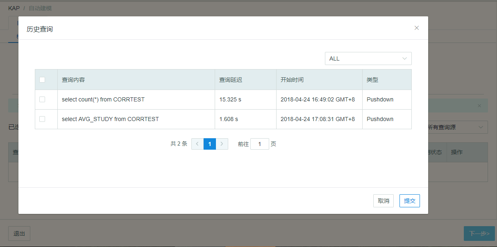
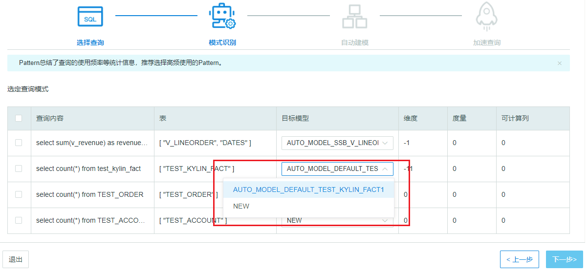
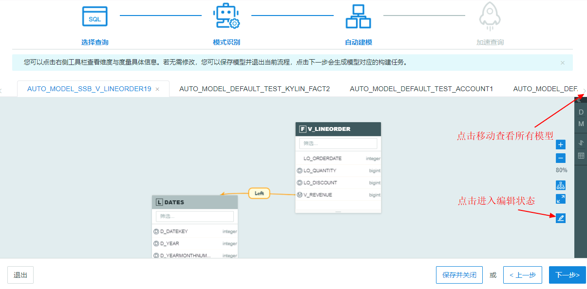
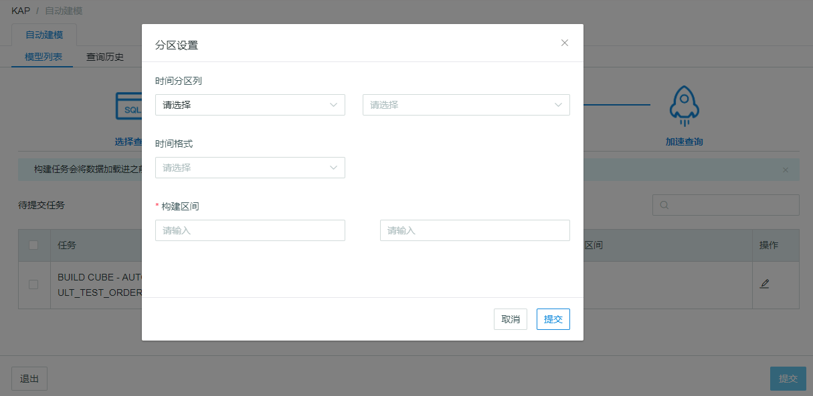

## 自动建模完全说明

从 Kyligence Enterprise 3.0 版本开始，系统新增了自动建模功能。它可以根据SQL语句自动生成模型并智能的进行 Cube 构建，让 Kyligence Enteprise 成为一个智能的 SQL 查询加速器，降低建模学习成本，大幅提升了用户大数据分析的效率。

进入自动建模后，您只需通过4步就可以完成建模（一次可创建多个模型）: 

- [选择查询](#选择查询)
- [模式识别](#模式识别)
- [自动建模](#自动建模)
- [查询加速](#加速查询)

#### 准备自动建模

启动系统，并选择一个项目后，点击左侧导航栏**自动建模**。初次进入自动建模，系统将引导您导入数据源表，自动建模可对Hive和RDBMS中的数据自动创建模型 。

> **注意**： Kyligence Enterprise 3.x版本中，每个项目支持一种数据源，自动建模不支持对Kafka 流式数据。

载入源数据表后，点击左侧导航栏回到**自动建模**，此时点击**＋自动建模**即可开始您的建模之旅。

#### 选择查询

自动建模的第一步是选择查询：在此页面，您可以从本地**导入**常用查询SQL 或 从系统的**历史查询**中批量选择SQL。此外，系统也支持手动**添加查询**。

> **注意**：
>
> 1. 历史查询的类型有 pushdown 和 slow 两类，分别表示已经下压的查询和执行较慢的查询。
> 2. 导入 SQL 时，文件大小应小于 1M，文件格式应为文本文档( .txt 或 .sql）

所有选入的查询 SQL 都会展现在如下列表中，其中每条 SQL 都记录了**查询内容、查询来源、检测状态**。检测状态代表了系统对该 SQL 的语法检测结果，只有全部查询SQL都语法正确时，才可以进行下一步。

点击编辑，系统将弹出 SQL 编辑窗口。另外，您可以点击**语法检测标志**查看 SQL 语法错误的具体原因和修改建议。

点击退出您将离开**自动建模**工作流。

#### 模式识别

在模式识别步骤，系统将内容相似的 SQL 作为同一模式，总结了查询模式对模型语义的影响（维度、度量等语义的增减） 。另外，系统将智能地推荐您将 SQL 适配到已有模型或者新创建模型（NEW）。

> **注意：**
>
> 1. Kyligence Enterprise 3.x 中，自动创建的模型名字由系统生成，无法修改。自动创建的模型名称遵照：AUTO\_MODEL\_数据集名\_事实表名\_编号，其中编号代表自动模型的迭代版本。
> 2. 如果是 NEW 模型，它的编号将在该事实表下已有的最大编号上累加。

#### 自动建模

此步骤中，系统将您勾选的 SQL 模式自动创建多个模型，并直观地展现。点击侧边栏中对应按钮，您可以查看当前模型的维度，度量，表索引和 Rowkeys。Kyligence Enterprise 3.x 版本的自动建模中，可计算列能力暂时不支持。

点击**编辑**，模型呈现可编辑状态。系统已经根据选入的SQL查询推荐出不同的**维度组**，包括联合维度（J:joint）、层级维度（H:hierarcy）和必要维度（M: madontary）。概念说明可以参考本产品手册[维度聚合组](../model/cube/aggregation_group.cn.md)。

> **注意：**
>
> 1. 只读状态下，模型上所有内容都无法修改。
> 2. 编辑状态下，维度无法修改。
> 3. 编辑状态下，度量可以批量选择并删除。
> 4. Rowkey （[设计Cube](../model/cube/create_cube.cn.md)）和 表索引（[明细表索引](../model/cube/table_index.cn.md)）的配置，系统已经自动推荐，您可以参考手册手动调整。
> 5. 删除模型：点击模型名称tag中的**“×”**将删除该模型，如果想再次得到该模型，可以点击**上一步**回到模式识别页面重新勾选。

如果您需要更细致的调节创建的自动模型，可以点击**保存并关闭**。自动模型可以在**建模→模型**中查看和编辑（[设计模型](../model/data_modeling.cn.md)）。

#### 加速查询

系统为每个自动模型生成了构建任务。默认为全量构建，如果需要更改构建时间，可以点击**操作**中的编辑，进行分区设置。分区设置请参考本手册中的[构建 Cube](../model/build_cube.cn.md)。

您可以查看待提交的任务信息，根据目标模型名称进行**筛选**，勾选需要构建的模型**提交**构建任务。构建后，对应模型（包含对应 cube）才可以查询，实现了加速查询至亚秒级延迟。

