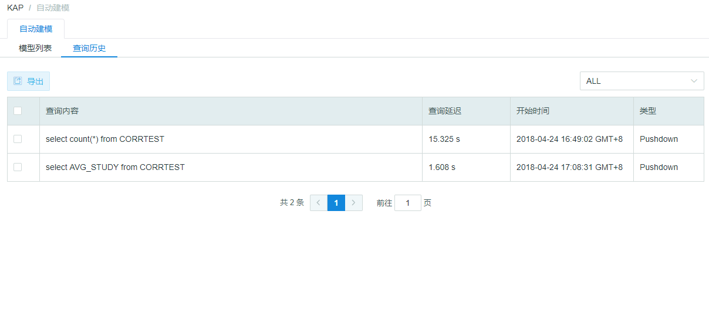
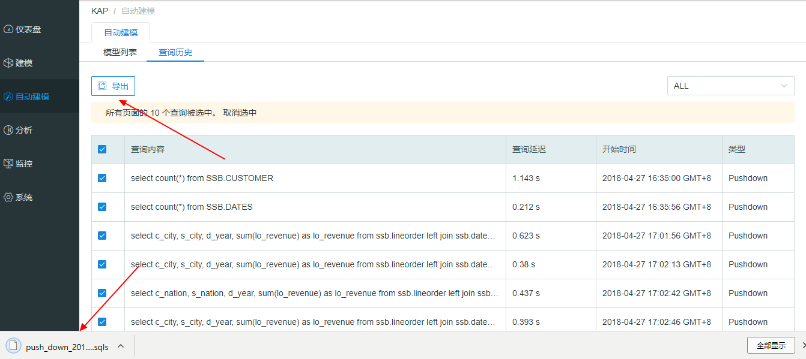

## 查询历史

**查询历史**显示了部分查询过的SQL历史，主要包括Slow（慢查询）和Pushdown（下压的查询）。您可以查看每条SQL的查询内容、查询延迟、开始时间和类型，并可以根据类型进行筛选。

默认查询延迟≥90s的查询会被归入**慢查询**，该参数可以在`$KYLIN_HOME/conf/kylin.properties` 配置文件中，添加`kylin.query.badquery-alerting-seconds`更改。

> 注意：当前查询历史默认最多存储500条去重查询，该参数可以在`$KYLIN_HOME/conf/kylin.properties` 文件中，添加`kylin.query.badquery-history-number`更改。如果查询语句数量大于500，新的SQL查询将会替换最早保存的SQL查询语句。
>

默认查询延迟≥300s的超时查询会被系统杀死，该参数可以在`$KYLIN_HOME/conf/kylin.properties` 配置文件中，添加`kylin.query.timeout-seconds`更改。

系统会每隔一段时间做一次慢查询和超时查询的检查，检查间隔时间默认36s，计算方法如下：min( `kylin.query.badquery-alerting-seconds `, `kylin.query.timeout-seconds` ) \* `kylin.query.timeout-seconds-coefficient`

`kylin.query.timeout-seconds-coefficient` 系统默认为0.4，可以在`$KYLIN_HOME/conf/kylin.properties` 配置文件中添加该配置项进行调整。

> 注意：超过了指定超时时间的查询并不会立刻被系统杀死，而是等到系统进行下一次检查时被杀。
>
> 例：系统设置查询延迟≥60s 的查询为慢查询，查询延迟≥100s 的超时查询会被系统杀死，每隔 30s 做一次慢查询和超时查询检查。
>
> 目前有一条慢查询已经执行了 80s，预期在 30s后，即下一次检查时，该查询已经执行了 110s，会被系统杀死。但如果恰好在下一次检查之前，系统进行了一次 60s 的 full gc，full gc 期间系统假死，检查会在 full gc 结束之后恢复，所以下一次检查时，该查询已经执行了 170s，此时系统会杀死这个超时查询。

在查询历史页面，您也可以勾选需要的SQL后点击**导出**，将SQL导出为文本文档。

