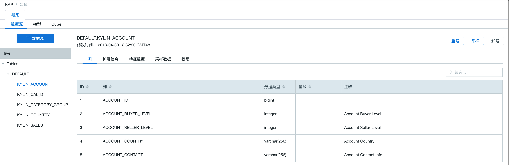

## 导入 Hive 数据源

Kyligence Enterprise 支持 Hive 作为默认的输入数据源。

本小节将结合样例数据集介绍 Hive 数据源使用方式，具体步骤如下。


### 准备样例数据集

用户可通过执行脚本方式，将本产品中自带的样例数据导入至 Hive。

该可执行脚本为 **sample.sh** ，其默认存放路径为系统安装目录下的 **/bin** 目录

```sh
$KYLIN_HOME/bin/sample.sh
```

> **注意：** 运行 sample.sh 之后， 在本产品的 **系统** 功能页面下点击 **重载元数据**，否则会导致建模出错。


脚本执行成功之后，可在服务器终端执行 **hive** 命令行，进入 hive，并执行查询语句验证导入正常。

```sh
hive
```

可检查已导入hive的表清单

```sh
hive> show tables;
```

可检查导入hive的具体表

```sh
hive> select count(*) from kylin_sales;
```


### 创建基于 Hive 数据源的项目

**步骤一**：打开 Kyligence Enterprise 的 Web UI，在主界面的顶端是项目的管理工具栏，点击“＋”即可如下图所示创建一个新的项目。


**步骤二**：进入具体项目**建模**功能，选择**数据源**选项卡；点击蓝色的**数据源**按钮，在弹出窗口中，选择 **Hive **作为数据源类型；


**步骤三**：点击 **下一步** 按钮，进入 **加载 Hive 表元数据** 窗口，用户可按需在左侧的 Hive 表清单中，单击选中需要建模的表，也支持输入关键字进行搜索

**步骤四**：点击右下方 **同步** 按钮进行加载


> **提示：** 默认选择**加载后启动表采样任务**。表采样结果能帮助优化后续的模型设计和 Cube 设计，我们强烈建议您启用该选项。

**步骤五**：同步完成后，可以在 **建模** 界面的 **数据源** 面板中，选中具体加载的表，查看表的详细信息。


