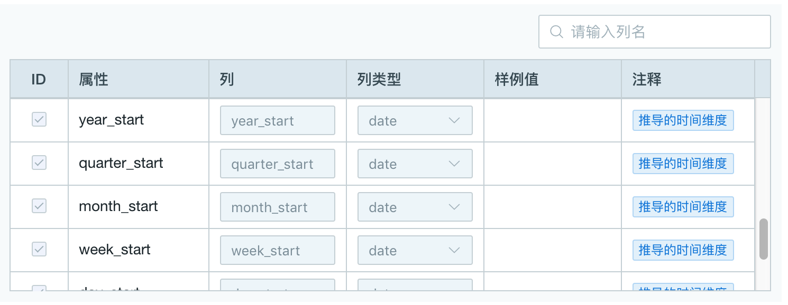
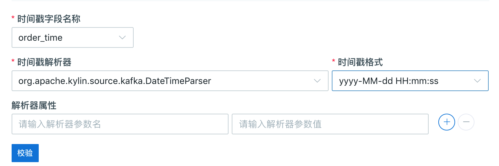
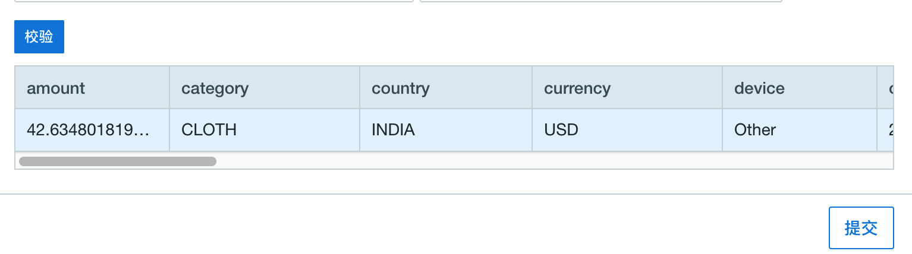
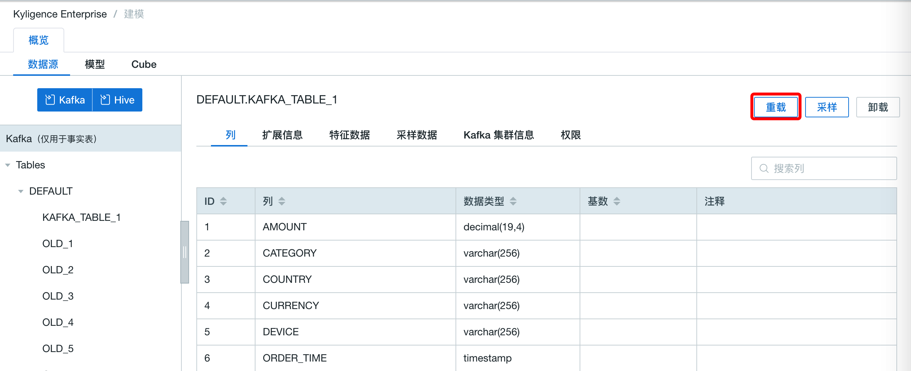
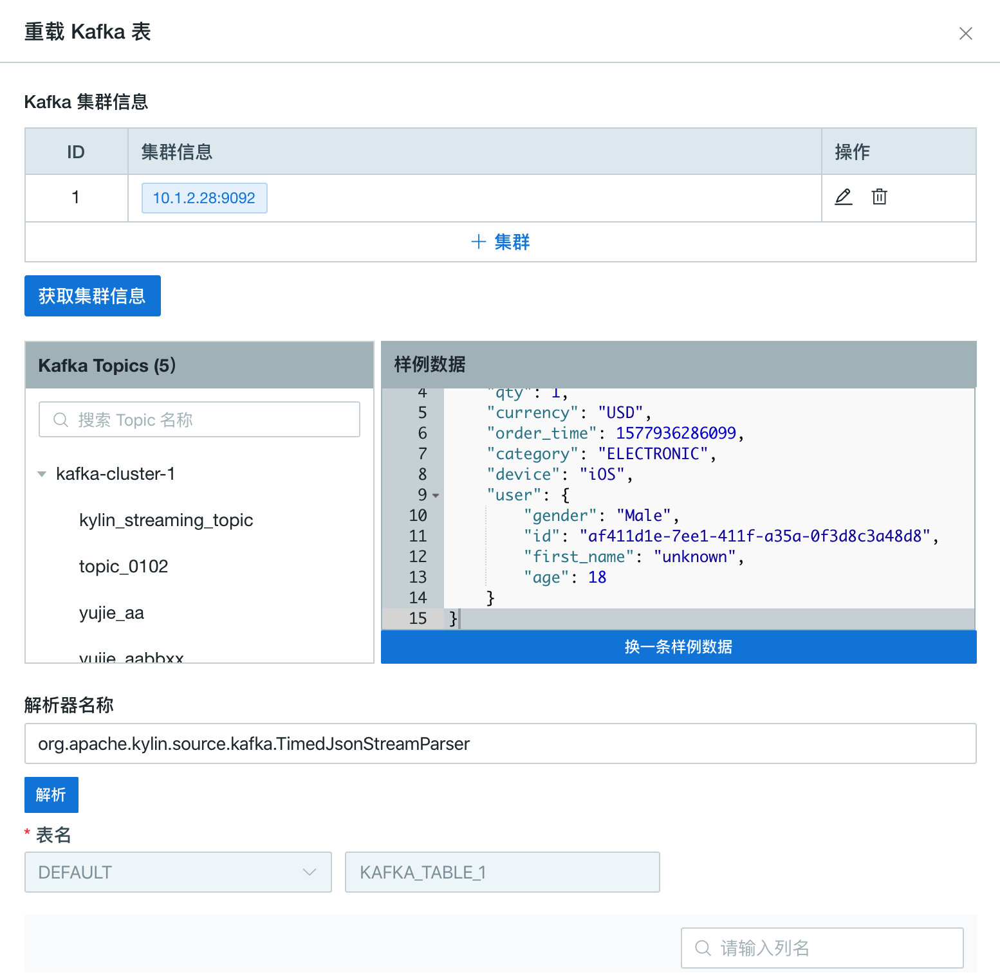

## 导入 Kafka 数据源

本节将介绍如何导入 Kafka 数据源，以及如何将 Kafka 消息流解析为表。

### 前提条件

请联系您的 Hadoop 管理员，确保您的环境中已安装 **Kafka v2.11-0.11.0.1** 或以上版本。

### 为测试部署 Kafka Broker

为方便测试和试用，以下步骤介绍如何在 Kyligence Enterprise 节点上启动一个新的 Kafka Broker。已经有 Kafka 集群的用户可以跳过该步骤。

> **提示：**
> 
> 如果 Kyligence Enterprise 节点上没有部署 Kafka 二进制包，则必须拷贝其他已部署 Kafka 节点的相同版本的 Kafka 二进制包并解压在本产品启动节点上的任意路径（如`/usr/local/kafka_2.11-0.11.0.1`），并设置 `KAFKA_HOME` 指向该路径。确保 `$KAFKA_HOME/libs/` 目录下有 Kafka 的客户端有关的 Jar 包。

1. 下载 Kafka 安装包并解压。
   ```sh
   curl -s https://archive.apache.org/dist/kafka/0.11.0.1/kafka_2.11-0.11.0.1.tgz | tar -xz -C /usr/local/
   ```
2. 指定 `KAFKA_HOME` 环境变量。
   ```sh
   export KAFKA_HOME=/usr/local/kafka_2.11-0.11.0.1
   ```
3. 启动 Kafka Broker。
   ```sh
   $KAFKA_HOME/bin/kafka-server-start.sh $KAFKA_HOME/config/server.properties &
   ```

> **注意：** 启动 Kafka Broker 时， 需要确认 Kafka 中 Zookeeper 的 IP 或者 端口是否配置正确


### 为测试创建 Kafka Topic 并模拟流数据

为方便测试和试用，以下步骤介绍如何创建 Kafka Topic 并模拟流数据，如果已经有了 Kafka Topic 的用户可以跳过这个步骤。

假设 Kafka Broker 运行在 127.0.0.1:9092，ZooKeeper 运行在 127.0.0.1:2181。

1. 创建一个名为 `kylin_streaming_topic` 的 Kafka Topic。
   ```sh
   $KAFKA_HOME/bin/kafka-topics.sh --create --zookeeper 127.0.0.1:2181 --replication-factor 1 --partitions 3 --topic kylin_streaming_topic
   ```

2. 启动 Kafka Producer。
   本产品提供了一个简单的 Producer 工具用于产生消息流，持续往 Kafka Topic 中导入数据。

   ```sh
   $KYLIN_HOME/bin/kylin.sh org.apache.kylin.source.kafka.util.KafkaSampleProducer --topic kylin_streaming_topic --broker 127.0.0.1:9092
   ```
   这个工具每秒会向 Kafka 中发送 100 条消息。在模拟流数据时，请保持本程序持续运行。

3. 同时，您可以使用 Kafka 自带的 Consumer 来检查消息是否成功导入。
   ```sh
   $KAFKA_HOME/bin/kafka-console-consumer.sh --bootstrap-server 127.0.0.1:9092 --topic kylin_streaming_topic --from-beginning
   ```

### 从流式数据中解析并定义数据表

本产品支持将 Kafka 消息流抽象为数据表，并通过构建数据实现对消息流的近实时处理。

1. 在 Web UI 界面新建一个项目用于导入流式数据。

2. 选择要导入流式数据的项目，在**建模**-->**数据源**页面，点击数据源选择数据源为 Kafka，点击**下一步**。
      
   
3. 在**设置 Kafka 主题**页面中点击 **+集群** 输入集群的 Broker 信息，包括主机的实际 IP 地址和端口号（如 `127.0.0.1:9092`），如果有多个 Broker 可以用 `,` 隔开。确认后点击  √，这时会对输入的 Broker 进行检测。如果检测出无效的 Broker，请移除后再重新确认。
  
   > **提示**：系统会记录输入过的 Kafka 集群方便后续的输入。
   
   
   
4. 点击 **获取该集群信息**，会显示当前 Broker 集群的 Topic 列表，选择点击一个 Topic（如：`kylin_streaming_topic`），消息流的采样数据会出现在右边文本框中，如果当前显示的样例消息是脏数据， 则可以点击 **换一条样例数据** 来更换另一条样例数据。检查样例数据后， 点击 **解析** 按钮，样例数据将会被展开为数据列

  
   > **注意**：
   > 1.当前系统只支持显示 JSON 格式的样例数据。如果 Topic 中的消息时非 JSON 格式， 则文本框内不会显示样例数据。
   >
   > 2. JSON 格式消息使用的解析器为 `org.apache.kylin.source.kafka.TimedJsonStreamParser`, 如果是非 JSON 格式消息， 则需要使用自定义解析器， 后文会介绍如何实现和使用自定义解析器


   

5. 为流式数据定义一个表名，如 `KAFKA_TABLE_1`。之后可以用这张表创建模型。
   

6. 检查表结构中的列和列的类型是否正确。
  - 您可以自定义每一列的列名，列类型， 注释，列名不可重复。
  - 确保至少有一列的列类型被选择为 **timestamp**，代表记录的数据时间。
  - 基于上述数据时间列，系统会自动衍生出 7 个不同粒度的时间列，即推导时间维度，包括 **year_start、quarter_start、month_start、week_start、day_start、hour_start、minute_start**。为了您的方便，这些时间列会默认出现在所有 Kafka 表上。
  - 推导时间维度信息由系统生成，不可修改
  - **minute_start** 将在后续的建模和 Cube 设计中发挥重要作用。在以 Kafka 表为中心的模型和 Cube 中，**minute_start** 将是必选维度，Segment 的自动合并也将以 **minute_start** 为时间维度。

    > **注意**：如果 Kafka 消息中有同名的字段，请按照界面提示进行修改。

    
    
  
7. 设置时间戳解析器以及消息解析器属性

   

   

   - 时间戳字段名称：每条记录的数据时间列，用于生成 7 个不同粒度的时间列。本例选择了 **order_time**。
   - 时间戳解析器：时间戳解析器，决定了如何从上面的 时间戳字段 创建 Timestamp 对象
     - `org.apache.kylin.source.kafka.DefaultTimeParser`, 将根据 Long 型的系统毫秒时间（类似 java.lang.System.currentTimeMillis）创建 Timestamp 对象。该解析器将根据给定的 `时间戳时区`，将时间解析为对应时间区间的时间，如 `GMT+8` 时，时间戳 1549008564973 将被解析为 2019-02-01 16:09:24。时区默认使用 `GMT+0`。
     - `org.apache.kylin.source.kafka.DateTimeParser`，将根据给定的 `时间戳格式`，将 `String` 类型转换为 `Timestamp` 对象。
   - 解析器属性：可以为自定义解析器设置更多属性，来定义其行为。
   
8. 点击 **校验**， 如果校验成功，表结构将会显示在界面上

    

9. 点击**提交**。至此，您完成了将 Kafka 消息流定义为数据表。

### 为 Kafka 数据源配置额外参数

#### 配置 Kafka Admin Client

Kyligence Enterprise 提供了两种方式来配置 Kafka Admin Client 的参数：

- 配置 `$KYLIN_HOME/conf/kylin-kafka-admin.xml`。样例如下：

  ```xml
  <configuration>
    <property>
        <name>request.timeout.ms</name>
        <value>20000</value>
    </property>
    <property>
        <name>client.id</name>
        <value>kyligence</value>
    </property>
  </configuration>  
  ```

- 配置文件`$KYLIN_HOME/conf/kylin.properties`：
  通过添加前缀为 `kylin.source.kafka.admin.config-override.`的配置项，来覆盖对应的 Kafka Admin Client 参数  (同样会覆盖 `$KYLIN_HOME/conf/kylin-kafka-admin.xml`)。样例如下：

  ```properties
  kylin.source.kafka.admin.config-override.client.id=kyligence
  ```

### 配置 Kafka Consumer
Kyligence Enterprise 提供了两种方式来配置 Kafka Consumer 的参数：

- 配置文件`$KYLIN_HOME/conf/kylin-kafka-consumer.xml`。样例如下：

  ```xml
  <configuration>
    <property>
        <name>session.timeout.ms</name>
        <value>10000</value>
    </property>
    <property>
        <name>request.timeout.ms</name>
        <value>20000</value>
    </property>
  </configuration>  
  ```

- 配置文件`$KYLIN_HOME/conf/kylin.properties`：
  通过添加前缀为 `kylin.source.kafka.config-override.`的配置项，来覆盖对应的Kafka Consumer参数  (同样会覆盖 `$KYLIN_HOME/conf/kylin-kafka-consumer.xml`)。样例如下：

  ```properties
  kylin.source.kafka.config-override.client.id=kyligence
  ```

更多关于 Kafka 配置的信息请参考：https://kafka.apache.org/21/documentation.html#consumerconfigs。

> 注意：
> 1. 如果需要配置 client-id， 那么需要同时配置 Kafka Admin Client 和 Kafka Consumer
> 2. `kylin.properties` 中的 Kafka 配置会覆盖 xml 配置文件中的配置

### 重载流式表

1. 在 **建模** 界面的 **数据源** 面板中，选中具体要重载的流式表，点击 **重载** 按钮。



2. 在弹出的重载 kafka 表界面中，原 kafka 表的列会被默认勾选，您可以修改该流式表使用的 kafka 集群信息，解析器，列及列类型，修改完成之后点击 **提交** 按钮进行重载。




### 注意事项和已知局限

- 在以 Kafka 为数据源的项目中，支持加载 Hive 表，然而 Kafka 表只能用作事实表
- 当前默认支持 JSON 格式的 Kafka 消息，更多格式请使用自定义解析器来。
- 在定义表结构时，请仔细核对系统自动识别的数据类型，在一些特定情况下识别可能有误。另外，已知 `Float` 类型在某些特殊情况下会导致 Kafka 表上的查询失败，推荐使用 `Double` 类型代替。
- 从产品 v3.4.1 开始，要求 **minute_start** 作为必选维度出现在以 Kafka 表为中心的模型和 Cube 上，这对于 Cube 能正常自动合并至关重要。不含 **minute_start** 的旧版模型和 Cube 将呈现为 BROKEN 状态。
- Kafka 表暂不支持查询下压。
- 从产品 v3.4.2 开始，不兼容旧版本的自定义解析器，需要重新实现。


## 自定义 Kafka 消息解析器

系统目前默认提供 JSON 格式的 Kafka 消息解析器， 如果 Kafka 消息是非 JSON 格式的，那么需要自定义消息解析器，下面的示例介绍如何使用 Java 实现自定义消息解析器。

> 注意： 自定义消息解析器需要您能够熟练使用 Java 进行开发


### 实现方法

Kyligence Enterprise 自带一个样例， 向您展示如何从源代码编译到打包部署的一个自定义 Kafka 消息解析器。下面向您介绍这个样例工程。

#### 一、搭建开发环境

拷贝 `$KYLIN_HOME/samples/example-kafka-parser.tar.gz`，解压后目录为一个完整的样例程序，将其拷贝到工作目录后，在项目的 lib 目录中加入 `$KYLIN_HOME/tool/kylin-tool-kap-[version].jar`，并将其添加到 classpath 中。您可以在 IDE 中打开并编译这个样例程序

样例提供了一个自定义解析器示例 `ExampleKafkaParser`, 用来解析 Kafka 消息。

#### 二、实现自定义 Kafka 消息解析器

自定义 Kafka 消息解析器的扩展点包含一个类 **CustomKafkaParserBase**， 其中需要覆写两个方法：
- `flattenMessage(ByteBuffer byteBuffer)`（必要）： 用来反序列化 Kafka 消息， 并解析为键值对集合，键值对集合用于定义 Kafka 表的列
- `parse(ByteBuffer byteBuffer)`（可选）： 根据定义的表，取出 Kafka 消息中对应列的数据

下面介绍如何实现这个类， 以样例中的 `ExampleKafkaParser` 为例。

`ExampleKafkaParser` 类继承自 `CustomKafkaParserBase` 抽象父类，并覆写其 `flattenMessage(ByteBuffer byteBuffer)` 方法

```java
public class ExampleKafkaParser extends CustomKafkaParserBase {
    private static final Logger logger = LoggerFactory.getLogger(ExampleKafkaParser.class);

    public ExampleKafkaParser(List<TblColRef> allColumns, Map<String, String> properties) {
        super(allColumns, properties);
    }

    @Override
    public Map<String, Object> flattenMessage(ByteBuffer byteBuffer) {
        Map<String, Object> flatMap = new LinkedHashMap<>();

        try {
            byte[] bytes = byteBuffer.array();
            // fill code here
            // 1. deserialize byte array

            // 2. extract to key - value, and put into flatMap

        } catch (Exception e) {
            throw new KafkaMessageParseException("Error when flatten message: " + e);
        } finally {
            // fill code here
            // close resources if any
        }

        return flatMap;
    }
}
```

`flattenMessage()` 方法中， 参数为序列化后的 Kafka 消息，首先需要将其转化为字节数组，然后将字节数组反序列化。然后将反序列化后的消息，解析为键值对，将其放入 flatMap 中。需要注意的是，此处应使用 `LinkedHashMap` 来保证每次解析的顺序保持一致。这个键值对集合将会展示在前端界面中，如图所示

 

 其中**属性**为 flatMap 中的键， **样例值** 为 flatMap 中的值。

 > 注意：
 > 1. 一般情况下不需要覆写 `parse()` 方法，但需要视具体情况而定
 > 2. 如果需要添加依赖，对于常用 Java 依赖， 一般设置 scope 为 `provided` 来避免和系统依赖 JAR 包冲突
 > 3. `flattenMessage()` 方法要注意结果的顺序，一般情况下需要保序


 ### 三、打包、部署与调试

 1. Maven 生成 JAR 包

 ```
 mvn clean package assembly:single
 ```
 在 target 目录下找到包含了自定义实现和依赖的 JAR 包

 2. 部署 JAR 包
 - 将该 JAR 包放入路径 `$KYLIN_HOME/ext`
 - 创建 `$KYLIN_HOME/mr-lib` 目录， 将该 JAR 包放入路径 `$KYLIN_HOME/mr-lib` 中
 - 在 `kylin.properties` 中配置 `kylin.engine.mr.lib-dir`，并设置为 `$KYLIN_HOME/mr-lib`

 3. 重启 Kyligence Enterprise 

 然后在创建流式数据表的过程中，在**解析器名称**位置填入自定义解析器的全名（包名+类名）点击解析即可，成功解析则说明已生效。