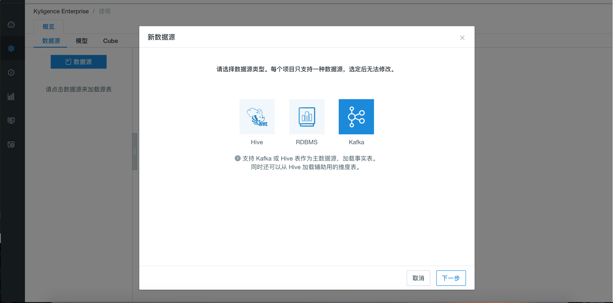
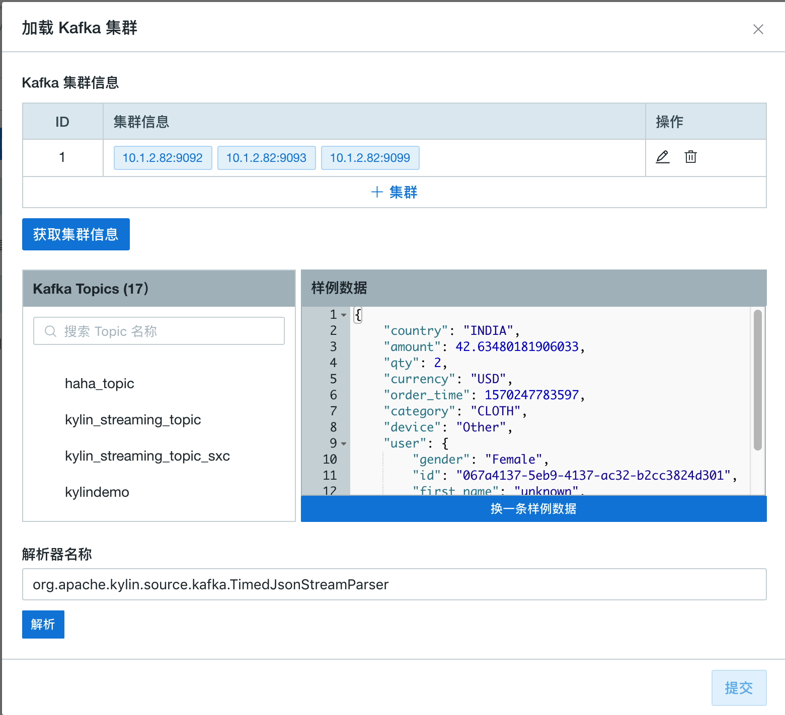
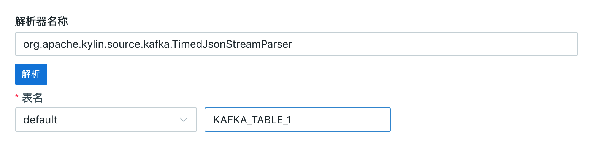
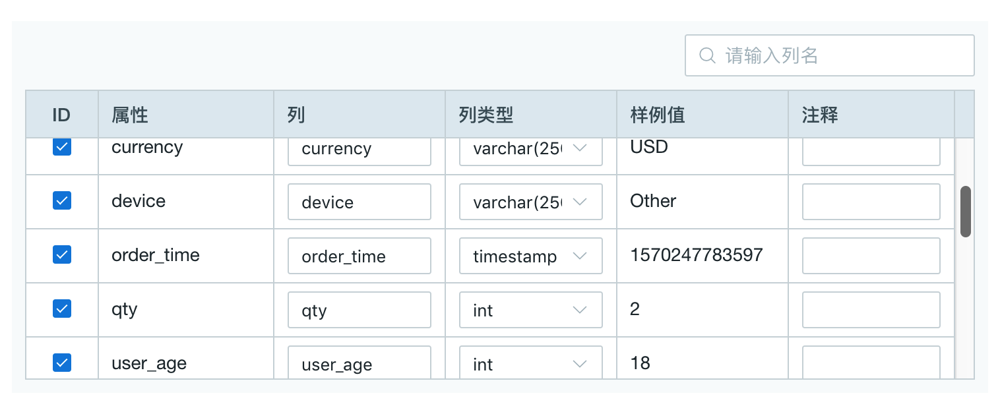
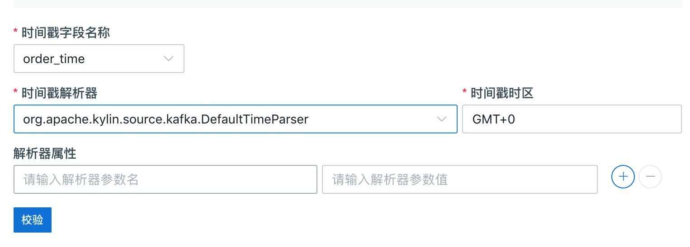

## 导入 Kafka 数据源

本节将介绍如何导入 Kafka 数据源，以及如何将 Kafka 消息流解析为表。

### 前提条件

请联系您的 Hadoop 管理员，确保您的环境中已安装 **Kafka v2.10-0.10.1.0** 或以上版本。

### 部署测试用 Kafka Broker

为方便测试和试用，以下步骤介绍如何在 Kyligence Enterprise 节点上启动一个新的 Kafka Broker。已经有 Kafka 集群的用户可以跳过该步骤。

> **提示：**
> 
> 如果 Kyligence Enterprise 节点上没有部署 Kafka 二进制包，则必须拷贝其他已部署 Kafka 节点的相同版本的 Kafka 二进制包并解压在本产品启动节点上的任意路径（如`/usr/local/kafka_2.10-0.10.1.0`），并设置 `KAFKA_HOME` 指向该路径。确保 `$KAFKA_HOME/libs/` 目录下有 Kafka 的客户端有关的 Jar 包。

1. 下载 Kafka 安装包并解压。
   ```sh
   curl -s https://archive.apache.org/dist/kafka/0.10.1.0/kafka_2.10-0.10.1.0.tgz | tar -xz -C /usr/local/
   ```
2. 指定 `KAFKA_HOME` 环境变量。
   ```sh
   export KAFKA_HOME=/usr/local/kafka_2.10-0.10.1.0
   ```
3. 启动 Kafka Broker。
   ```sh
   $KAFKA_HOME/bin/kafka-server-start.sh config/server.properties &
   ```


### 创建测试用 Kafka Topic 并模拟流数据

为方便测试和试用，以下步骤介绍如何创建 Kafka Topic 并模拟流数据，如果已经有了 Kafka Topic 的用户可以跳过这个步骤。

假设 Kafka Broker 运行在 127.0.0.1:9092，ZooKeeper 运行在 127.0.0.1:2181。

1. 创建一个名为 `kylindemo` 的 Kafka Topic。
   ```sh
   $KAFKA_HOME/bin/kafka-topics.sh --create --zookeeper 127.0.0.1:2181 --replication-factor 1 --partitions 3 --topic kylindemo
   ```

2. 启动 Kafka Producer。
   本产品提供了一个简单的 Producer 工具用于产生消息流，持续往 Kafka Topic 中导入数据。

   ```sh
   $KYLIN_HOME/bin/kylin.sh org.apache.kylin.source.kafka.util.KafkaSampleProducer --topic kylindemo --broker 127.0.0.1:9092
   ```
   这个工具每秒会向 Kafka 中发送 100 条消息。在模拟流数据时，请保持本程序持续运行。

3. 同时，您可以使用 Kafka 自带的 Consumer 来检查消息是否成功导入。
   ```sh
   $KAFKA_HOME/bin/kafka-console-consumer.sh --bootstrap-server 127.0.0.1:9092 --topic kylindemo --from-beginning
   ```

### 从流式数据中解析并定义数据表

本产品支持将 Kafka 消息流抽象为数据表，并通过构建数据实现对消息流的近实时处理。

1. 在 Web UI 界面新建一个项目用于导入流式数据。
2. 在**建模**-->**数据源**页面，点击数据源选择数据源为 Kafka，点击**下一步**。
   
3. 在**设置 Kafka 主题**页面中输入 Broker 集群信息，包括主机的实际 IP 地址和端口号，确认后点击  √。
   
4. 点击 **获取该集群信息** -> **{Kafka Topic 名称}**（如：`kylindemo`），消息流的采样数据会出现在右边文本框中，点击 **Convert**。
   
5. 为流式数据源定义一个表名，这张数据表将作为后续创建模型和查询的事实表。本例将表命名为 **KAFKA_TABLE_1**。
   
6. 检查表结构中的列和对应的列类型是否正确。
  **注意：** 
  - 确保至少有一列的列类型被选择为 **timestamp**。
  - 本产品会自动生成 7 个不同粒度的时间列，包括 **year_start、quarter_start、month_start、week_start、day_start、hour_start、minute_start**，请务必保证 **minute_start** 的勾选，保证后续模型设计、Cube 构建等过程的顺利进行，其他维度可以根据您实际业务场景需要进行勾选。
  
7. 设置解析器
   
   - 解析器名称：默认为 `org.apache.kylin.source.kafka.TimedJsonStreamParser`，支持自定义解析器；
   - 时间戳字段名称：必须指定一列时间字段用于解析，本例选择了 **order_time**。
   - 解析器属性：为解析器定义更多属性，请参照输入框中提示的属性格式指定 **tsParser** 和 **tsPattern**。
     - tsParser：指时间戳解析器，该解析器会将 `tsColName` 的数值解析成时间戳。
       本产品提供有两种内置解析器：
       - 默认为 `org.apache.kylin.source.kafka.DefaultTimeParser`，会将 Long 型的 Unix 时间解析为时间戳。该解析器将根据给定的 `tsTimezone`，将时间解析为对应时间区间的时间，如 `tsTimezone=GMT+8` 时，时间戳 1549008564973 将被解析为 2019-02-01 16:09:24；如果没有指定 `tsTimezone`，将默认使用 `GMT+0`。
       - 您还可以使用 `org.apache.kylin.source.kafka.DateTimeParser`，该解析器将根据给定的 `tsPattern`，将 String 类型的时间表达式解析成时间戳；如果没有指定 `tsPattern`，将默认使用 `yyyy-MM-dd HH:mm:ss`。
     - tsPattern：指时间戳样式，供 tsParser 使用。
8. 点击**提交**。至此，您完成了将 Kafka 输出的消息流定义为数据表。

### 为 Kafka 数据源配置额外参数

Kyligence Enterprise 提供了两种方式来配置 Kafka Consumer的参数：

- 配置文件`$KYLIN_HOME/conf/kylin-kafka-consumer.xml`。样例如下：

  ```xml
  <configuration>
    <property>
        <name>session.timeout.ms</name>
        <value>10000</value>
    </property>
    <property>
        <name>request.timeout.ms</name>
        <value>20000</value>
    </property>
  </configuration>  
  ```

- 配置文件`$KYLIN_HOME/conf/kylin.properties`：
  通过添加前缀为 `kylin.source.kafka.config-override.`的配置项，来覆盖对应的Kafka Consumer参数  (同样会覆盖 `$KYLIN_HOME/conf/kylin-kafka-consumer.xml`)。样例如下：

  ```properties
  kylin.source.kafka.config-override.client.id=kyligence
  ```

完整配置列表请参考：https://kafka.apache.org/21/documentation.html#consumerconfigs