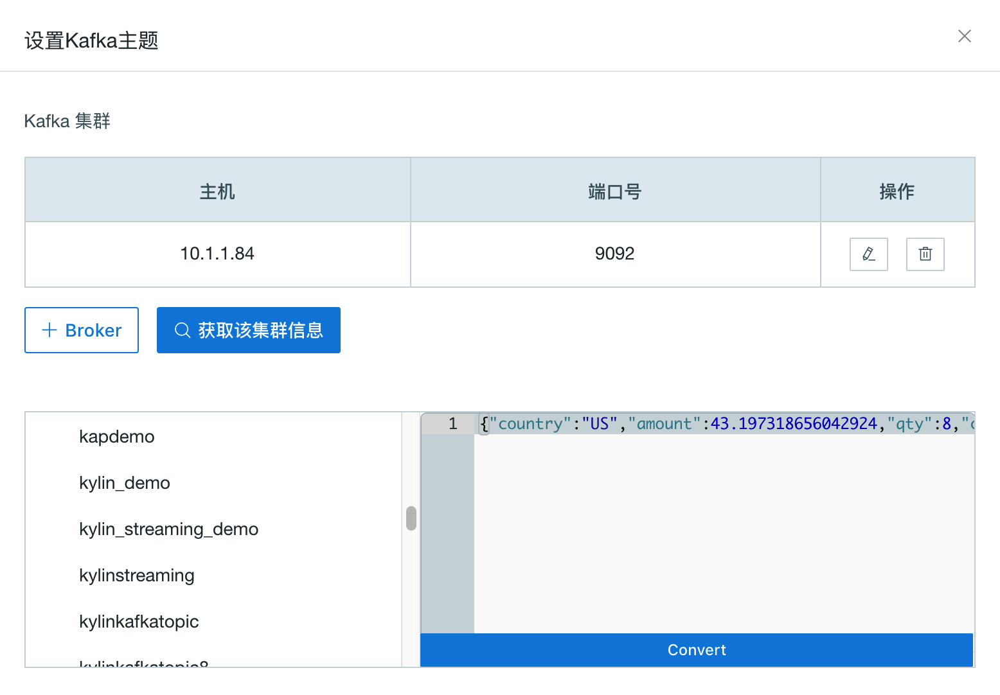
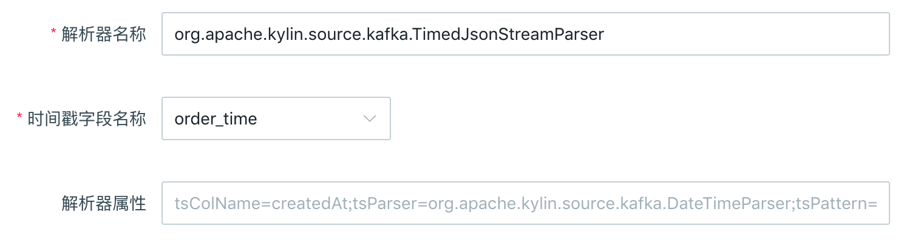

## 导入 Kafka 数据源
本节介绍如何导入 Kafka 数据源，以及将 Kafka 消息流解析为事实表。


### 环境准备

在开始本教程前，请确保您已准备好 Hadoop 环境并且已经安装了**Kyligence Enterprise 2.3 (或以上版本)** 和 **Kafka v2.10-0.10.1.0**及以上版本。在本教程中，我们使用 Hortonworks HDP 2.4 Sandbox 虚拟机作为 Hadoop 环境。

Kafka Broker 无需与本产品部署在同一个节点上。

> **注意：** 如果 Kyligence Enterprise 节点上没有部署 Kafka Broker，建议将与其他已部署节点相同版本的 Kafka 二进制包复制，并解压在本产品启动节点上的任意路径（如`/usr/local/kafka_2.10-0.10.1.0`），并设置 KAFKA_HOME 指向该路径。确保 `KAFKA_HOME/libs` 目录下有 Kafka 的客户端 library。

本例中，假设用户没有安装过 Kafka Broker，包含了将 Kafka Broker 部署到本机以及启动的过程，已经安装过 Kafka Broker 的用户可以跳过该步骤。

```sh
curl -s https://archive.apache.org/dist/kafka/0.10.1.0/kafka_2.10-0.10.1.0.tgz | tar -xz -C /usr/local/
cd /usr/local/kafka_2.10-0.10.1.0/
./bin/kafka-server-start.sh config/server.properties &
```

务必确保产品实例启动前，已经将 `KAFKA_HOME` 变量正确导出，操作如下。

```sh
export KAFKA_HOME=/usr/local/kafka_2.10-0.10.1.0
```


### 创建 Kafka Topic 并模拟流数据（可选）

> **提示：**
> 1. 该创建 Topic 步骤为可选，用户如果已经有了 Kafka Topic 可以忽略这个步骤。
> 2. 以下例子假设 Kafka Broker 运行在 127.0.0.1:9092，ZooKeeper 运行在 127.0.0.1:2181，用户在自己环境中请自行更新 IP 地址。

通过以下命令，我们创建一个名为 "kylindemo" 的 topic。

```sh
./bin/kafka-topics.sh --create --zookeeper 127.0.0.1:2181 --replication-factor 1 --partitions 3 --topic kylindemo
```

接着，我们需要启动一个产生消息流的工具，持续往 topic 中导入数据。本产品提供了一个简单的 Producer 工具用于产生数据。

```sh
cd $KYLIN_HOME
./bin/kylin.sh org.apache.kylin.source.kafka.util.KafkaSampleProducer --topic kylindemo --broker 127.0.0.1:9092
```
这个工具每秒会向 Kafka 中发送100条消息。在学习本教程的过程中，请保持本程序持续运行。同时，你可以使用 Kafka 自带的 Consumer 来检查消息是否成功导入。

```sh
cd $KAFKA_HOME
bin/kafka-console-consumer.sh --bootstrap-server 127.0.0.1:9092 --topic kylindemo --from-beginning
```


### 从流式数据中定义事实表

本产品中，支持将 Kafka 消息流抽象为数据表（事实表）。通过快速构建数据，实现对消息流的近实时处理。后续，设计流式数据模型和 cube，请参见[流式cube](../streaming_cube.cn.md)。

**步骤一**：启动产品, 从 Web GUI 登录, 新建一个项目。选择数据源为 Kafka。


**步骤二**：输入 Broker 集群信息，注意：这里 Host 要填写实际 IP 地址，是 YARN 集群上运行的 Job 可以访问的地址。


**步骤三**：点击 √ 确认 Broker 后，点击 **获取该集群信息** -> **kylindemo**， Kafka 的采样消息会出现在右边，点击 **Convert**。



**步骤四**：您需要为流式数据源定义一个表名，本产品将消息流中的数据作为此表的数据。这张数据表将作为后续创建模型和查询的事实表。本例将表命名为 "KAFKA_TABLE_1" 。


**步骤五**：检查表结构是否正确，**确保至少有一列被选择为timestamp**。


**步骤六**：设置解析器

- 解析器名称：默认为 org.apache.kylin.source.kafka.TimedJsonStreamParser，支持自定义解析器；

- 时间戳字段名称：必须为解析器指定一列用于分段的时间字段，本例选择了 order_time；

- 解析器属性：为解析器定义更多属性，请参照输入框中提示的属性格式指定 tsParser 和 tsPattern。

- tsParser：指时间戳解析器，对 tsColName 的数值解析成时间戳；
- tsPattern：指时间戳样式，供 tsParser 使用。

> **注意：** tsParser 有两种内置解析器：一种是默认的 org.apache.kylin.source.kafka.DefaultTimeParser，对 Long 型的 timestamp 值（epoc time）解析成 timestamp；
>
> 另一种是org.apache.kylin.source.kafka.DateTimeParser，它根据给定的 tsPattern，将 String 类型的时间表达式解析成 timestamp；如果没有指定 tsPattern，默认使用 "yyyy-MM-dd HH:mm:ss"。



**步骤七**：点击**提交**。至此，您完成了将 Kafka 输出的消息流定义为事实表。


