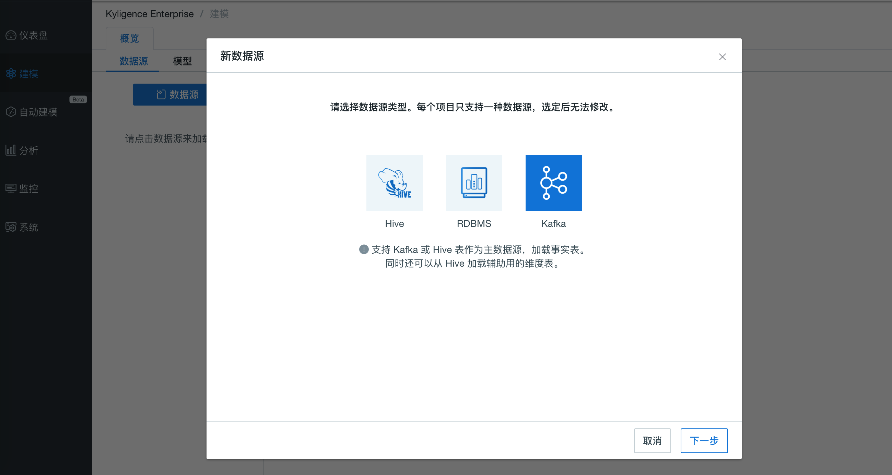
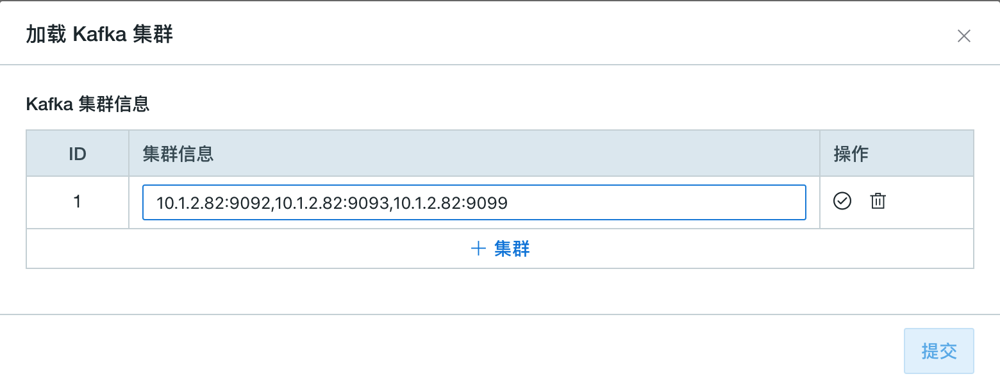

## 导入 Kafka 数据源

本节将介绍如何导入 Kafka 数据源，以及如何将 Kafka 消息流解析为表。

### 前提条件

请联系您的 Hadoop 管理员，确保您的环境中已安装 **Kafka v2.11-0.11.0.1** 或以上版本。

### 为测试部署 Kafka Broker

为方便测试和试用，以下步骤介绍如何在 Kyligence Enterprise 节点上启动一个新的 Kafka Broker。已经有 Kafka 集群的用户可以跳过该步骤。

> **提示：**
> 
> 如果 Kyligence Enterprise 节点上没有部署 Kafka 二进制包，则必须拷贝其他已部署 Kafka 节点的相同版本的 Kafka 二进制包并解压在本产品启动节点上的任意路径（如`/usr/local/kafka_2.11-0.11.0.1`），并设置 `KAFKA_HOME` 指向该路径。确保 `$KAFKA_HOME/libs/` 目录下有 Kafka 的客户端有关的 Jar 包。

1. 下载 Kafka 安装包并解压。
   ```sh
   curl -s https://archive.apache.org/dist/kafka/0.11.0.1/kafka_2.11-0.11.0.1.tgz | tar -xz -C /usr/local/
   ```
2. 指定 `KAFKA_HOME` 环境变量。
   ```sh
   export KAFKA_HOME=/usr/local/kafka_2.11-0.11.0.1
   ```
3. 启动 Kafka Broker。
   ```sh
   $KAFKA_HOME/bin/kafka-server-start.sh $KAFKA_HOME/config/server.properties &
   ```


### 为测试创建 Kafka Topic 并模拟流数据

为方便测试和试用，以下步骤介绍如何创建 Kafka Topic 并模拟流数据，如果已经有了 Kafka Topic 的用户可以跳过这个步骤。

假设 Kafka Broker 运行在 127.0.0.1:9092，ZooKeeper 运行在 127.0.0.1:2181。

1. 创建一个名为 `kylin_streaming_topic` 的 Kafka Topic。
   ```sh
   $KAFKA_HOME/bin/kafka-topics.sh --create --zookeeper 127.0.0.1:2181 --replication-factor 1 --partitions 3 --topic kylin_streaming_topic
   ```

2. 启动 Kafka Producer。
   本产品提供了一个简单的 Producer 工具用于产生消息流，持续往 Kafka Topic 中导入数据。

   ```sh
   $KYLIN_HOME/bin/kylin.sh org.apache.kylin.source.kafka.util.KafkaSampleProducer --topic kylin_streaming_topic --broker 127.0.0.1:9092
   ```
   这个工具每秒会向 Kafka 中发送 100 条消息。在模拟流数据时，请保持本程序持续运行。

3. 同时，您可以使用 Kafka 自带的 Consumer 来检查消息是否成功导入。
   ```sh
   $KAFKA_HOME/bin/kafka-console-consumer.sh --bootstrap-server 127.0.0.1:9092 --topic kylin_streaming_topic --from-beginning
   ```

### 从流式数据中解析并定义数据表

本产品支持将 Kafka 消息流抽象为数据表，并通过构建数据实现对消息流的近实时处理。

1. 在 Web UI 界面新建一个项目用于导入流式数据。

2. 选择要导入流式数据的项目，在**建模**-->**数据源**页面，点击数据源选择数据源为 Kafka，点击**下一步**。
      
   
3. 在**设置 Kafka 主题**页面中点击 **+集群** 输入集群的 Broker 信息，包括主机的实际 IP 地址和端口号（如 `127.0.0.1:9092`），如果有多个 Broker 可以用 `,` 隔开。确认后点击  √，这时会对输入的 Broker 进行检测。如果检测出无效的 Broker，请移除后再重新确认。
  
   > **提示**：系统会记录输入过的 Kafka 集群方便后续的输入。
   
   
   
4. 点击 **获取该集群信息** 并选择一个 Topic（如：`kylin_streaming_topic`），消息流的采样数据会出现在右边文本框中，点击 **转换**。
  
   > **注意**：当前系统只支持 JSON 格式的消息。请确保 Topic 中至少有一条信息可以被显示为样例数据。
   
   
   
5. 为流式数据定义一个表名，如 `KAFKA_TABLE_1`。之后可以用这张表创建模型。
   

6. 检查表结构中的列和列的类型是否正确。
  - 确保至少有一列的列类型被选择为 **timestamp**，代表记录的数据时间。

  - 基于上述数据时间列，系统会自动衍生出 7 个不同粒度的时间列，包括 **year_start、quarter_start、month_start、week_start、day_start、hour_start、minute_start**。为了您的方便，这些时间列会默认出现在所有 Kafka 表上。

  - **minute_start** 将在后续的建模和 Cube 设计中发挥重要作用。在以 Kafka 表为中心的模型和 Cube 中，**minute_start** 将是必选维度，Segment 的自动合并也将以 **minute_start** 为时间维度。

    > **注意**：如果 Kafka 消息中有同名的时间字段，它们将被系统生成的时间列覆盖。

    
  
7. 设置解析器
   
   - 解析器名称：默认为 `org.apache.kylin.source.kafka.TimedJsonStreamParser`，支持自定义解析器。
   - 时间戳字段名称：每条记录的数据时间列，用于生成 7 个不同粒度的时间列。本例选择了 **order_time**。
   - 解析器属性：可以为默认解析器 `TimedJsonStreamParser` 设置更多属性，来定义其行为。
     - `tsParser`：时间戳解析器，决定了如何从上面的 **时间戳字段** 创建 Timestamp 对象。
       
       若设为 `org.apache.kylin.source.kafka.DefaultTimeParser`，将根据 `Long` 型的系统毫秒时间（类似 `java.lang.System.currentTimeMillis`）创建 `Timestamp` 对象。该解析器将根据给定的 `tsTimezone`，将时间解析为对应时间区间的时间，如 `tsTimezone=GMT+8` 时，时间戳 1549008564973 将被解析为 2019-02-01 16:09:24。如果没有指定 `tsTimezone`，将默认使用 `GMT+0`。
       
       若设为 `org.apache.kylin.source.kafka.DateTimeParser`，将根据给定的 `tsPattern`，将 `String` 类型转换为 `Timestamp` 对象。如果没有指定 `tsPattern`，将默认使用 `yyyy-MM-dd HH:mm:ss`。
   
     - `tsPattern`：指字符串形态的时间戳格式，供 `tsParser` 使用。
   
8. 点击**提交**。至此，您完成了将 Kafka 消息流定义为数据表。

### 为 Kafka 数据源配置额外参数

Kyligence Enterprise 提供了两种方式来配置 Kafka Consumer 的参数：

- 配置文件`$KYLIN_HOME/conf/kylin-kafka-consumer.xml`。样例如下：

  ```xml
  <configuration>
    <property>
        <name>session.timeout.ms</name>
        <value>10000</value>
    </property>
    <property>
        <name>request.timeout.ms</name>
        <value>20000</value>
    </property>
  </configuration>  
  ```

- 配置文件`$KYLIN_HOME/conf/kylin.properties`：
  通过添加前缀为 `kylin.source.kafka.config-override.`的配置项，来覆盖对应的Kafka Consumer参数  (同样会覆盖 `$KYLIN_HOME/conf/kylin-kafka-consumer.xml`)。样例如下：

  ```properties
  kylin.source.kafka.config-override.client.id=kyligence
  ```

更多关于 Kafka 配置的信息请参考：https://kafka.apache.org/21/documentation.html#consumerconfigs。

### 注意事项和已知局限

- 在以 Kafka 为数据源的项目中，也可以加载 Hive 表。然而 Kafka 表只能用作事实表，Hive 表只能用作维度表。
- 暂时 Kafka 表无法重载，我们会在后续版本中修复。暂时您可以先删除原表，再重新加载同名的 Kafka 表。
- 当前只支持 JSON 格式的 Kafka 消息，更多格式将在后续的版本中支持。
- 在定义表结构时，请仔细核对系统自动识别的数据类型，在一些特定情况下识别可能有误。另外，已知 `Float` 类型在某些特殊情况下会导致 Kafka 表上的查询失败，推荐使用 `Double` 类型代替。
- 从产品 v3.4.1 开始，要求 **minute_start** 作为必选维度出现在以 Kafka 表为中心的模型和 Cube 上，这对于 Cube 能正常自动合并至关重要。不含 **minute_start** 的旧版模型和 Cube 将呈现为 BROKEN 状态。
- Kafka 表暂不支持查询下压。
- Kafka 表相关的模型和 Cube 导入导出也暂不支持，我们将在后续版本中修复。

