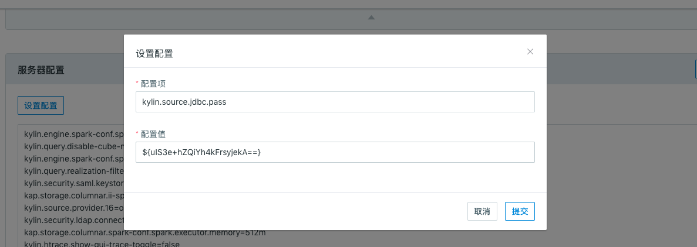

## 导入 RDBMS 数据源


### 隐藏、加密数据库密码

* **项目级配置**

在项目配置页，当添加了 `kylin.source.jdbc.pass` 配置时，参数的值将会自动进行隐藏处理，如下图：


* **全局配置**

本产品可以在**系统**页面配置系统级参数。为了防止在此页面上密码的明文显示，本产品提供了加密工具，将数据库密码进行加密处理后，在写入配置中。加密步骤如下：
**步骤一**：在 `$KYLIN_HOME/tomcat/webapps/kylin/WEB-INF/lib` 目录下运行如下命令，就可得到加密后的密码：

```sh
java -classpath kap.jar:spring-beans-4.3.10.RELEASE.jar:spring-core-4.3.10.RELEASE.jar:commons-codec-1.7.jar org.apache.kylin.rest.security.PasswordPlaceholderConfigurer AES yourpassword
```

> **注意：** 加密后的密码是形如 ${xxxxxxxxx} 的格式。为了防止系统将用户的原始密码识别为加密后的密码，建议用户在设置数据库密码时避开 ${xxxxxxxxx} 的格式。

**步骤二**：在**系统**页面配置参数 `kylin.source.jdbc.pass` 时，使用密文密码，系统会自动识别进行后续的处理。


