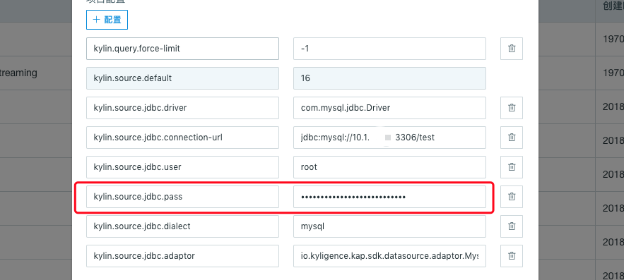
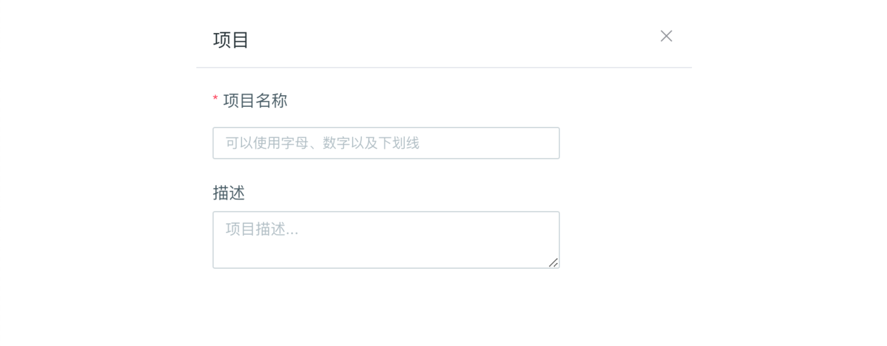
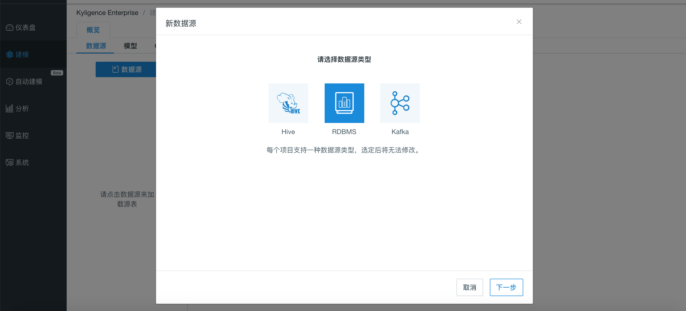
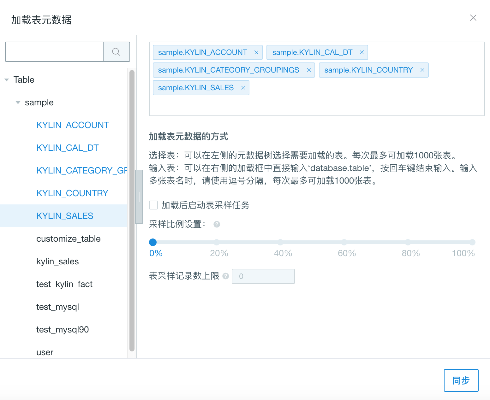

## 导入 RDBMS 数据源

Kyligence Enterprise 可通过 JDBC 接口连接 RDBMS 数据源。

> 注：本文介绍的 RDBMS 连接方案属于二次开发方案，不建议直接在生产环境使用。如果您有需求，请在 Kyligence 服务人员的支持下使用。

### 环境要求

连接 RDBMS 数据源，需要满足以下环境要求：

- 安装 **开源** sqoop client
- 有权限在 sqoop 安装目录下的 lib 目录创建文件

### 准备工作

连接 RDBMS 数据源，需要先完成相关驱动程序准备工作:

- 下载数据源 JDBC Driver，同时放置在 sqoop 安装目录的 lib 目录和`$KYLIN_HOME/ext`目录下
- 从[Kyligence Download](http://download.kyligence.io/#/addons)下载 Data Source Adaptor，并放置在`$KYLIN_HOME/ext`目录下
- 在`kylin.properties`配置文件添加 `kylin.source.jdbc.sqoop-home=<sqoop_path>`，其中 sqoop_path 为 sqoop 命令所在的文件
- 确保 Hadoop 集群中的每个节点都具有访问 RDBMS 数据源的网络端口权限
- 重启 Kyligence Enterprise 生效

> **注意：** 配置项 `kylin.source.jdbc.sqoop-home=<sqoop_path>` 必需配置在`kylin.properties`文件中，不支持项目级配置覆盖。

### 配置连接参数

以下参数需要您配置在连接 RDBMS 数据源的**项目配置**或 `kylin.properties` 中：

| 参数名                           | 解释                          |
| -------------------------------- | ----------------------------- |
| kylin.source.jdbc.driver         | JDBC 驱动类名                 |
| kylin.source.jdbc.connection-url | JDBC 连接字符串               |
| kylin.source.jdbc.user           | JDBC 连接用户名               |
| kylin.source.jdbc.pass           | JDBC 连接密码                 |
| kylin.source.jdbc.dialect        | JDBC 方言                     |
| kylin.source.jdbc.adaptor        | 连接数据源使用的 Data Source Adaptor 类名 |

如果需要开启查询下压，还需要配置以下参数：

```properties
kylin.query.pushdown.runner-class-name=io.kyligence.kap.query.pushdown.PushdownRunnerSDKImpl
```

#### 密码隐私保护

如果您在**项目配置**添加这些参数，当添加了 `kylin.source.jdbc.pass` 配置时，参数的值将会自动进行隐藏处理，如下图：



本产品还支持对密码加密，并将加密后的密文写入配置中，加密步骤如下：
在 `$KYLIN_HOME/tomcat/webapps/kylin/WEB-INF/lib` 目录下运行如下命令，就可得到加密后的密码：

```sh
java -classpath kap.jar:spring-beans-4.3.14.RELEASE.jar:spring-core-4.3.14.RELEASE.jar:commons-codec-1.7.jar org.apache.kylin.rest.security.PasswordPlaceholderConfigurer AES yourpassword
```

加密后的密文是形如 ${xxxxxxxxx} 的格式，您可以使用这段密文配置到 `kylin.source.jdbc.pass` 配置项。

> **注意：** 为了防止系统将用户的原始密码识别为加密后的密码，请您在设置数据库密码时避开 ${xxxxxxxxx} 的格式。

### 为项目设置 RDBMS 数据源

**步骤一**：打开 Kyligence Enterprise 的 Web UI，在主界面的顶端是项目的管理工具栏，点击`＋`即可如下图所示创建一个新的项目。



**步骤二**：进入具体项目**建模**功能，选择**数据源**选项卡；点击蓝色的**数据源**按钮，在弹出窗口中，选择 **RDBMS **作为数据源类型；    

**步骤三**：点击 **下一步** 按钮，进入 **加载 RDBMS 表元数据** 窗口，您可按需在左侧的表清单中，单击选中需要建模的表，也支持输入关键字进行搜索

**步骤四**：点击右下方 **同步** 按钮进行加载



> **提示：** 默认选择**加载后启动表采样任务**。表采样结果能帮助优化后续的模型设计和 Cube 设计，我们强烈建议您启用该选项。

**步骤五**：同步完成后，可以在 **建模** 界面的 **数据源** 面板中，选中具体加载的表，查看表的详细信息。