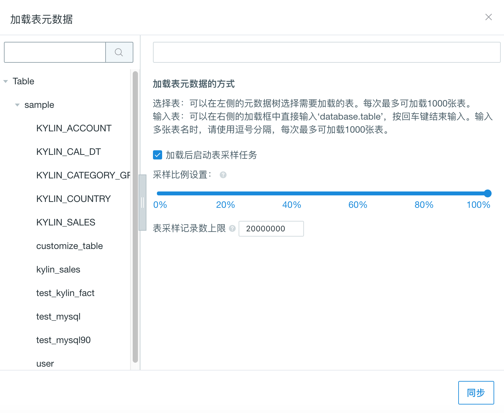

## 导入 Greenplum 数据源

Kyligence Enterprise 从3.0开始支持 Greenplum 作为默认的数据源，目前支持的 Greenplum 版本为5.3.0。需要下载 Greenplum 驱动程序 jar 包，并把 jar 包放置在`$KYLIN_HOME/ext` 目录下。此外，因为Cube构建过程需要使用 **sqoop**，还需要把 jar 包拷贝到 sqoop 安装目录的 lib 目录下。

以下参数需要您配置在连接 RDBMS 数据源的**项目配置**或 `kylin.properties` 中：

| 参数名                           | 解释                                             |
| -------------------------------- | ------------------------------------------------ |
| kylin.source.jdbc.driver         | JDBC驱动类名                                     |
| kylin.source.jdbc.connection-url | JDBC连接字符串                                   |
| kylin.source.jdbc.user           | JDBC连接用户名                                   |
| kylin.source.jdbc.pass           | JDBC连接密码                                     |
| kylin.source.jdbc.dialect        | JDBC方言（目前仅支持default、greenplum两种方言） |
| kylin.source.default             | 使用的数据源种类（RDBMS和Greenplum为16）         |

如果需要开启查询下压，还需要配置以下参数：

```properties
kylin.query.pushdown.runner-class-name=io.kyligence.kap.query.pushdown.PushdownRunnerSDKImpl
```

> **注意：** 除以上项目配置项外，还需要在`kylin.properties`中添加 kylin.source.jdbc.sqoop-home=<sqoop_path>，其中 sqoop_path 为 sqoop 命令所在的文件。


### 创建项目

以 Greenplum 数据源为例，我们使用 PostgreSQL JDBC Driver 来连接 Greenplum 数据源，步骤如下：

**步骤一**：下载 Greenplum Driver 的 jar 包，放置在`$KYLIN_HOME/ext`和 sqoop 安装目录的 lib 目录下。 重启 Kyligence Enterprise 生效。

**步骤二**：打开 Kyligence Enterprise 的 Web UI，在主界面的顶端是项目的管理工具栏，点击“＋”即可如下图所示创建一个新的项目（Project）。 


**步骤三**：在 Web UI 的左上角选择刚刚创建的项目，表示我们接下来的全部操作都在这个项目中，在当前项目的操作不会对其他项目产生影响。 

​    **注意**：当前版本使用 Greenplum 数据源时，需要选择 RDBMS 数据源


**步骤四**：在项目配置中添加以下配置：

```properties
kylin.source.jdbc.driver=com.pivotal.jdbc.GreenplumDriver
kylin.source.jdbc.connection-url=jdbc:pivotal:greenplum://<HOST>:<PORT>;DatabaseName=<DATABASE_NAME>
kylin.source.jdbc.user=<username>
kylin.source.jdbc.pass=<password>
kylin.query.pushdown.runner-class-name=io.kyligence.kap.query.pushdown.PushdownRunnerSDKImpl
kylin.source.jdbc.dialect=greenplum
kylin.source.default=16
kylin.source.jdbc.sqoop-home=/usr/hdp/current/sqoop-client/bin
```

**步骤五**：配置完成之后，就可以通过 Kyligence Enterprise 界面连接 Greenplum 数据源了。


### 同步 Greenplum 表

选择数据源为 RDBMS 后，通过点击 “Table” 来加载我们所需要的表，如下图所示：

在弹出的对话框中展开 sample 数据集，并选择需要的表，如图所示：


> **提示：** 默认选择**加载后启动表采样任务**。 表采样结果能帮助优化后续的模型设计和 Cube 设计，我们强烈建议您启用该选项。
