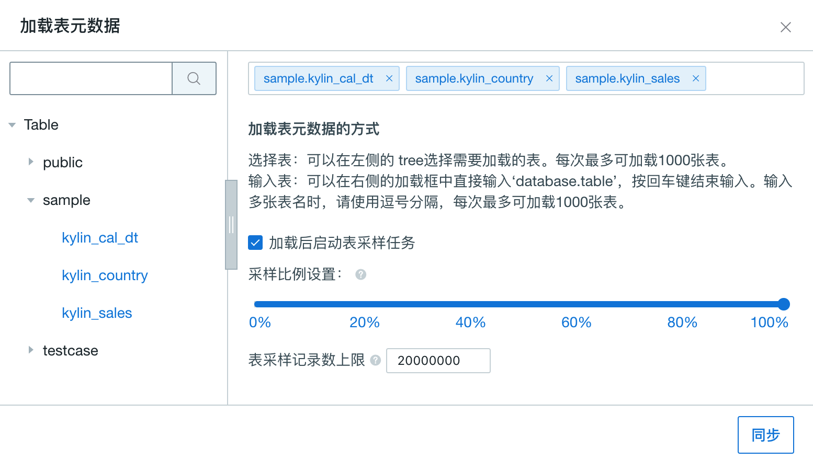

## 导入 Greenplum 数据源

Kyligence Enterprise 从 3.0 版本开始支持 Greenplum 作为数据源，目前支持的 Greenplum 版本为 5.3.0。

您可以参考[连接 RDBMS 数据源](README.md)中的介绍配置连接，本文着重介绍针对 Greenplum 的特殊配置。

> 注：本文介绍的 Greenplum 连接方案属于二次开发方案，不建议直接在生产环境使用。如果您有需求，请在 Kyligence 服务人员的支持下使用。

### 驱动程序

- 使用官方 Greenplum JDBC Driver (推荐版本 gsjdbc4.jar)
- 使用 Kyligence Enterprise 内置的 Data Source Adaptor for Greemplum

### 连接参数配置

请参考[连接 RDBMS 数据源](README.md)中的介绍配置连接参数，以下是一个连接 Greenplum 数据源的配置样例：

```properties
kylin.source.jdbc.driver=com.pivotal.jdbc.GreenplumDriver
kylin.source.jdbc.connection-url=jdbc:pivotal:greenplum://<HOST>:<PORT>;DatabaseName=<DATABASE_NAME>
kylin.source.jdbc.user=<username>
kylin.source.jdbc.pass=<password>
kylin.source.jdbc.dialect=greenplum
<<<<<<< HEAD
kylin.source.default=16
kylin.source.jdbc.sqoop-home=/usr/hdp/current/sqoop-client/bin
```

**步骤五**：配置完成之后，就可以通过 Kyligence Enterprise 界面连接 Greenplum 数据源了。


### 同步 Greenplum 表

选择数据源为 RDBMS 后，通过点击 “Table” 来加载我们所需要的表，如下图所示：

> **提示：** Greenplum中模式、表名和字段名均大小写敏感，当前版本使用 Greenplum 数据源时只支持小写的模式、表名和字段名。


在弹出的对话框中展开 sample 数据集，并选择需要的表，如图所示：



> **提示：** 默认选择**加载后启动表采样任务**。 表采样结果能帮助优化后续的模型设计和 Cube 设计，我们强烈建议您启用该选项。
=======
kylin.source.jdbc.adaptor=io.kyligence.kap.sdk.datasource.adaptor.GreenplumAdaptor
```
>>>>>>> refactor data source content
