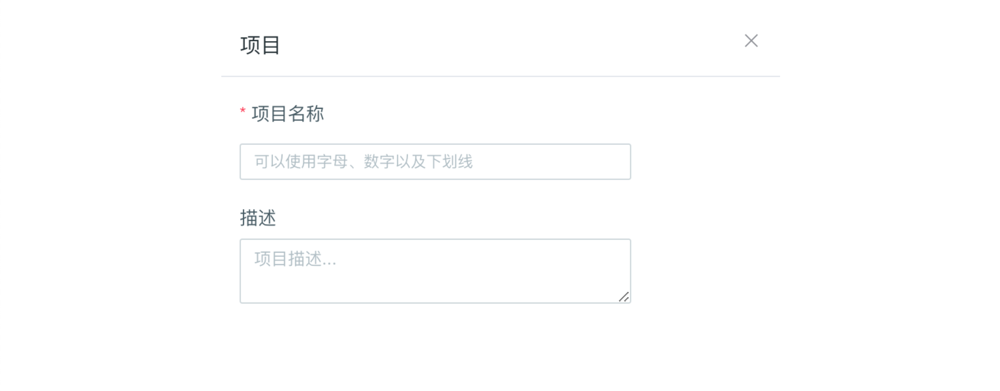
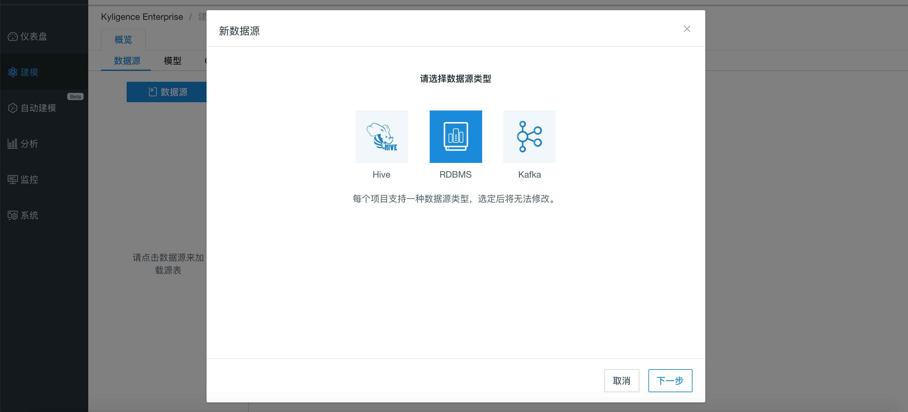

## 导入 Oracle 数据源

Kyligence Enterprise 从3.3.0开始支持 Oracle 作为数据源，目前支持的  Oracle 版本为 Oracle 11g 及更高版本。首先需要下载 Oracle 驱动程序 jar 包，并放置在`$KYLIN_HOME/ext`目录下。推荐的驱动版本为 ojdbc6.jar 及以上版本。


以下参数需要您配置在连接 RDBMS 数据源的**项目配置**或 `kylin.properties` 中：

| 参数名                           | 解释                          |
| -------------------------------- | ----------------------------- |
| kylin.source.jdbc.driver         | JDBC 驱动类名                 |
| kylin.source.jdbc.connection-url | JDBC 连接字符串               |
| kylin.source.jdbc.user           | JDBC 连接用户名               |
| kylin.source.jdbc.pass           | JDBC 连接密码                 |
| kylin.source.jdbc.dialect        | JDBC 方言                     |
| kylin.source.jdbc.adaptor        | JDBC 连接的数据源对应的适配器 |

如果需要开启查询下压，还需要配置以下参数：

```properties
kylin.query.pushdown.runner-class-name=io.kyligence.kap.query.pushdown.PushdownRunnerSDKImplForOracle
```

> **注意：** 除以上项目配置项外，还需要在`kylin.properties`中添加 kylin.source.jdbc.sqoop-home=<sqoop_path>，其中 sqoop_path 为 sqoop 命令所在的文件。


### 为项目设置 Oracle 数据源

Kyligence Enterprise 可以通过如下步骤，为特定项目设置 Oracle 数据源：

**步骤一**：打开 Kyligence Enterprise 的 Web UI，在主界面的顶端是项目的管理工具栏，点击 **＋** 即可如下图所示创建一个新的项目。



**步骤二**：进入具体项目**建模**功能，选择**数据源**选项卡；点击蓝色的**数据源**按钮，在弹出窗口中，选择 **RDBMS** 作为数据源类型；

​    

**步骤三**：在项目配置中添加以下配置：

```properties
kylin.source.jdbc.sqoop-home=/usr/hdp/current/sqoop-client
kylin.source.jdbc.driver=oracle.jdbc.OracleDriver
kylin.source.jdbc.connection-url=jdbc:oracle:thin:@//<host>:<port>/<service_name> 
kylin.source.jdbc.user=<username>
kylin.source.jdbc.pass=<password>
kylin.source.jdbc.dialect=oracle11g
kylin.source.jdbc.adaptor=io.kyligence.kap.sdk.datasource.adaptor.Oracle11gAdaptor
```

**步骤四**：配置完成之后，就可以通过 Kyligence Enterprise 界面连接 Oracle 数据源了。

**步骤五**：进入**加载表元数据**窗口，用户可按需在左侧表清单中，单击选中需要建模的表，也支持输入关键字进行搜索。点击右下方**同步**按钮进行加载。


### 注意事项

- Oracle jdbc 默认会把 `date` 类型转换成 `timestamp`, 就是 Oracle 可以创建 `date` 类型字段，但是通过jdbc获取到默认就是 `timestamp`. 为了避免不一致，尽量在 Oracle 里使用 `timestamp` 来代替 `date` 类型

- Oracle 使用 `number` 类型表示 `integer` 和 `double` 两种类型, 同步到Kyligence Enterprise为 `decimal`, 有些BI工具为因为是`decimal`类型在数字结尾拼接 `.0` 造成显示的不一致

