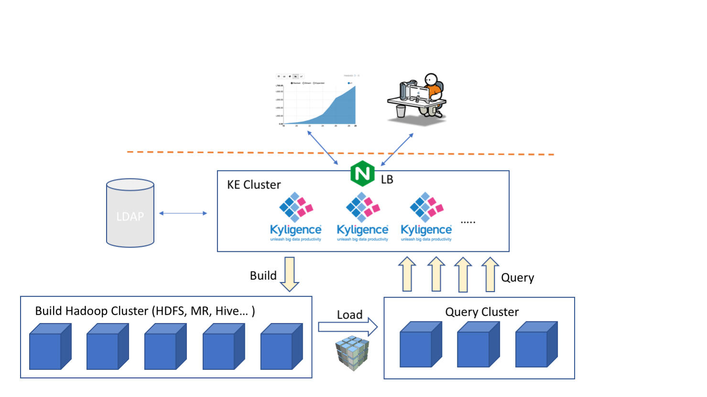

## 读写分离部署
Kyligence Enterprise 读写分离部署需要使用两个 Hadoop 集群，分别称为 **构建集群** 和 **查询集群**。

即使在普通部署方式下，这两个集群也是“逻辑上”存在的，只是在物理上共用同一个 Hadoop 集群而已。Kyligence Enterprise 使用构建集群进行 Cube 构建等任务，同时使用查询集群进行分布式查询计算。前者中存在很多写操作，而后者中则以只读操作为主。如果您需要完全隔离上述两种工作负载，让它们各自独立运行，避免它们之间的相互影响及其可能引发的性能不稳定，那么可以将 **构建集群（写集群）** 和 **查询集群（读集群）** 分开部署，即读写分离部署。

读写分离的部署架构如下图所示。


### 检查和准备工作

读写分离部署将在两个 Hadoop 集群上分别部署 Kyligence Enterprise，下面称这两组将要部署 Kyligence Enterprise 的机器为 **构建服务器** 和 **查询服务器**。

由于牵涉到两套 Hadoop 环境，读写分离部署的环境复杂度较高。**请仔细阅读和执行下述的环境检查**。

1. 请确认要用到的构建集群和查询集群的 Hadoop 版本一致，且满足 Kyligence Enterprise 安装的必要条件。

2. 请确认在**构建服务器**上安装和配置了构建集群的 Hadoop 客户端，并确认`hdfs`、`mapred`、`hive`等命令能够正常使用，且 Hadoop 集群上的服务和资源能够正常访问。

3. 请确认在**查询服务器**上安装和配置了查询集群的 Hadoop 客户端，并确认`hdfs`、`mapred`、`hive`等命令能够正常使用，且 Hadoop 集群上的服务和资源能够正常访问。

4. 在**构建服务器**上，请配置并确认通过 `hdfs` 命令能访问**查询集群** HDFS。

   > 提示：在**构建服务器**上，请确认命令可用：`hadoop fs -ls hdfs://{query-cluster}/`
   >
   > 提示：如果启用了 Hadoop HA，您将需要配置查询集群的 Nameservice。

5. 请确认构建集群和查询集群可以在无须额外验证的情况下互相连通。
   > 提示：您可以尝试从**构建集群**的任一节点上拷贝文件至**查询集群**的任一节点，以验证两个集群之间的安全性和网络连通状况。

6. 由于构建过程会在两个集群之间移动大量数据，请尽量缩短查询集群和构建集群之间的网络延迟。

7. 如果集群开启 Kerberos，需要确保以下配置。
   - 构建集群和查询集群属于不同的域
   - 构建集群和查询集群已配置互信

### 安装和配置读写分离部署

下面说明如何在两个 Hadoop 集群中部署 Kyligence Enterprise 构建服务器和查询服务器，并配置它们协同工作。

1. 首先在**构建服务器**和**查询服务器**上，解压 Kyligence Enterprise 安装包到统一的安装路径下。以下称此安装路径为 `$KYLIN_HOME`。

2. 在**构建服务器**和**查询服务器**上，修改 `$KYLIN_HOME/conf/kylin.properties`，为所有的 Kyligence Enterprise 服务配置相同的元数据仓库和数据存储路径。

   > 注意：此处需使用 JDBC 为元数据仓库，请参阅 [JDBC 元数据仓库的相关配置文档](../../config/metastore_jdbc_mysql.cn.md)。
   > 注意：此处数据存储路径需指向**查询集群** HDFS。

   ```properties
   # 请参阅 JDBC 元数据仓库的相关配置文档
   kylin.metadata.url=...
   
   # 数据存储路径需指向查询集群 HDFS
   kylin.storage.columnar.file-system=hdfs://{query-cluster}:8020/
   kylin.storage.columnar.separate-fs-enable=true
   
   # 请替换为查询集群的 Zookeeper 服务地址，格式为 host1:port1,host2:port2,...
   kylin.env.zookeeper-connect-string=...
   ```

3. 在**构建服务器**和**查询服务器**上，修改 `$KYLIN_HOME/conf/kylin.properties`，为所有的 Kyligence Enterprise 服务配置相同的 Hive 数据源。

   > 注意：下例假设 Hive 使用 Beeline 连接方式。如果您使用 Hive CLI 连接方式，请自行调整。

   ```properties
   kylin.source.hive.client=beeline
   kylin.source.hive.beeline-shell=beeline
   kylin.source.hive.beeline-params=...
   
   # 对于华为 FusionInsight，请打开下面配置
   #kylin.source.hive.table-dir-create-first=true
   ```
   为了性能考虑，我们假设 Hive 数据源在构建集群中。为了让查询服务器能连接构建集群中的 Hive 服务，**请复制构建集群上的 `hive-site.xml` 到查询服务器的 `$KYLIN_HOME/conf` 目录下**。

4. 在**构建服务器**上，修改 `$KYLIN_HOME/conf/kylin.properties`，设置其工作模式。

   ```properties
   kylin.server.mode=job
   ```

5. 在**查询服务器**上，修改 `$KYLIN_HOME/conf/kylin.properties`，设置其工作模式。

   ```properties
   kylin.server.mode=query
   ```

6. 如果集群开启 Kerberos，还需要进行以下配置。

   - 在两个集群上 [配置 Kerberos 集成](../../security/kerberos.cn.md)。并确认：
     - 构建集群和查询集群属于不同的域
     - 构建集群和查询集群已配置互信

   - 在**查询服务器**上，修改 `$KYLIN_HOME/conf/kylin.properties`。
     ```properties
     kap.storage.columnar.spark-conf.spark.yarn.access.namenodes=hdfs://{query-cluster},hdfs://{build-cluster}
     ```

   - 在**构建服务器**上，修改 `$KYLIN_HOME/conf/kylin.properties`。
     ```properties
     kylin.engine.spark-conf.spark.yarn.access.namenodes==hdfs://{query-cluster},hdfs://{build-cluster}
     ```

   - 在**构建服务器**上，修改 `$KYLIN_HOME/conf/kylin_job_conf.xml`。
     ```xml
     <property>
         <name>mapreduce.job.hdfs-servers</name>
         <value>hdfs://{build-cluster}/, hdfs://{query-cluster}/</value>
     </property>
     ```

至此，读写分离配置完毕。请启动 Kyligence Enterprise 查询服务器和构建服务器。