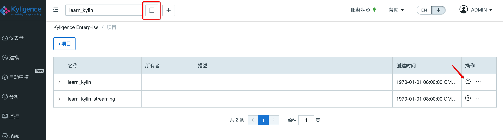
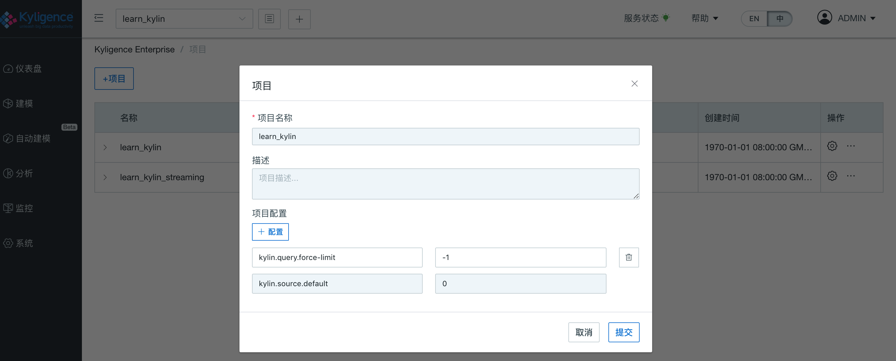
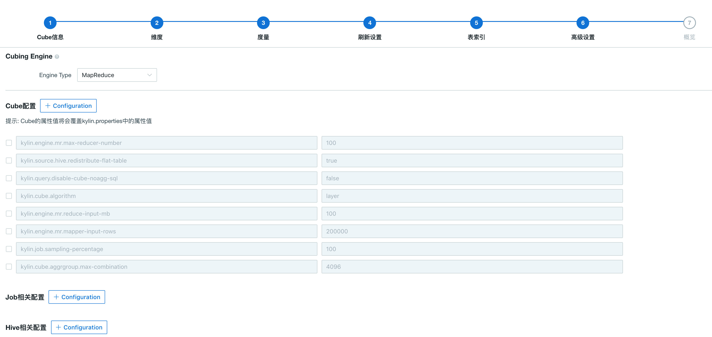
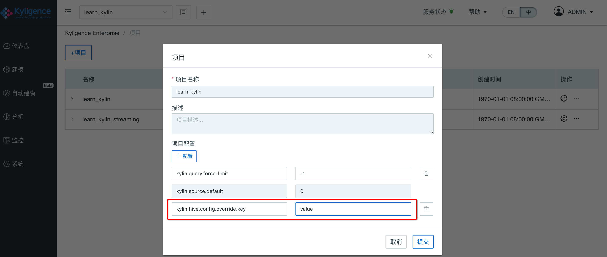
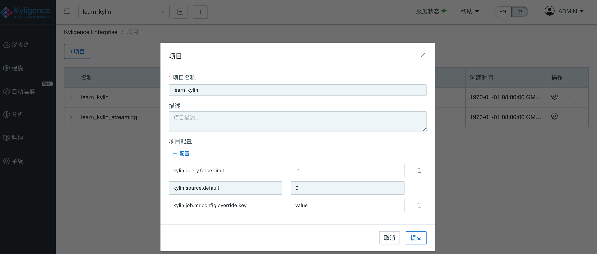

## 多级配置重写

`$KYLIN_HOME/conf/`下的部分配置项可以在 Kyligence Enterprise GUI 中重写。配置重写有两个作用域，分别是 Project 级别和 Cube 级别。Project 级别的配置继承于全局配置文件，Cube 级别的配置继承于 Project.

配置的覆盖优先级关系是：Cube 级别配置项 > Project 级别配置项 > 配置文件。

配置文件主要是``$KYLIN_HOME/conf``文件夹下``kylin.properties``，``kylin_hive_conf.xml``，``kylin_job_conf.xml``和``kylin_job_conf_inmem.xml``。

### 项目配置重写

点击项目列表按钮，进入项目管理（Project Management）页面，该页面可以打开某一项目的编辑页面，继而可以添加配置项。这些配置项将覆盖配置文件中的默认值。

 

> 注意：`kylin.query.force-limit` 仅可在项目级别重写

### Cube 配置重写

在 cube 设计的**高级设置**步骤中，可以添加配置项，这些配置项将覆盖项目级别和配置文件中的默认值。如图所示：

 

### 项目及 Cube 级别配置参数

目前`kylin.properties`中的下列配置项均可以通过 Cube 级别和 Project 级别进行重定义。

- 所有以`kylin.engine.mr.config-override`开头的参数，默认值空字符串；
- `kylin.cube.cuboid-scheduler`，默认值org.apache.kylin.cube.cuboid.DefaultCuboidScheduler；
- `kylin.cube.algorithm`，默认值auto，其它有效值包括inmem，layer；
- `kylin.cube.algorithm.layer-or-inmem-threshold`，默认值7；
- `kylin.cube.aggrgroup.is-mandatory-only-valid`，默认值false；
- `kylin.engine.mr.reduce-input-mb`，默认值500；
- `kylin.engine.mr.max-reducer-number`，默认值500；
- `kylin.engine.mr.mapper-input-rows`，默认值1000000；
- `kylin.hbase.default.compression.codec`，默认值none，其他有效值包括snappy，lzo，gzip，lz4;
- `kylin.job.sampling-percentage`，默认值100；
- `kylin.snapshot.max-cache-entry`，默认值500；
- `kylin.snapshot.max-mb`，默认值300；
- `kylin.storage.hbase.region-cut-gb`，默认值5.0；
- `kylin.storage.hbase.hfile-size-gb`，默认值2.0；
- `kylin.storage.hbase.min-region-count`，默认值1；
- `kylin.storage.hbase.max-region-count`，默认值500；
- `kylin.storage.partition.max-scan-bytes`，默认值3221225472，即3G；
- `kylin.cube.aggrgroup.max-combination`，默认值4096；

  > **注意：** **请勿**将此参数设置 > 10000, 否则将会在计算维度组合时耗用大量CPU与内存资源。易导致页面卡顿，严重或可致 Kyligence Enterprise崩溃。如 Cube 中有大量维度，建议分多个聚合组（AGG）进行优化。

- `kylin.source.hive.flat-table-storage-format`，默认值SEQUENCEFILE，其他有效值为TEXTFILE；

- `kylin.source.hive.flat-table-field-delimiter`，默认值‘ \u001F’，其他有效值为‘\t’，‘\n’；

  > **注意： 只有**`kylin.source.hive.flat-table-storage-format`=TEXTFILE时，配置`kylin.source.hive.flat-table-field-delimiter`才会生效。

- `kylin.snapshot.force-reuse-enabled`，默认值false，是否复用维表快照（snapshot）；

目前只支持在cube级别设置的参数

- `kylin.materialized-view.force-reuse-enabled`，默认值false，是否在构建过程中复用物化视图。对于视图维表，如果选择了以快照（snapshot）形式存储，cube 构建步骤中会首先物化视图，并使用该物化视图构建打平表和快照。本参数设置为 true 时，物化视图将会在当前 cube 所属项目中存储，而不会在构建任务完成后作为临时表被清理。开启了复用物化视图的 cube 将会在其所属项目范围内查找已经物化的视图，并在构建步骤中使用，不再重新物化。可使用刷新维表快照功能更新被复用的物化视图，刷新维表快照功能参见 [Cube与Segment管理](../../model/segment_manage.cn.md) 或 [Segment管理API](../../rest/segment_manage_api.cn.md)。**请勿将此参数配置在系统或项目级别**，否则会导致表采样等功能不可用。

  > **注意： **由于视图维表的快照是使用物化视图构建的，当开启复用物化视图时，如果未开启复用维表快照，多次构建的维表快照将不会有变化。因此存在以快照形式存储的视图维表时，建议同时开启复用物化视图和复用维表快照，使用刷新维表快照功能定期更新物化视图和维表快照。

### 覆盖 Hive 参数

Kyligence Enterprise 支持通过 Kyligence Enterprise GUI 覆盖`kylin_hive_conf.xml`中的参数，以 Key-Value 的形式，按照如下格式替换:

**Cube 级别配置**

kylin.hive.config.override.key = value

**Project 级别配置**

kylin.hive.config.override.key = value

### 覆盖构建相关参数

Kyligence Enterprise 支持通过 Kyligence Enterprise GUI 覆盖`kylin_job_conf.xml`和`kylin_job_conf_inmem.xml`中的参数，以 Key-Value 的形式，按照如下格式替换：

**Cube 级别配置**

kylin.job.mr.config.override.key = value

**Project 级别配置**

kylin.job.mr.config.override.key = value

