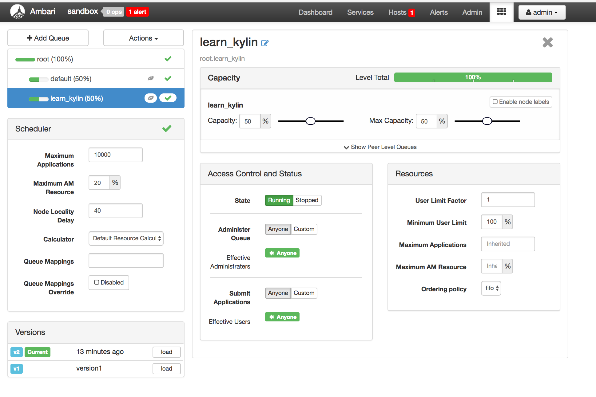
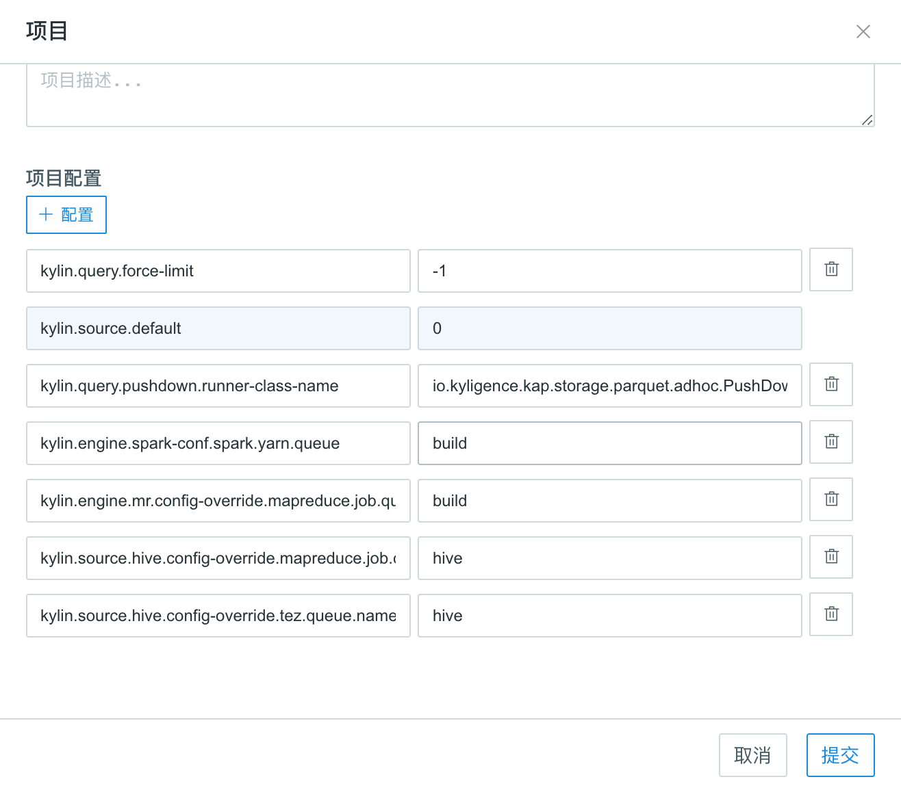
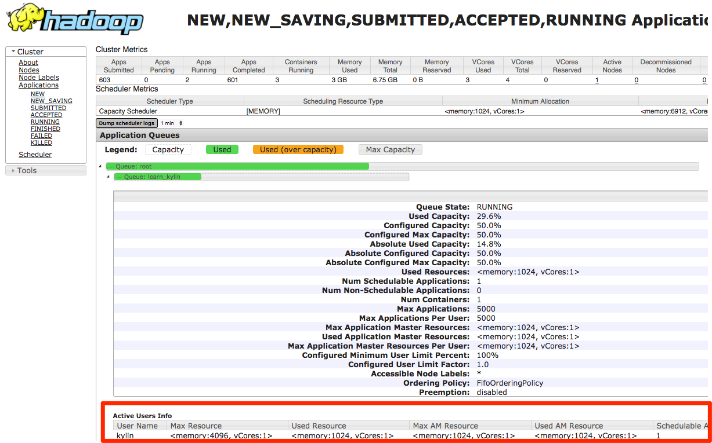

## Hadoop 队列配置


在多租户的场景下，多位租户为了安全地共享一个大型集群，需要对计算资源进行隔离及调配。在每位租户使用单独 Kyligence Enterprise 项目的情况下，Kyligence Enterprise 支持对每个项目单独设置 YARN 队列，以实现计算资源的调配隔离。

默认情况下，Kyligence Enterprise 的构建任务会发送到集群的 `default` 队列中。为每个项目配置单独的队列，首先需要在 YARN 队列中添加一个新的队列。

在下面的截图中，我们创建了一个新的 YARN 队列 `learn_kylin`。



随后，在 Kyligence Enterprise 中配置项目需要使用的队列

1. 在 Kyligence Enterprise 中进入项目配置页面，选择需要配置队列的项目。
2. 点击编辑项目，然后点击 `+property` 添加 key / value 如下。




```shell
# 指定Cube构建引擎的YARN队列
kylin.engine.spark-conf.spark.yarn.queue=YOUR_QUEUE_NAME
kylin.engine.mr.config-override.mapreduce.job.queuename=YOUR_QUEUE_NAME
# 指定Hive执行时的YARN队列
kylin.source.hive.config-override.mapreduce.job.queuename=YOUR_QUEUE_NAME
# HDP平台下需指定Tez执行时的YARN队列
kylin.source.hive.config-override.tez.queue.name=YOUR_QUEUE_NAME
# 指定查询引擎的YARN队列
kap.storage.columnar.spark-conf.spark.yarn.queue=YOUR_QUEUE_NAME
```

将 YOUR_QUEUE_NAME 修改为您配置的 YARN 队列名称。

如上图所示在本例中项目 learn_kylin 的 YARN 队列被改为 `learn_kylin`。我们可以在 learn_kylin 项目中触发一个任务来验证项目的队列是否已被修改。


在 YARN 资源管理器中，可以看到刚才触发的任务已经进入到 `learn_kylin` 队列中。




类似的，您也可以将其他项目配置到不同的 YARN 队列中以实现计算资源的隔离。
