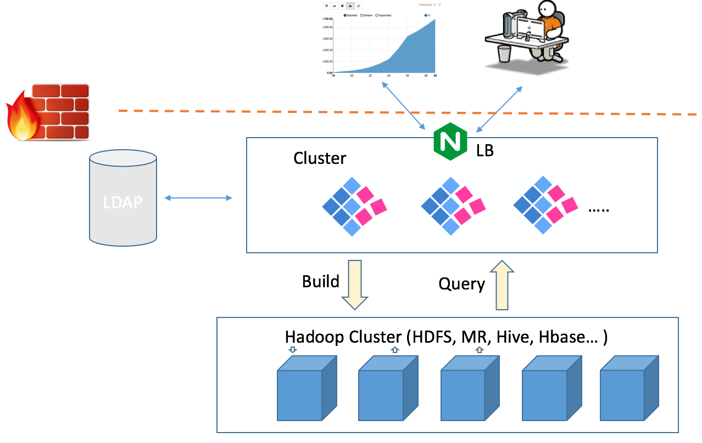

## 集群部署与负载均衡


Kyligence Enterprise 实例是无状态的服务，所有的状态信息都存储在元数据库中（如 HBase，JDBC 数据库）中。因此，您可以启用多个 Kyligence Enterprise 节点以部署负载均衡集群，使各个节点分担查询压力且互为备份，从而提高服务的可用性，其部署架构如图所示：



### Kyligence Enterprise 节点配置

如果您需要将多个 Kyligence Enterprise 节点组成集群，请确保它们使用同一个 Hadoop 集群和元数据库。请执行下面配置：

- 在各 Kyligence Enterprise 节点的`$KYLIN_HOME/conf/kylin.properties` 配置文件中，为各节点配置相同的`kylin.metadata.url`值，即令各 Kyligence Enterprise 节点使用同一个元数据库。

  > 如果您需要启用任务引擎高可用，请参考[服务发现及任务引擎高可用](ha.cn.md)。

### 负载均衡配置

为了将查询请求发送给集群而非单个节点，您应当部署一个负载均衡器（Load Balancer），如 Apache HTTP Server 或 Nginx。负载均衡器采用一定的策略决定将某个请求分发给某个节点，并且在该节点失效时重试其他节点。需要提交查询请求的用户通过负载均衡器的地址来访问 Kyligence Enterprise。为了便于用户和角色的管理，在这样的使用情景下通常会启用 LDAP 安全验证。

以 Nginx 为例，首先您应当为Kyligence Enterprise 站点新建一个配置文件（如 kylin.conf），内容如下：

```shell
upstream kylin {
    server 1.1.1.1:7070; # Kylin Server 1
    server 1.1.1.2:7070; # Kylin Server 2
}
server {
    listen 8080;
    location / {
        proxy_pass http://kylin;
    }
}
```
Nginx 在默认情况下将以轮询的方式分发请求。如果一个 Kyligence Enterprise 实例失效，将会被自动剔除。但在默认情况下，Kyligence Enterprise 用户的 Session 信息是保存在本地的，因此当同一个用户的多个请求发送给不同 Kyligence Enterprise 实例时，并非所有的实例都能识别用户的登陆信息。

对于这种情况，您可以简单地配置 Nginx 使用 ip_hash 的方式，将每个请求按照客户端 ip 的 hash 结果固定地分发至某个 Kyligence Enterprise 实例。

如果您需要回避 ip_hash 可能导致的 Kyligence Enterprise 实例的负载不均衡（例如只有少量应用服务器频繁访问 Kyligence Enterprise，导致大部分查询请求被分发给少数 Kyligence Enterprise 实例），您应当在 Kyligence Enterprise 中进行相关配置，将 Session 信息保存至 Redis 集群（或 MySQL、MemCache 等）中，实现多个 Kyligence Enterprise 实例的 Session 共享。

要配置 Session 共享，请**在所有查询节点上**执行下面步骤：

1. 执行下述命令以下载 Redis Session 共享插件包
   ```sh
   wget https://github.com/ran-jit/tomcat-cluster-redis-session-manager/releases/download/3.0.4/tomcat-cluster-redis-session-manager.zip
   ```

2. 解压包并复制一些文件

   - 将 lib 目录下的 jar 包拷贝到 `$KYLIN_HOME/tomcat/lib/`
   - 将 `redis-data-cache.properties` 拷贝到 `$KYLIN_HOME/tomcat/conf/`

3. 在查询节点的 `$KYLIN_HOME/tomcat/conf/redis-data-cache.properties` 配置文件中，配置 Redis 节点或集群信息，如 `redis.hosts=127.0.0.1:6379`,`redis.password=123456`。
   
   如果您需要对redis密码加密，需要配置`redis.password=${REDIS_PASSWORD}`,并在kylin.properties中配置`kylin.cache.redis.password`
   
   如果您需要配置 Redis 集群，还需要进行如下配置：

   * `redis.hosts=host1:port,host2:port`

   * `redis.cluster.enabled=true`

   如您需要开启更多功能，请参考 [Redis Session Manager 介绍](https://github.com/ran-jit/tomcat-cluster-redis-session-manager)。

4. 在`$KYLIN_HOME/tomcat/conf/context.xml`中追加如下配置：

   ```xml
   <Valve className="tomcat.request.session.redis.SessionHandlerValve" />
   <Manager className="tomcat.request.session.redis.SessionManager" />
   ```

5. 在配置完成后请启动或者重启 Kyligence Enterprise 使配置生效。