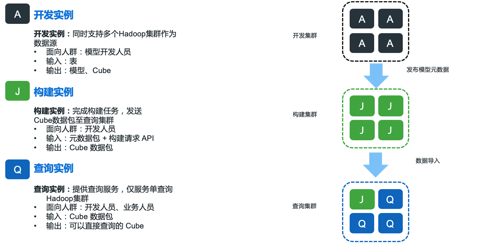

## 跨集群的数据发布流程

在企业级大数据应用平台中，数据发布流程是数据开发和管理中十分重要的一环。通过企业内部制定的发布审核流程，能够更好的保证系统的稳定性。本产品从 v3.3.0 版本开始支持模型开发、数据构建、数据查询三种功能的分离，更好的满足了客户的 IT 流程与企业数据交换的需求。

这里我们以基本的 **模型开发**-**数据构建**-**数据导入和查询** 为例，介绍如何进行完整的数据发布流程。

**模型开发**：对应实例角色建议设置为 **All**，该集群主要用于表采样、构建、查询测试等相关任务，保障用户模型的正确性与合理性。

**数据构建**：对应实例角色为 **Job**，该集群用于构建开发集群所发布的元数据包，构建完成后将生成对应的 Cube 数据文件及元数据文件，简称为 Cube 数据包。

**数据导入和查询**：对应实例角色为 **Query**，需要注意的是在查询集群中仍需要部署一个用于执行同步任务的实例如 **All** / **Job**，该实例将用于执行字典文件同步等操作。通过将 Cube 数据包导入至查询集群后，将自动生成一个同步任务，在该任务完成后即可开始查询。

