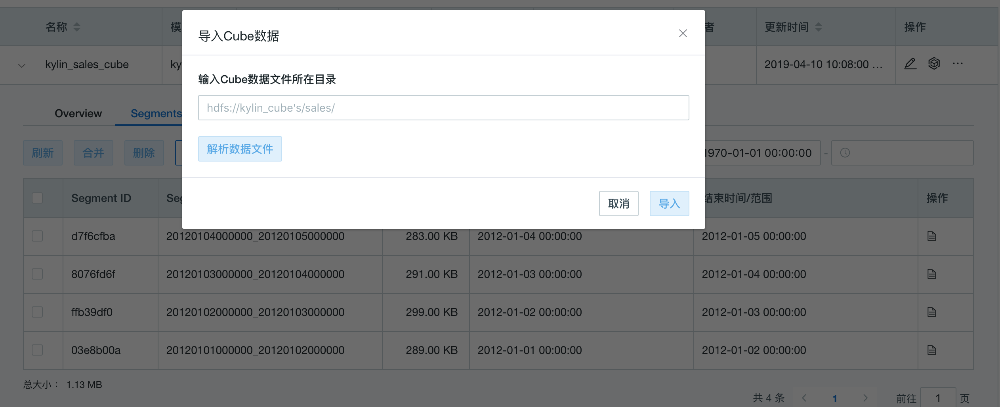

## 数据导入

通过数据构建功能生成的数据文件可以直接导入到查询集群中，完成构建集群发布到生产环境的数据发布过程。该功能支持通过 WEB UI 及 Rest API 两种方式使用。

### 导入构建数据

在 建模 - Cube 页面，展开 Cube 信息后，在 Segment 界面中点击**导入**按键后，弹出如下弹窗。输入Cube数据文件所在目录后，进行解析并导入至 Cube 中，在导入后将自动生成一个导入任务用于更新该 Segment 所需的字典文件等。

> 请注意：此时如果查询集群中没有可用于构建的实例角色（All / Job），将无法完成该任务。




### Rest API

- `POST http://host:port/kylin/api/cubes/segment/import`

- HTTP Header

  - `Accept: application/vnd.apache.kylin-v2+json`
  - `Accept-Language: en`
  - `Content-Type: application/json`

- HTTP Body: JSON Object

  - `hdfsPath` - `必选` `string`，导入的 Cube 数据及元数据路径，需要根据数据构建返回的结果进行填写，如 `hdfs://hacluster/kylin/export_segment/6daadacf-27cf-4590-9c68-12ace64647d3`  

- Curl 请求示例

  ```sh
  curl -X POST \
    'http://host:port/kylin/api/cubes/segment/import' \
    -H 'Accept: application/vnd.apache.kylin-v2+json' \
    -H 'Accept-Language: en' \
    -H 'Content-Type: application/json' \
    -H 'Authorization: Basic QURNSU46S1lMSU4=' \
    -d '{
      "hdfsPath":"hdfs://hacluster/kylin/export_segment/6daadacf-27cf-4590-9c68-12ace64647d3","projectName":"project_test","cubeName":"cube_test"
  }'
  ```

- 响应示例

  ```json
  {
      "code": "000",
      "data": null,
      "msg": ""
  }
  ```