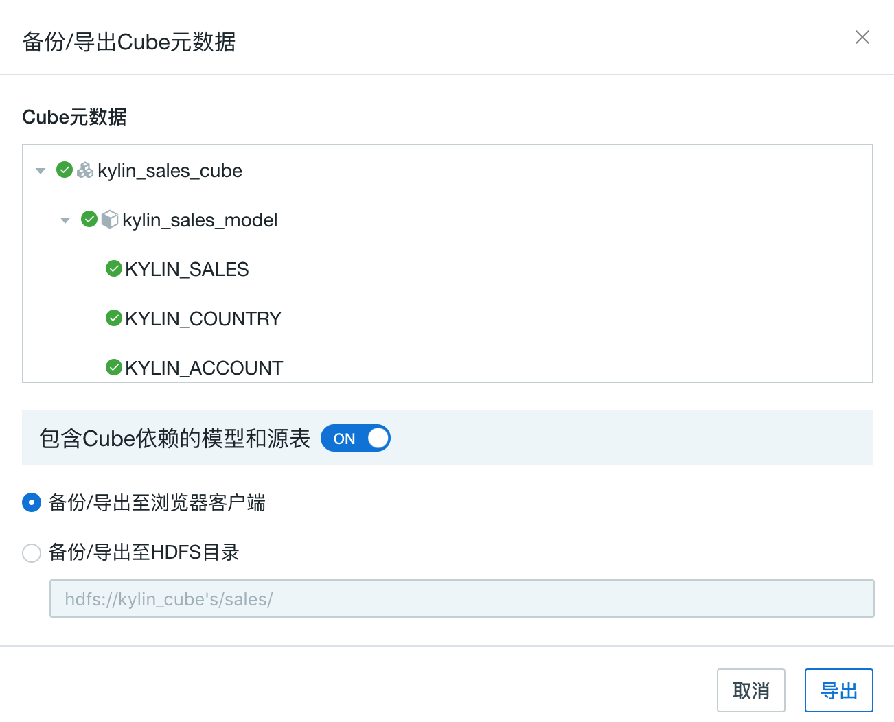

## 模型开发

本产品从 v3.3.0 版本开始支持**系统管理员**或**项目管理员**导入导出 Cube 元数据功能，提供了从开发集群发布至生产集群的能力。该功能提供了 WEB UI 及 Rest API 两种方法。

### 导出 Cube 元数据

在 **建模** - **Cube** -**操作** 菜单栏中点击**备份/导出**后弹出如下窗口。您可以通过该界面预览元数据结构并选择是否导出 Cube 所依赖的模型和源表。如您关闭该开关，系统将仅导出该 Cube 的元数据信息。通常情况下，我们推荐您打开该开关。



同时，系统支持导出至浏览器客户端以及 HDFS 目录，您可以根据业务需求选择导出位置。

### Rest API

- `POST http://host:port/kylin/api/metastore/cube/export`

- HTTP Header
  - `Accept: application/vnd.apache.kylin-v2+json`
  - `Accept-Language: en`
  - `Content-Type: application/x-www-form-urlencoded`

- HTTP Body: x-www-form-urlencoded
  - `cube` - `必选` `string`，需要导出的 Cube名，如 `learn_kylin_cube `
  - `project` - `必选` `string`，导出 Cube 所在的项目名，如 `learn_kylin`
  - `withDependence` - `必选` `boolean`，选择导出是否包含依赖的表，模型等元数据信息。
  - `destPath` - `可选` `string`，导出的 HDFS 路径，如 `hdfs://host:port/kylin/export_cube/`。不选择时直接下载导出的元数据包。
  - `tableMapping['tablename1']` -`可选` `string`，可以将 tablename1 映射为 tablename2，如 tableMapping['tablename1']=tablename2。支持添加多个键值对。

- Curl 请求示例

  ```sh
  curl -X POST \
   'http://host:port/kylin/api/metastore/cube/export' \
   -H 'Authorization: Basic QURNSU46S1lMSU4=' \
   -H 'Content-Type: application/x-www-form-urlencoded' \
   -H 'cache-control: no-cache' \
   -d 		   'cube=learn_kylin_cube&project=learn_kylin&withDependence=true&destPath=hdfs%3A%2F%2Fhost%3Aport%2Fkylin%2Fexport_cube%2F&tableMapping%255Btablename1%255D%2520=tablename2'
  ```

- 响应示例

  ```json
  {
     "code": "000",
     "data": "hdfs://10.1.2.28/kylin/export_cube/learn_kylin.zip",
      "msg": ""
  }
  ```