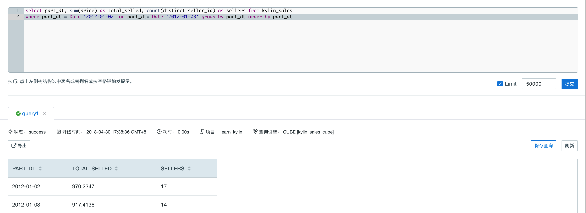

## 安装验证

Kyligence Enterprise 为您提供了一组轻量的样例数据。您可以通过运行示例脚本轻松导入相应的元数据和数据集，以验证安装的正确性。

### 导入样例数据

运行下述命令以导入样例数据：

```shell
$KYLIN_HOME/bin/sample.sh
```

该脚本将会创建 5 个 Hive 表，并将数据导入其中，然后自动创建样例项目、模型和 Cube 定义。

运行成功后，您将在控制台中看到如下提示信息：

```shell
Sample cube is created successfully in project 'learn_kylin'.
Restart Kylin Server or click Web UI => System Tab => Reload Metadata to take effect
```

### 重新加载元数据

请您使用 `ADMIN` 账户登陆 Kyligence Enterprise，进入**系统**页面，点击**重载元数据**，将上一步中导入的元数据加载至系统中。重载成功后请刷新浏览器页面，您将从项目下拉列表中看到名为 `learn_kylin` 的项目。点击以选择该项目，进入下一步。

### 首次构建 Cube

进入**模型**页面，点击 **Cubes** 标签，您将看到名为 `kylin_sales_cube` 的样例 Cube，如图所示：


点击**操作** -> **构建**，选择一个晚于 `2012-01-01` 的结束日期，然后点击**提交**，如图所示：


进入**监控**页面，可以看到正在构建的 Cube 任务，等待任务进度达到100%。


### 执行 SQL

当 Cube 构建任务成功后，进入**查询**页面，您将在页面左侧看到之前导入的 5 个 Hive 表。在右侧的文本框中输入 SQL 语句，即可对样例数据进行查询分析。例如输入下述 SQL 语句：

```sql
select part_dt, sum(price) as total_selled, count(distinct seller_id) as sellers from kylin_sales

where part_dt = Date '2012-01-02' or part_dt= Date '2012-01-03' group by part_dt order by part_dt
```

您将在页面下方看到 Kyligence Enterprise 为您呈现出的查询结果，如图所示：




您也可以使用同样的 SQL 语句在 Hive 上查询，以对比验证查询的结果和响应的速度。

至此 Kyligence Enterprise 的主要功能验证完毕。