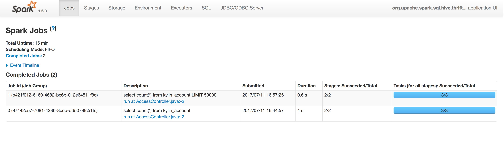

## 下压至外部 SparkSQL

Spark 是用于大数据处理的快速通用引擎，具有用于流计算，SPARK-SQL，机器学习和图形处理的内置模块。

Spark Thrift 使用 Hive JDBC 接口，支持 JDBC 接口的应用可以通过 Hive JDBC 访问 Spark 进行数据查询。

使用外部 SparkSQL 查询下压,需要环境中提供可使用的 Spark Thrift.

#### 下载 Hive JDBC Driver

1. 根据自己 Hadoop 集群 Hive 的版本下载对应版本的[hive-jdbc-version.jar](hive-jdbc.jarhttps://mvnrepository.com/artifact/org.apache.hive/hive-jdbc)，请确保使用的 JDBC 版本不要高于集群的 Hive 版本。建议下载使用和 Hadoop/Hive 版本一致的 Jar 包。
2. 下载[httpclient-version.jar](https://mvnrepository.com/artifact/org.apache.httpcomponents/httpclient)和[httpcore-version.jar](https://mvnrepository.com/artifact/org.apache.httpcomponents/httpcore)。

### 安装 JDBC

把下载好的所有 Jar 包放到 `KYLIN_HOME/ext` 下面，以便让本产品在启动时可以加载 JDBC Driver 。

### 修改kylin.properties

修改 `$KYLIN_HOME/conf/kylin.properties` ，添加以下配置：

- **配置 Hive JDBC driver 和 Pushdown Runner:**

  ``kylin.query.pushdown.runner-class-name=org.apache.kylin.query.adhoc.PushDownRunnerJdbcImpl``

  ``kylin.query.pushdown.jdbc.driver=org.apache.hive.jdbc.HiveDriver``

- **配置 JDBC URL**
  - 以下配置中 spark_host 为 Spark Thrift 所在节点的 hostname,spark_hs2_port 是 Spark Thrift 的端口.
  - 访问没有 kerberos 安全认证的 Spark Thrift，例如(访问 default 库):``kylin.query.pushdown.jdbc.url=jdbc:hive2://spark_host:spark_hs2_port/default``
  - 访问带有 kerberos 安全认证的 Spark Thrift: 访问带有 kerberos 认证 Spark Thrift 需要 JDBC Client 端包含 Spark Thrift(principal=<Spark-Kerberos-Principal>)principal 在 JDBC url中，例如(访问 default 库):``kylin.query.pushdown.jdbc.url=jdbc:hive2://spark_host:spark_hs2_port/default;principal=Spark-Kerberos-Principal``
      - 请确保本产品能都读取到的 hive-site.xml 中打开了 hive-server2 的 kerberos 认证:

          ```xml
          <property>
          	<name>hive.server2.authentication</name>
          	<value>kerberos</value>
          </property>
          ```
          在初始化 hive-jdbc connection 前，本产品 需要具有有效的 kerberos ticket，**请确保 klist 中存在有效的 principal** 能够访问 Spark Thrift。

          ​

> **注意：** 如果使用的环境没有 Spark Thrift 时，配置用户名与密码的方式为将下列参数在配置文件 `kylin.properties` 添加并重启本产品。

```properties
kylin.query.pushdown.jdbc.username
#Jdbc对应数据库的用户名

kylin.query.pushdown.jdbc.password
#Jdbc对应数据库的密码，默认为空字符串
```


### 验证 Thrift server

- 在以下位置中寻找 beeline 并启动:``${HIVE_HOME}/bin/beeline 或者 ${SPARK_HOME}/bin/beeline``，其中，``Hive_HOME``和``SPARK_HOME``为环境变量地址。

- 使用 beeline 连接 Spark Thrift ```!connect ${kylin.query.pushdown.jdbc.url}```，其中``kylin.query.pushdown.jdbc.url``为Kylin pushdown的JDBC URL地址。


- 使用简单 SQL 进行测试是否可用。

### 验证 Query Pushdown

启动本产品，在 Insight 界面进行一些简单查询。

Spark web 页面中能够找到刚才的查询，表示本产品能够正常连接 Spark Thrift。

 


