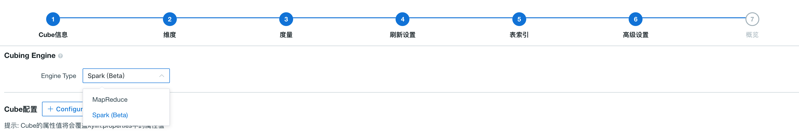
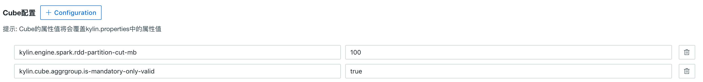
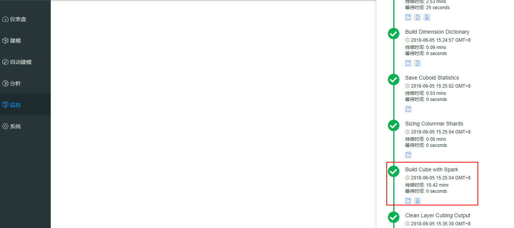

## 配置 Spark 构建引擎

Kyligence Enterprise 中提供两种构建引擎用于构建 Cube。它们分别是：MapReduce 和 Spark。默认情况下，Kyligence Enterprise 使用 MapReduce 来构建 Cube，但是您也可以选择 Spark 作为构建引擎。

本文介绍如何配置 Spark 构建引擎。

### 前置条件

要在 Yarn 上运行 Spark，需要指定环境变量 `HADOOP_CONF_DIR`，即用于存放 Hadoop 客户端配置文件的目录。在许多 Hadoop 发行版中，该目录为`/etc/hadoop/conf`。但 Kyligence Enterprise 不仅需要访问 HDFS、Yarn 和 Hive，而且需要访问 HBase（如果HBase是元数据存储），所以该默认目录不一定包含所有必需的文件。在这种情况下，需要创建一个新目录，然后将这些客户端文件（core-site.xml、hdfs-site.xml、yarn-site.xml、hive-site.xml 和 hbase-site.xml）拷贝到该目录或为它们建立链接。

> **提示**：在 HDP 2.4 中，hive-tez 与 Spark 之间有冲突，因此在拷贝时，需要将默认引擎由“tez”更改为“mr”。

```shell
mkdir $KYLIN_HOME/hadoop-conf
ln -s /etc/hadoop/conf/core-site.xml $KYLIN_HOME/hadoop-conf/core-site.xml
ln -s /etc/hadoop/conf/hdfs-site.xml $KYLIN_HOME/hadoop-conf/hdfs-site.xml
ln -s /etc/hadoop/conf/yarn-site.xml $KYLIN_HOME/hadoop-conf/yarn-site.xml
ln -s /etc/hbase/2.4.0.0-169/0/hbase-site.xml $KYLIN_HOME/hadoop-conf/hbase-site.xml
cp /etc/hive/2.4.0.0-169/0/hive-site.xml $KYLIN_HOME/hadoop-conf/hive-site.xml
# change "hive.execution.engine" value from "tez" to "mr"
vi $KYLIN_HOME/hadoop-conf/hive-site.xml
```

然后在 `kylin.properties` 中设置 `kylin.env.hadoop-conf-dir`：

```properties
kylin.env.hadoop-conf-dir=$KYLIN_HOME/hadoop-conf
```
> 注意：请将这里的 ` $KYLIN_HOME/hadoop-conf` 替换为绝对路径

如果未设置该属性，Kyligence Enterprise 将自动寻找环境中 Hive 使用的配置目录（一般包含`hive-site.xml`等其它配置文件），而该文件夹可能不包含`hbase-site.xml`，这样在 Spark 中可能会发生 HBase/Zookeeper 连接错误。

### 检查 Spark 配置

Kyligence Enterprise 将 Spark 二进制包存放在 `$KYLIN_HOME/spark` 中，所有 Spark 配置在`$KYLIN_HOME/conf/kylin.properties` 中被托管，其前缀为 `kylin.engine.spark-conf`。 在运行提交 Spark 的任务时，这些属性将被提取出来使用，例如，如果配置 `kylin.engine.spark-conf.spark.executor.memory=4G`，在执行 `spark-submit` 时，Kyligence Enterprise 将使用 `–conf spark.executor.memory=4G` 作为参数。

在使用 Spark 进行 Cube 构建之前，建议查看以下配置，并根据实际集群情况进行修改。下面是默认配置，也是用于 sandbox 的最小配置（1 个 executor 占用 1GB 内存）。通常在真实集群中，需要更多 executor，每个至少占用 4GB 内存和 2 个 core：

```properties
kylin.engine.spark-conf.spark.master=yarn
kylin.engine.spark-conf.spark.submit.deployMode=cluster
kylin.engine.spark-conf.spark.yarn.queue=default
kylin.engine.spark-conf.spark.executor.memory=1G
kylin.engine.spark-conf.spark.executor.cores=2
kylin.engine.spark-conf.spark.executor.instances=1
kylin.engine.spark-conf.spark.eventLog.enabled=true
kylin.engine.spark-conf.spark.eventLog.dir=hdfs\:///kylin/spark-history
kylin.engine.spark-conf.spark.history.fs.logDirectory=hdfs\:///kylin/spark-history

#kylin.engine.spark-conf.spark.io.compression.codec=org.apache.spark.io.SnappyCompressionCodec

## uncomment for HDP
#kylin.engine.spark-conf.spark.driver.extraJavaOptions=-Dhdp.version=2.4.0.0-169
#kylin.engine.spark-conf.spark.yarn.am.extraJavaOptions=-Dhdp.version=2.4.0.0-169
#kylin.engine.spark-conf.spark.executor.extraJavaOptions=-Dhdp.version=2.4.0.0-169
```

> 注意：为了在 Hortonworks 平台上运行，需要为 YARN 容器指定 `hdp.version` 作为 Java 选项，因此需要在 `kylin.properties` 中删除后三行的注释，**并将其中的HDP版本号替换为您自己的相应版本**。

此外，为了避免重复将 Spark JAR 上传到 YARN，可以手动配置 JAR 在 HDFS 中的位置。注意 HDFS 位置需要完全限定的名称。

```
jar cv0f spark-libs.jar -C $KYLIN_HOME/spark/jars/ .
hadoop fs -mkdir -p /kylin/spark/
hadoop fs -mkdir -p /kylin/spark-history
hadoop fs -put spark-libs.jar /kylin/spark/
```

> 注意： 在 MapR 平台中， 上传 Spark Jar 包步骤必须要在执行了 `$KYLIN_HOME/bin/check-env.sh` 或 `$KYLIN_HOME/bin/kylin.sh start` 之后执行 

这样，`kylin.properties` 中的配置将变为：

```properties
kylin.engine.spark-conf.spark.yarn.archive=hdfs://sandbox.hortonworks.com:8020/kylin/spark/spark-libs.jar
kylin.engine.spark-conf.spark.driver.extraJavaOptions=-Dhdp.version=2.4.0.0-169
kylin.engine.spark-conf.spark.yarn.am.extraJavaOptions=-Dhdp.version=2.4.0.0-169
kylin.engine.spark-conf.spark.executor.extraJavaOptions=-Dhdp.version=2.4.0.0-169
```

所有 `kylin.engine.spark-conf.*` 参数均可在 Cube 级别或项目级别被替换，为用户提供更多的灵活性，方便使用。

### 配置验证

在执行完上述配置之后，我们来验证一下上述配置。在 Cube 设计的第 6 步**高级设置**中选择 **Spark (Beta)** 作为 Cube 构建引擎。



点击 Cube 默认配置旁的 **+** 号，添加以下配置：

```properties
kylin.engine.spark.rdd-partition-cut-mb=100
kylin.cube.aggrgroup.is-mandatory-only-valid=true
```



然后点击**下一步**->**保存**。Spark 构建引擎配置完毕。

返回 Cube 页面，启动一次新的构建，在**监控**页面上点击该 Cube 的**进度/状态**条，可以看到 Cube 的构建引擎为 Spark：




### FAQ

**Q：如果在 CDH 环境下，使用 Spark 构建，出现如下报错：java.lang.UnsatisfiedLinkError: org.apache.hadoop.util.NativeCodeLoader.buildSupportsSnappy()Z**

请在 `kylin.properties` 文件中，配置如下参数
```properties
kylin.engine.spark-conf.spark.executor.extraJavaOptions="-Djava.library.path=/opt/cloudera/parcels/CDH/lib/hadoop/lib/native"
kylin.engine.spark-conf.spark.driver.extraJavaOptions="-Djava.library.path=/opt/cloudera/parcels/CDH/lib/hadoop/lib/native"
```

**Q：如果在 MapR 环境下， 使用 Spark 构建，出现如下报错：java.io.IOException: Could not create FileClient**

请在 `kylin.properties` 文件中， 检查参数 `kylin.engine.spark-conf.spark.yarn.archive` 中配置的 IP 地址（或域名）以及端口是否与 `/opt/mapr/conf/mapr-cluster.conf` 中保持一致
