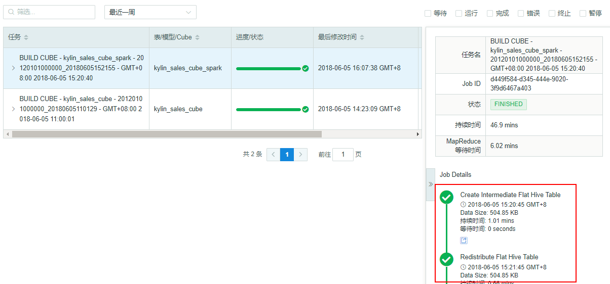

## 构建 Cube 过程中使用 SparkSQL

Kyligence Enterprise 在 Cube 构建过程中，默认应用 Hive 来做部分预计算。SparkSQL 在 Hive 上有更好的性能，所以使用 Spark SQL 可能会在特定步骤中提高构建速度。



### 配置 SparkSQL

**HDP / CDH / FusionInsight 平台：**

请按照下列步骤，在 Cube 的构建中启用 SparkSQL：

1. 要在 Yarn 上运行 Spark，需要指定环境变量 `HADOOP_CONF_DIR`，即用于存放 Hadoop 客户端配置文件的目录。在许多 Hadoop 发行版中，该目录通常为`/etc/hadoop/conf`。因此我们推荐您在 Kyligence Enterprise 的根目录下创建一个目录并链接这些配置文件，来保证 Kyligence Enterprise 能够访问所有需要的服务。

   ```shell
   mkdir $KYLIN_HOME/hadoop-conf
   ln -s $HADOOP_CONF_DIR/core-site.xml $KYLIN_HOME/hadoop-conf/core-site.xml
   ln -s $HADOOP_CONF_DIR/hdfs-site.xml $KYLIN_HOME/hadoop-conf/hdfs-site.xml
   ln -s $HADOOP_CONF_DIR/yarn-site.xml $KYLIN_HOME/hadoop-conf/yarn-site.xml
   ln -s $HBASE_HOME/hbase-site.xml $KYLIN_HOME/hadoop-conf/hbase-site.xml
   cp /$HIVE_HOME/conf/hive-site.xml $KYLIN_HOME/hadoop-conf/hive-site.xml
   ```

   > 注意：在某些发行版中，如 HDP 2.4，您还需要在 `hive-site.xml` 文件中将 Hive 的默认引擎由 `tez` 修改为 `mr`。
   >
   > ```xml
   > <property>
   > 	<name>hive.execution.engine</name>
   > 	<value>mr</value>
   > </property>
   > ```

2. 在`$KYLIN_HOME/conf/kylin.properties`进行如下设置：

   ```properties
   kylin.source.hive.enable-sparksql-for-table-ops=true
   kylin.env.hadoop-conf-dir=$KYLIN_HOME/hadoop-conf
   ```

   > 注意：请将这里的 ` $KYLIN_HOME/hadoop-conf` 替换为绝对路径。参数 ` kylin.source.hive.enable-sparksql-for-table-ops=true ` 支持在项目或 cube 级别设置，操作方式参见 [多级配置重写](../config/config_override.cn.md)。

**MapR 平台：**

对 MapR 环境，在 Cube 的构建中启用 SparkSQL，只需要在 `$KYLIN_HOME/conf/kylin.properties`中，或项目中，或 cube 级别进行如下设置：

   ```properties
   kylin.source.hive.enable-sparksql-for-table-ops=true
   ```

> **注意：**MapR 平台启动 Kyligence Enterprise 前需要指定 `$SPARK_HOME` 为系统的 Spark 安装路径。

### 验证 SparkSQL

当配置完上述配置后，可以运行 Kyligence Enterprise 自带的检测脚本来验证是否配置成功。

```shell
$KYLIN_HOME/bin/spark-test.sh test
```

> **注意：**执行此检测脚本，需要在 `$KYLIN_HOME/conf/kylin.properties` 中配置 ` kylin.source.hive.enable-sparksql-for-table-ops=true `

当您看到如下输出时，代表已经配置成功。

```shell
...
Starting test spark with conf
...
====================================
Testing spark-sql...
19/01/16 07:55:50 WARN ObjectStore: Version information not found in metastore. hive.metastore.schema.verification is not enabled so recording the schema version 1.2.0
19/01/16 07:55:51 WARN ObjectStore: Failed to get database default, returning NoSuchObjectException
19/01/16 07:56:02 WARN Utils: Your hostname, maprdemo resolves to a loopback address: 127.0.0.1; using 10.1.2.223 instead (on interface eth0)
19/01/16 07:56:02 WARN Utils: Set SPARK_LOCAL_IP if you need to bind to another address
Time taken: 1.597 seconds
...
```

