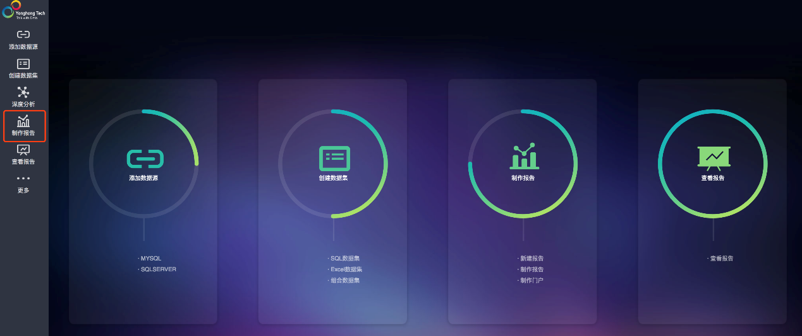

## 与 Yonghong BI 集成

Yonghong BI 为用户提供了一站式的大数据分析平台。本文将分步介绍如何使用 Kyligence Enterprise 与 Yonghong BI 集成。

### **前置条件**

* 安装 Yonghong BI Z-Suite。有关安装信息，请参考 [Yonghong 帮助中心](https://www.yonghongtech.com/help/Z-Suite/8.5/ch/)。

* 安装 Kyligence JDBC 驱动程序

  1. 获取 Kyligence JDBC 驱动程序。有关信息，请参考 [Kyligence JDBC 驱动程序教程](../driver/jdbc.cn.md)。

  2. 向 Yonghong BI 添加 JDBC 驱动程序。拷贝 JDBC 驱动程序至安装路径，如  `Yonghong/Yonghong/lib/jdbcDriver/` 。

  > **提示**：由于 Yonghong BI 内置了 Apache Kylin 的 JDBC 驱动，防止驱动冲突，建议将其移除后再添加 Kyligence Enterprise JDBC 驱动。

### 新建 Kyligence Enterprise 数据源

在首页选择**添加数据源**，点击进入 - 选择 Kylin：

输入连接属性等连接信息后，点击**测试连接**，成功后请点击**保存**：

### 新建数据集

在首页选择**创建数据集**模块，点击进入-选择 **SQL 数据集**：

选择已经创建好的Kyligence Enterprise数据源，输入自定义SQL语句，点击**刷新元数据**后进行保存；

### 制作报告

在首页选择**制作报告**，点击进入，选择主题，新建报告：

数据集处选择保存好的查询，拖拽字段即可设计报告：

报告创建完成后，请点击预览报告。至此，你将可以在 Yonghong BI 中查看 Kyligence Enterprise 数据。

