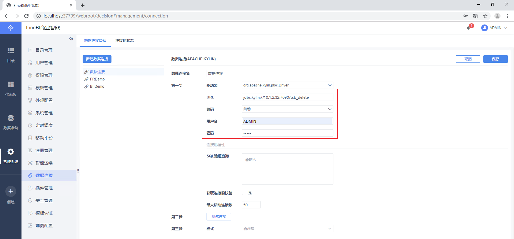
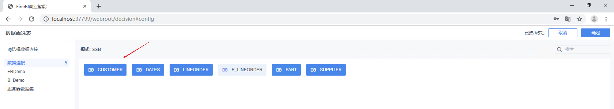

## 与 FineBI 集成

帆软是国内最大、实力最强的 Web 报表工具、商业智能等数据类产品研发的公司。旗下产品 FineBI 是新型商业智能软件优秀代表。帆软产品被成功实施于上万个信息化应用项目，客户遍及各行各业，每天有超过 50 万人通过帆软的产品来查阅、填报、分析数据。Kyligence Enterprise 支持与 FineBI 4.1，5.1 产品集成。本文将分别介绍集成操作。

### 安装 FineBI

有关 FineBI 的安装说明，请访问 [FineBI 下载页面](http://www.finebi.com/product/download/)。

> 注意：仅支持 Windows，Linux 版 FineBI

### 安装 Kyligence JDBC 驱动程序

FineBI 通过 JDBC 连接 Kyligence Enterprise，所以首先需要在 FineBI 上安装 Kyligence JDBC 驱动程序。

1.  获取 Kyligence JDBC 驱动程序

   请参考 [Kyligence JDBC 驱动程序说明](../driver/jdbc.cn.md)。

2. 向 FineBI 增加 JDBC 驱动程序

​       Windows 版：拷贝 JDBC 驱动程序到 `安装路径\webapps\webroot\WEB-INF\lib`

​       Linux 版：拷贝 JDBC 驱动程序到 `安装路径\webapps\webroot\WEB-INF\lib`

### 建立 Kyligence Enterprise 数据源连接

1. 新建数据源

   在主页面选择**管理系统->数据连接**。

   

   点击**新建数据连接**，选择 **APACHE KYLIN**。

   

2. 保存数据源

   将服务器 IP 地址等信息填写到连接字符串，字符串格式为：

   ```sh
   jdbc:kylin://<hostname>:<port>/<project_name>
   ```
   
   然后填写用户名和密码。
   
   
   
   **注意**：由于 FineBI 若开启获取连接前校验的选项会不使用数据库名发送侦测查询，且该配置从5.1开始默认开启，所以在测试连接前请确认关闭了该选项。
   
   
   
   然后点击测试连接，测试成功后点击确定保存数据源连接。
   
   

### 新建业务包

1. 在主页面选择**数据准备->添加业务包**，新建一个业务包。

   

2. 点击新增的业务包，进入业务包编辑页面。

   

3. 点击**添加表->数据库表**。

   

4. 点击需要加入数据库的表，点击确定，将需要的表添加到业务包中。

   

5. 为了将查询推送到 Kyligence Enterprise 中，选择实时数据

   

6. 点击管理视图，可以定义表间关联。

   

### 添加自助数据集

1. 点击**创建->添加自助数据集**，并且选择位置为您刚才新建的业务包

   

2. 从各张表中选择需要的列，点击保存

   

### 在仪表盘中使用数据

1. 在主页面选择**创建->新建仪表板**，新建一个仪表板。

   

2. 点击**添加组件->选择创建的业务包->选择数据集或者表**，即可开始分析。

   
