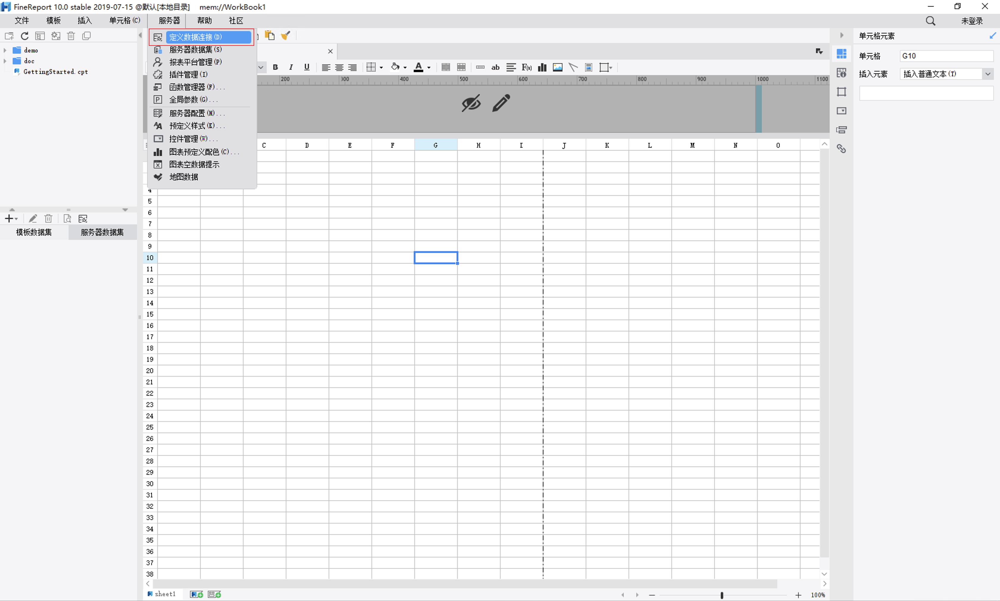
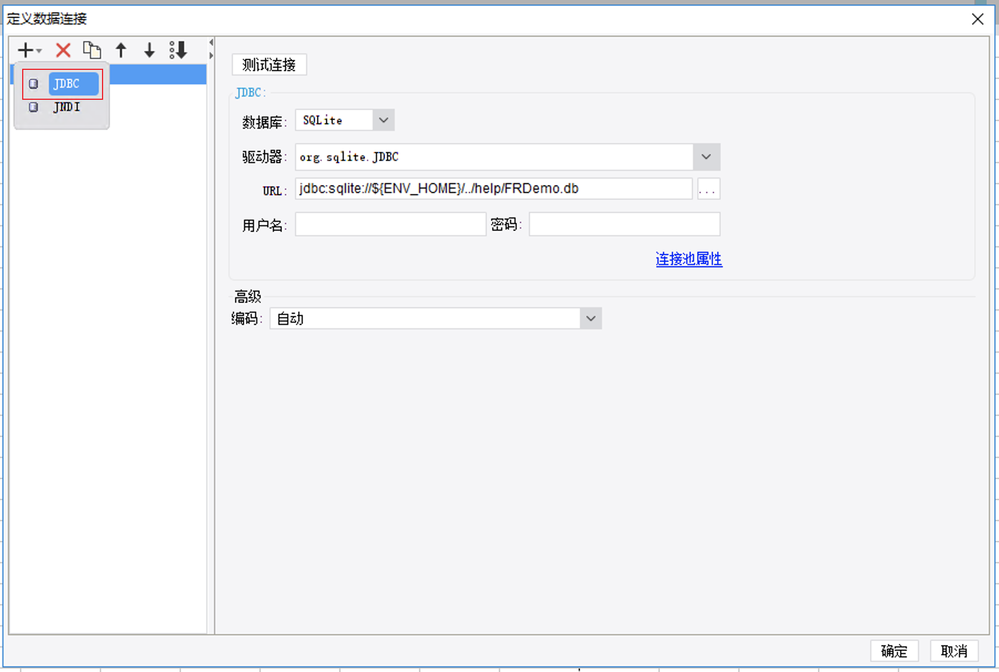
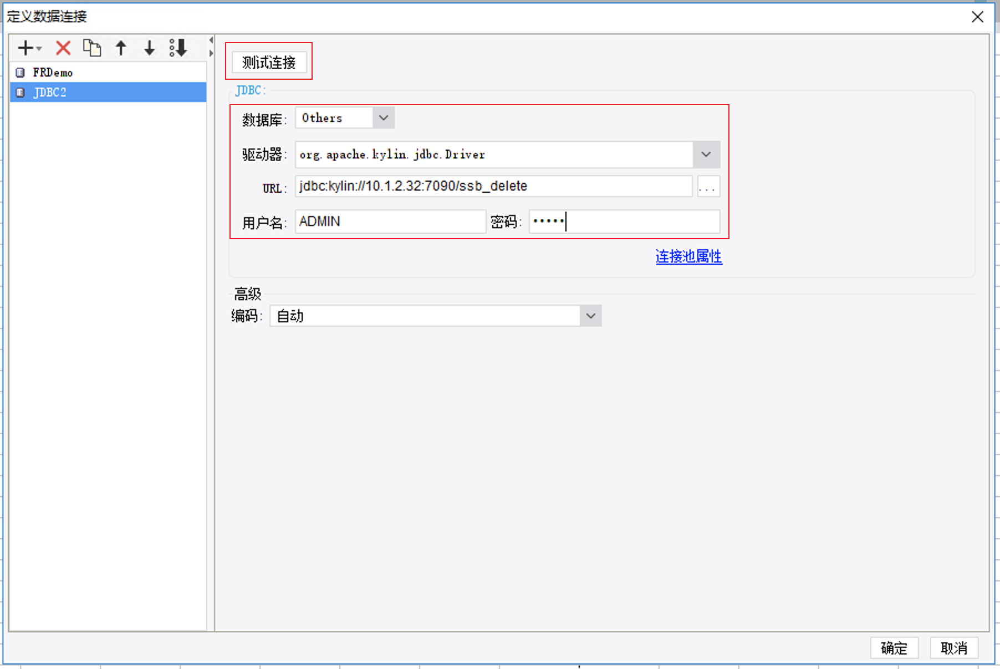
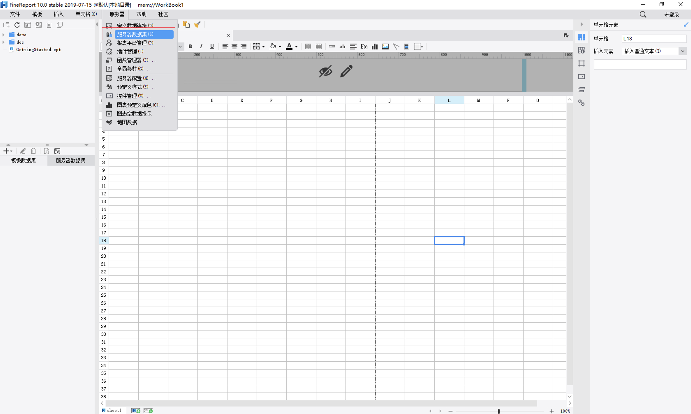
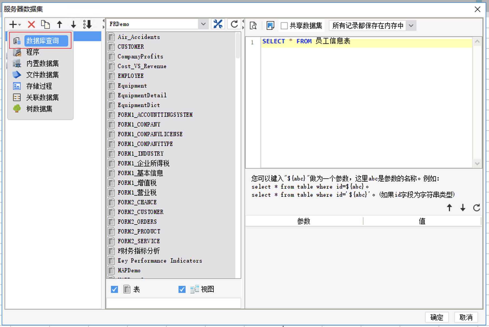
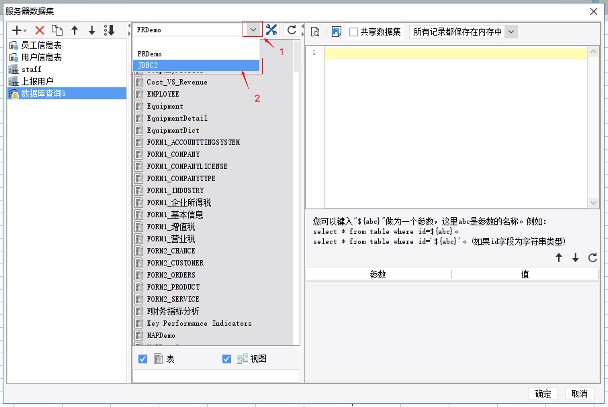
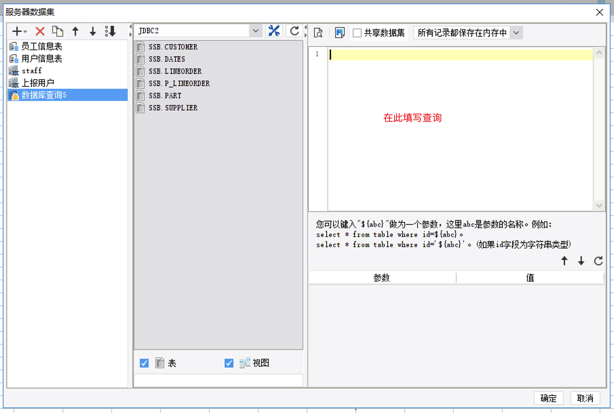
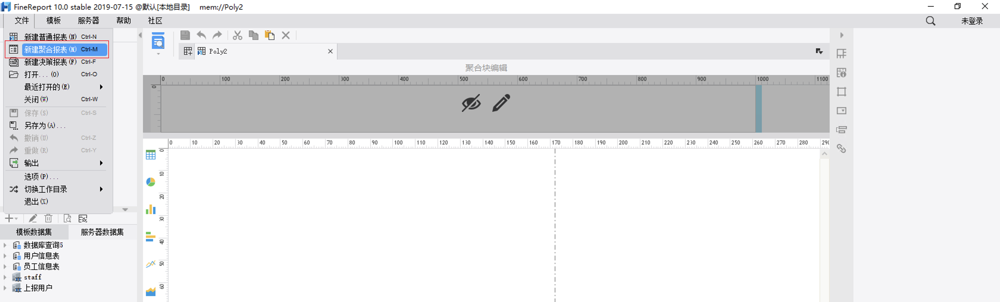
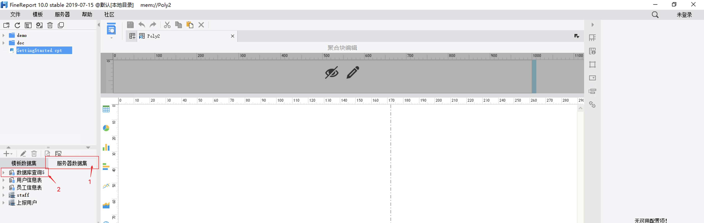

## 与帆软集成

帆软是国内最大、实力最强的 Web 报表工具、商业智能等数据类产品研发的公司。旗下产品 FineReport 是中国报表软件著名品牌。帆软产品被成功实施于上万个信息化应用项目，客户遍及各行各业，每天有超过 50 万人通过帆软的产品来查阅、填报、分析数据。近日，Kyligence 已认证帆软旗下 FineReport（9.0版本）产品。本文将分别介绍 Kyligence Enterprise 与 FineReport 的集成。

### 安装 FineReport

有关 FineReport 的安装说明，请访问 [FineReport 下载页面](http://www.finereport.com/product/download)。

### 安装 Kyligence JDBC 驱动程序

FineReport 通过 JDBC 连接 Kyligence Enterprise，所以首先需要在 FineReport 上安装 Kyligence JDBC 驱动程序。

1. 获取 Kyligence JDBC 驱动程序

   请参考 [Kyligence JDBC 驱动程序说明](../driver/jdbc.cn.md)。

2. 向 FineReport 增加 JDBC 驱动程序

   拷贝 JDBC 驱动程序到**安装路径 \webapps\webroot\WEB-INF\lib**路径下，然后重启设计器。

### 建立 Kyligence Enterprise 数据源连接

1. 在主页面选择**服务器->定义数据连接**，

   

2. 选择新建 JDBC 数据源

   

3. 选择数据库类型为 Others，驱动器填写：org.apache.kylin.jdbc.Driver，URL填写：```jdbc:kylin://<hostname>:<port>/<project_name>```，填写用户名、密码，然后点击测试连接，连接成功后点击确定保存。

   

### 建立 Kyligence Enterprise 数据集

1. 在主页面选择**服务器->服务器数据集**

   

2. 选择新建数据库查询

   

3. 数据源选择 Kyligence Enterprise 的数据源

   

4. 然后将编辑查询语句

   

### 制作报表

1. 在主页面选择**文件->新建聚合报表**

   

2. 从服务器数据集中，选择 Kyligence Enterprise 的数据集，编辑报表，自由使用 Kyligence Enterprise 中的数据。

   