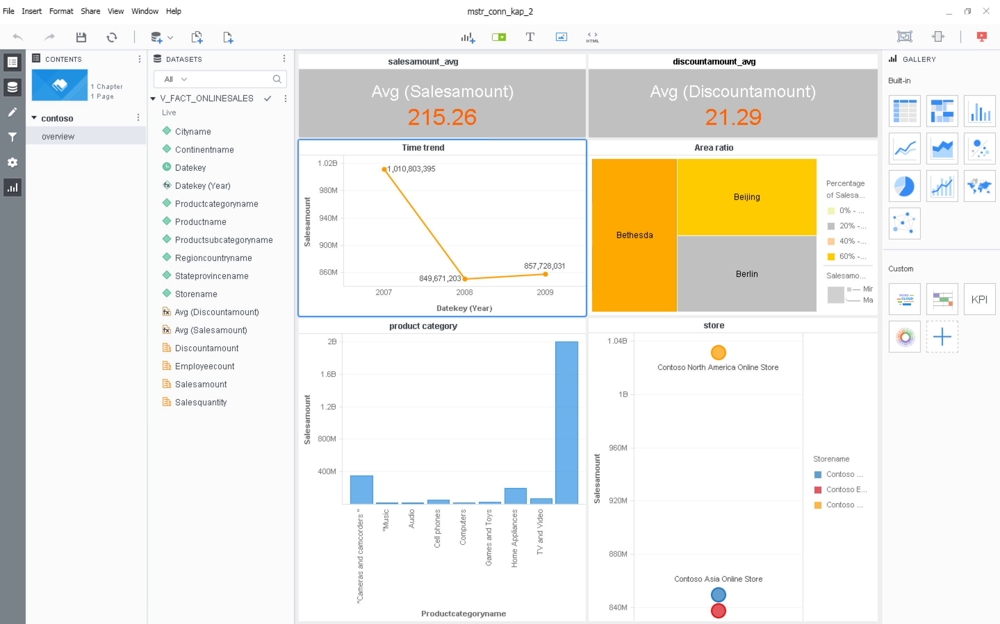

## 与 MicroStrategy Workstation/Desktop 集成

### 前提条件:

1. 已经安装 MicroStrategy Workstation / Desktop 10.10 或更高版本。
2. 已经安装 Kyligence Enterprise 。
3. 已经在安装 MicroStrategy Workstation / Desktop的机器上安装了 JDK 1.8或更高版本。
4. 已经在安装 MicroStrategy Workstation / Desktop的机器上安装了64位的Kyligence ODBC 驱动程序。 有关如何下载和配置 Kyligence ODBC驱动程序的详细信息，请参阅 Kyligence Enterprise 用户手册中 [Kyligence ODBC 驱动程序教程](../../driver/odbc/README.md) 章节。

### 在 MicroStrategy Workstation/Desktop上安装连接器:

1. 按照 MicroStrategy Web 平台中安装连接器的步骤更新 DBProperties.xml 文件

2. 更新 DBProperties.json 文件

   * 解压下载的 KyligenceConnectorFiles.zip 中的 utils.zip
   
   * 拷贝utils 至 C:\Program Files (x86)\MicroStrategy\Web ASPx路径下
   
   * 在 Windows 中以管理员权限运行 utils\run.bat 脚本

   * 运行脚本后，该工具会自动将原始DBProperties.xml转换为两个新文件 DBProperties.json32 和 DBProperties.json64，将 DBProperties.json64 重命名为 DBProperties.json ，并使用此新文件替换 MicroStrategy Workstation / Desktop 中的旧文件。

     > 旧文件默认路径：<MSTR_WINDOWS_WORKSTATION/Desktop>\code\config for Windows Platform

3. 要自定义图标，请将KyligenceConnectorFiles.zip中的图标文件放到<MSTR_WINDOWS_WORKSTATION>\code\javascript\mojo\css\images\DI\connectors\ 路径中

4. 使用之前在中步骤中配置的DATABASE.PDS 文件和 DTMapping.PDS 文件替换Workstation / Desktop 中原有的DATABASE.PDS and DTMapping.PDS 文件

   > 文件默认位置  location: C:\Program Files (x86)\Common Files\MicroStrategy

5. 重启 Workstation / Desktop

6. 请注意，Kyligence 在 Mac 版 Workstation / Desktop 中尚不支持 

### 使用 MicroStrategy Desktop 连接Kyligence:

1. 打开 MicroStrategy Desktop并选择 New Data，选择 Kyligence 作为数据源

   

   

2. 然后，选择 Select Table 方式 

   

3. 接着，您可以任意选择 DSN 数据源或 DSN-less 数据源。如果使用 DSN 数据源的话则首先需要在 ODBC Manager 中先配置DSN。选择数据类型为 Kyligence。

4. 成功创建数据源后即可选择表、表连接关系及定义维度和度量，以匹配 Kyligence中的数据模型。

5. 为了完全发挥经过预计算的cube的能力，请选用 Connect Live 方式进行连接，而无需将数据导入内存。

6. 连接数据之后就可以自由地在 MicroStrategy Desktop中使用 Kyligence中的数据源了。

