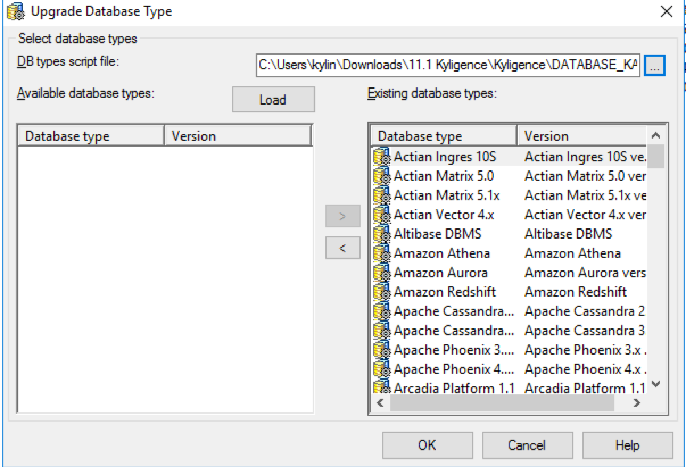
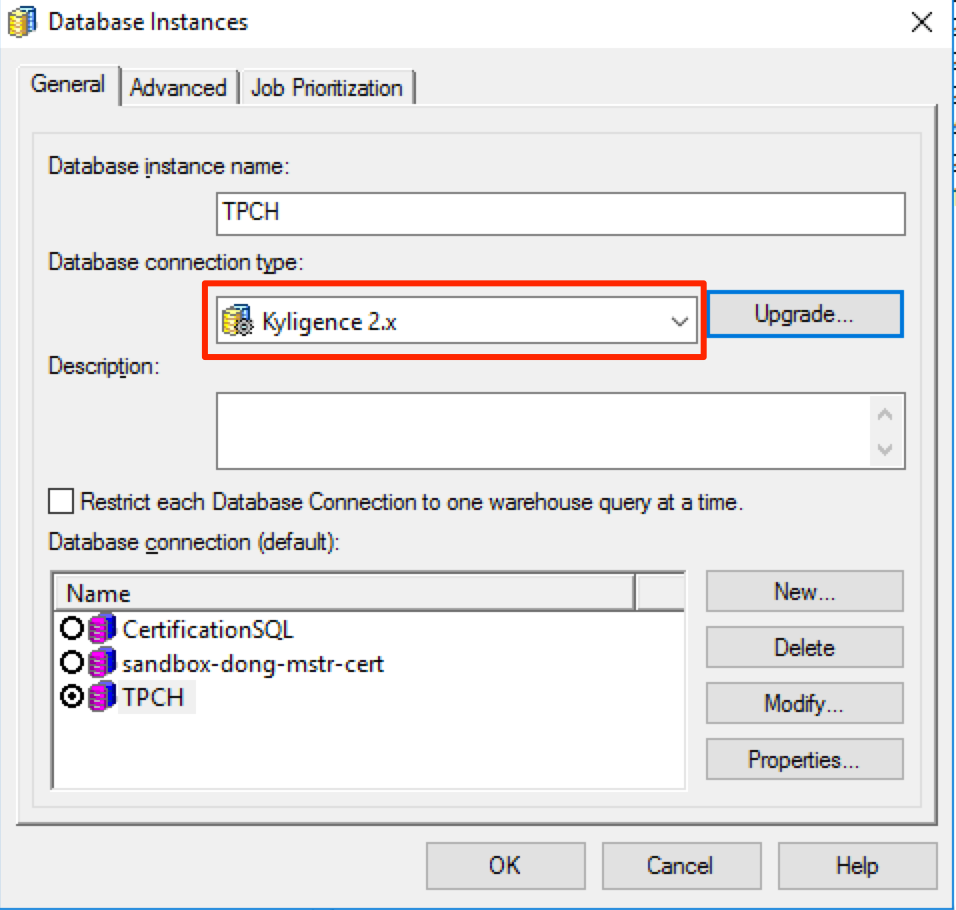
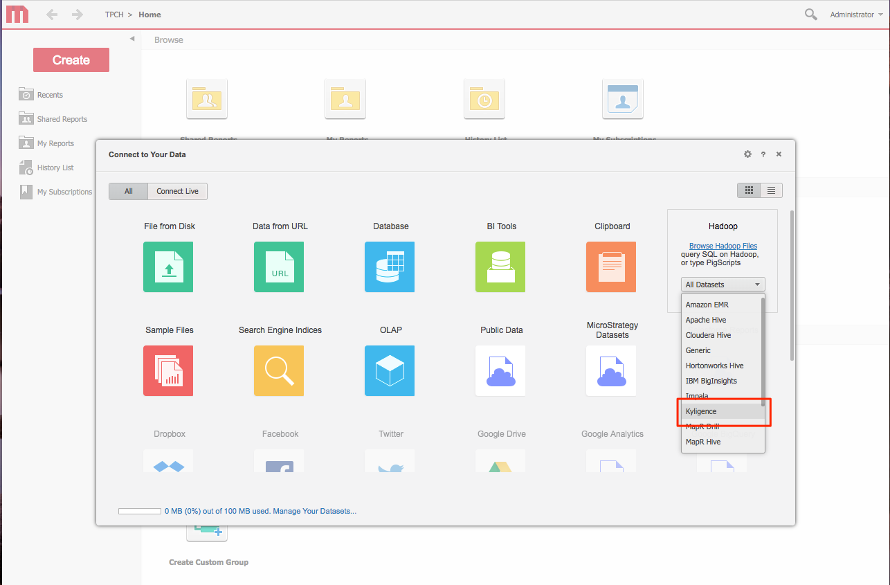

## 与 MicroStrategy Secure Enterprise 集成

### 支持的平台:

Kyligence 目前支持 MicroStrategy Secure Enterprise 10.8及更高版本。

### 前提条件:

- 已经安装 MicroStrategy Secure Enterprise 10.8或更高版本。
- 已经安装 Kyligence Enterprise 。
- 已经在安装 MicroStrategy Intelligence Server 的机器上安装了 JDK 1.8或更高版本。
- 已经在安装 MicroStrategy Intelligence Server 的机器上安装了64位的 Kyligence ODBC 驱动程序。 有关如何下载和配置 Kyligence ODBC 驱动程序的详细信息，请参阅 Kyligence Enterprise用户手册中 [Kyligence ODBC 驱动程序教程](../../driver/odbc/README.md)章节。


### 为MicroStrategy Intelligence Server 安装Kyligence 连接器 

#### 更新数据库对象

1. 在安装 MicroStrategy Intelligence Server 的计算机上下载并拷贝连接器文件。 连接器文件可以点击以下[链接](https://community.microstrategy.com/s/article/Kyligence-Analytic-Platform)下载。

2. 在 MicroStrategy 的安装目录之外的其他目录解压zip文件

3. 启动 MicroStrategy Developer 并登录到2-tier项目源。 转到数据库实例管理器，并编辑您已连接到Kyligence数据源的实例。点击位于 “ 数据库连接类型” 旁边的 “ 升级” 按钮，如下所示：

   

4. 出现以下窗口。浏览文件，使得数据库类型脚本文件指向在**步骤1**中获得的 ”Database_KAP.PDS“ 文件。单击 “加载” 按钮，如下图所示：

   

5. 现在左侧窗格中的可用数据库类型中出现了 Kyligence。 使用箭头按钮将 "Kyligence" 对象从左侧窗格移动到右侧，如下图所示：

   

6. 单击确定。“Kyligence 2.x”现在显示为可用的数据库连接类型。 

   在数据库实例管理器中选择 “Kyligence 2.x”。

   

7. 点击确定并保存数据库实例。

8. 重新加载项目，以使新设置生效。


#### 更新Intelligence Server上的数据类型映射

1. 将 DTMAPPING 和 AddConnector.jar 复制到需要安装连接器的机器。

2. 查找安装Intelligence Server的机器上的DTMAPPING.pds文件的位置

   > 提示：在 Windows 上，默认位置是 `C：\Program Files（x86）\Common Files \MicroStrategy`，也指向环境变量$ MSTR_CLASSPATH

3. 用 DTMAPPING.pds 所在的文件夹替换 <location> 并运行以下命令。

   ``` java -jar AddConnector.jar --target <location>\DTMAPPING.pds --file DTMAPPING```

   > 提示：运行该命令需要具有复制和修改现有 DTMAPPING.pds文件的权限。该命令将在 <location> 中创建原始 DTMAPPING.pds文件的备份。

4. 重启 Intelligence Server.

#### 在 MicroStrategy Web 中安装 Kyligence Connector

接下来需要在 MicroStrategy 集群中所有的 MicroStrategy Web 计算机中完成如下的配置：

1. 在MicroStrategy Community下载[连接器文件](https://community.microstrategy.com/s/article/Kyligence-Analytic-Platform?language=undefined).

2. 将 DBproperties 文件和 AddConnector.jar 文件复制到运行MicroStrategy Web的机器。 并将文件的所在路径记为<location1>。

3. 找到DBProperties.xml文件的所在路径，并将此路径记为<location2>。

  > DBProperties.xml文件的路径默认为
  >
  > * Microsoft IIS: `C:\Program Files (x86)\MicroStrategy\Web ASPx\WEB-INF\xml\DBproperties.xml`
  > * Tomcat (on Windows): `C:\Program Files (x86)\Common Files\MicroStrategy\Tomcat\apache-tomcat-8.0.30\webapps\MicroStrategy\WEB-INF\xml\DBProperties.xml`
  > * Tomcat (on Linux): `/opt/apache/tomcat/apache-tomcat-8.0.43/webapps/MicroStrategy/WEB-INF/xml/DBproperties.xml`
  >

4. 替换<location1>和<location2>，并执行如下命令：

  ```
  java -jar <location1>\AddConnector.jar --target <location2>\DBProperties.xml --file <location1>\DBproperties
  ```

  > 提示：
  >
  > * 运行该命令需要具有复制和修改现有DBproperties.xml文件的权限。
  >
  > * 在Windows上，<location>需要以反斜杠 “ \ ” 字符结束，在Linux上需要以正斜杠 “ / ” 字符结束。
  >
  > * 该命令将在<location2>中创建原始DBProperties 文件的备份。

5. 运行上述命令后，请重新启动您的应用程序服务器。

6. 设置连接器图标:

   * 默认情况下，数据导入主页中的图标是如下所示数据库的常规图标：

     

   * 要自定义图标，请将KyligenceConnectorFiles.zip中的图标文件放到`<MSTR_WEB_SERVER>\javascript\ mojo\css\images\DI\connectors\` 路径中。

     


然后在数据源处搜索 Kyligence 来连接 Kyligence，或者可以在 **Hadoop** 连接类别下找到 Kyligence。

 

### 使用 MicroStrategy 连接 Kyligence Enterprise 的最佳实践

以下是经笔者测试的 MicroStrategy 连接 Kyligence Enterprise 的最佳实践，建议按照下面操作配置你的 MicroStrategy 环境以优化和 Kyligence Enterprise 的连接。

1. 建议在 MicroStrategy 环境中修改 VLDB 配置，设置 report intermediate table类型为 derived 来避免 MicroStrategy 生成临时表，以提高查询效率。修改方法为在 MicroStrategy 的 report 中菜单选择 Data-> VLDB property-> Tables-> Intermediate Table Type设置为Derived即可。

2. 避免使用以下 MicroStrategy功能，因为下面的功能可能会生成多段SQL语句，这些多段的SQL语句无法通过VLDB配置规避。

   - 使用 Datamarts
   - 使用 partitioned tables
   - 使用 custom groups

3. 如果 Kyligence 数据模型中有事实表向维度表的左连接，MicroStrategy 生成的 SQL 也需要产生相同的左连接来击中 Cube，默认情况下 MicroStrategy 仅会生成内连接，
   可以参照以下 MicroStrategy 技术文档来修改 MicroStrategy 的 VLDB 配置实现左连接：[https://community.microstrategy.com/s/article/...](https://community.microstrategy.com/s/article/ka1440000009GrQAAU/KB17514-Using-the-Preserve-all-final-pass-result-elements-VLDB)

4. 默认情况下 MicroStrategy 生成的 SQL 语句在对日期进行过滤时日期的格式为 'mm/dd/yyyy'。这个格式可能会和 Kyligence Enterprise 中的日期格式不一致，导致查询报错。
   可以参考以下文章来修改 MicroStrategy 的配置，使其生成与 Kyligence Enterprise 的日期格式一致的日期过滤查询：[https://kyligence.zendesk.com/...](https://kyligence.zendesk.com/hc/en-us/articles/115001690433-Modify-MicroStrategy-query-date-format-to-be-consitent-with-KAP)


