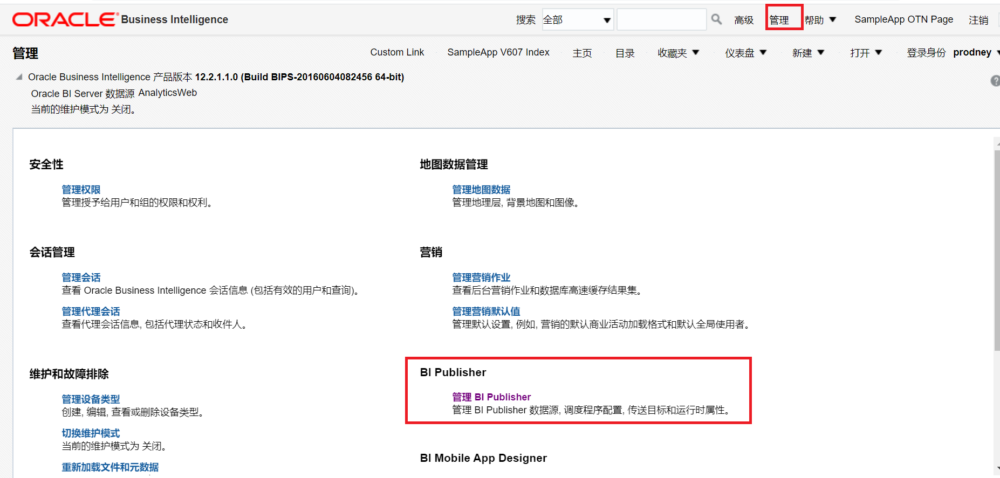
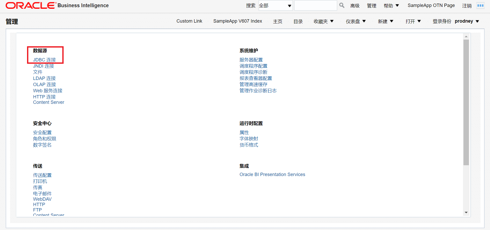
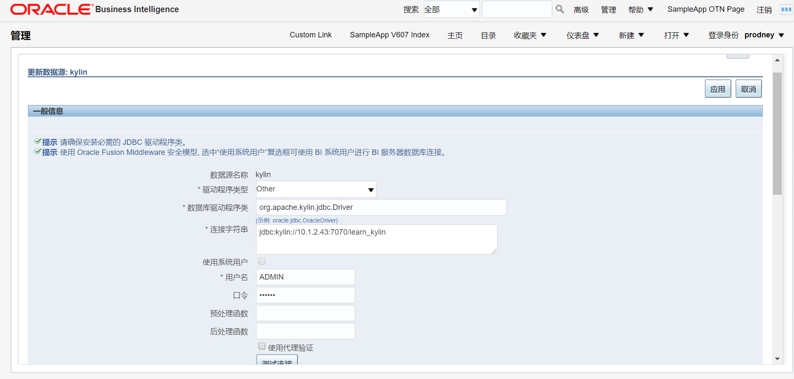
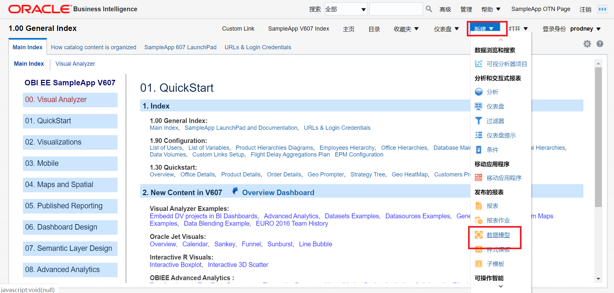
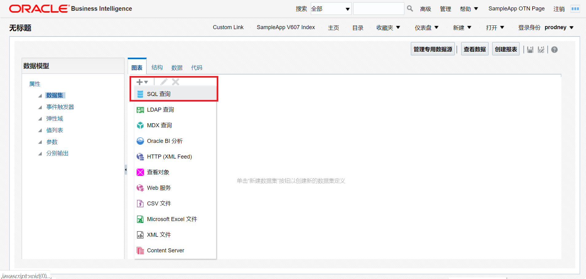
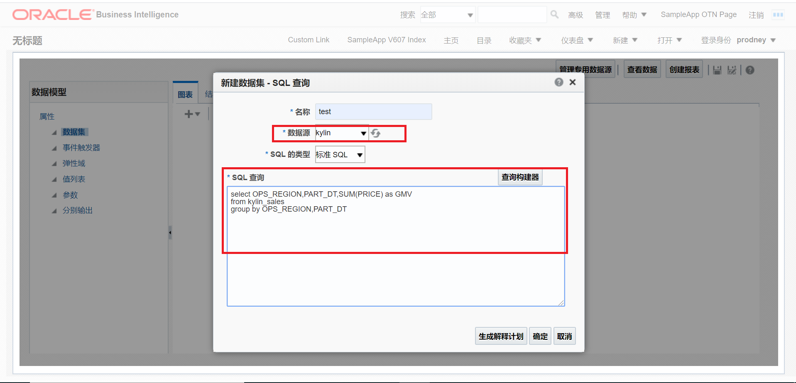
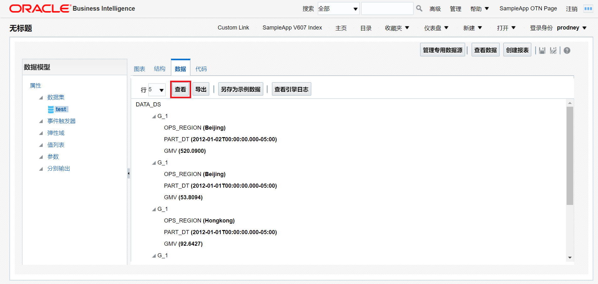

## 与 Oracle BI Publisher 集成

**Oracle BI Publisher** 是一种报告解决方案，可以比传统报告工具更轻松、更快速地制作、管理和交付所有报告和文档。使用您的 Web 浏览器或熟悉的桌面工具，针对几乎所有数据源创建所需的报告，从面向客户的完美文档到交互式管理报告。

本文以 OBIEE 12c 为例，介绍如何与 Oracle BI Publisher 集成。

### 前提条件
在 Oracle BI Server 安装 Kyligence JDBC 驱动程序

1. 获取 Kyligence JDBC 驱动程序。有关信息，请参考 [Kyligence JDBC 驱动程序教程](../../driver/jdbc.cn.md)。

2. 将 Kyligence JDBC 驱动放置 Oracle BI Server 安装目录下，如: 

   ```
   ${WL_HOME} /wlserver/server/lib
   ```

3. 修改配置文件 ${WL_HOME} /oracle_common/common/bin/commExtEnv.sh 中的变量$WEBLOGIC_CLASSPATH，添加驱动包路径信息，如：

   ```
   ${CLASSPATHSEP}${WL_HOME}/server/lib/kyligence-jdbc-{version}.jar
   ```

4. 重启 Oracle BI Server

   

### 进入 Oracle BI Server，选择管理 -> 管理 BI Publisher



### 新建 Kyligence JDBC 数据源

选择 JDBC 连接



新建 Kyligence JDBC 数据源，输入：

- 驱动类型：Other
- 数据库驱动程序类：org.apache.kylin.jdbc.driver
- 连接字符串：jdbc:kylin://<hostname>:<port>/<project_name>
- 用户名
- 口令：

输入完成后，点击**测试连接**，并应用保存。



### 新建数据模型，使用已创建的 JDBC 连接，进行报表查询

新建 -> **数据模型**



新建 **SQL 查询**



选择已创建的 JDBC 连接，输入 SQL 查询




点击**数据** -> **查看**, 即可完成报表查询



