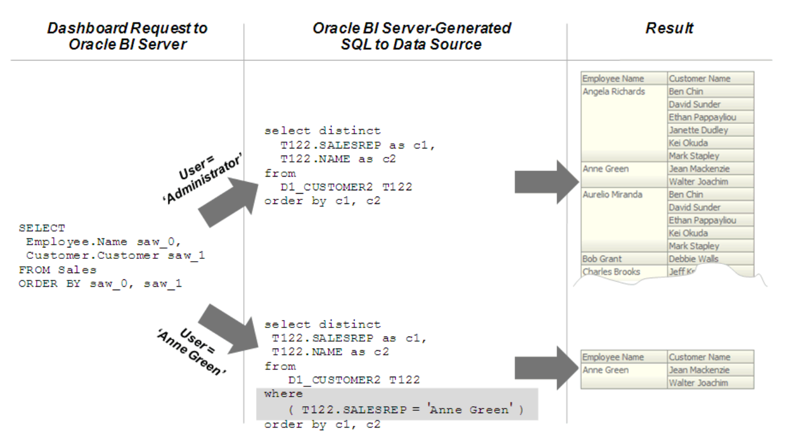
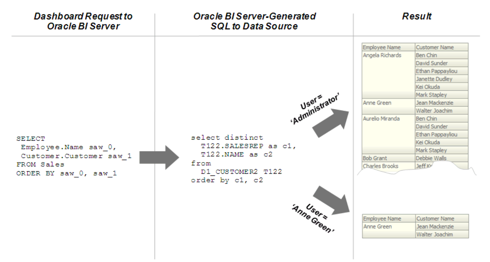

## OBIEE 设置行级安全性

本文将引导您在 OBIEE 设置行级安全性，与 Kyligence 进行用户集成，实现数据权限控制。

您可以选择在 OBIEE 存储库或数据库（即 Kyligence）中设置行级安全性。在存储库中实现行级安全性的好处在于：

- 所有用户共享同一个数据库连接池，可提高性能

- 所有用户共享缓存，可提高性能

- 您可以定义和维护适用于许多联合数据源的安全规则

相比之下，在 Kyligence 中实现行级安全性，适用于多个应用程序共享同一个 Kyligence 环境，Kyligence 作为统一的查询入口。请注意，即使在数据库中设计和实现行级安全性时，仍应在存储库中定义和应用对象权限。

> **注意**：尽管可以在存储库和数据库中都设置行级安全性，但是除非有特殊需要，否则通常不要在两个地方都强制执行行级安全性。

本节包含以下主题：

- 在存储库中设置行级安全性（数据过滤器）
- 在数据库中设置行级安全性

### 在存储库中设置行级安全性（数据过滤器）

数据过滤器是一项安全功能，它提供了一种在存储库中强制执行行级安全规则的方法。数据过滤器需要使用管理工具在存储库中设置，并应用于特定的应用程序角色。如果您已在数据库中实现行级安全性，则通常不需要再设置数据过滤器。

支持在业务模型和映射层、表示层中为对象设置数据过滤器。在逻辑对象上应用筛选器，会影响使用该对象的所有展示层对象。如果在展示层对象上设置过滤器，则除了可能在基础逻辑对象上设置的所有过滤器之外，还会应用该过滤器。下图显示了如何在 Oracle BI Server 中实施数据过滤器规则。安全规则适用于所有传入的客户端，即使修改了 Logical SQL 查询，也不会被违反。

在此示例中，已将过滤器应用于应用程序角色。当属于该角色的成员 Anne Green 发送请求时，将基于过滤器限制返回结果。由于未将任何过滤器应用于管理员用户的应用程序角色，因此将返回所有结果。 Oracle BI Server 生成的 SQL 考虑了已定义的所有数据过滤器。

您应该始终为特定的应用程序角色而不是单个用户设置数据过滤器。

在存储库中设置行级安全性（数据过滤器），配置步骤如下：

1. 在管理工具中打开您的存储库

2. 选择**管理**，然后选择身份

3. 在**身份管理**对话框的树形窗格中，选择 **BI 资料档案库**

4. 在右窗格中，选择**应用程序角色**选项卡，然后双击要为其设置数据过滤器的应用程序角色
   
> **注意**：如果您处于脱机模式，除非您首先在联机模式下对其进行了修改，否则列表中不会显示任何应用程序角色。有关更多信息，请参见[关于在脱机模式下应用数据访问安全性](https://docs.oracle.com/middleware/12211/biee/BIEMG/GUID-C63CD161-06A0-4757-BFE0-B06B1EFE5BAC.htm#dataaccess_offline)。

5. 在**应用程序角色**对话框中，单击**权限**

6. 在**应用程序角色 -> 权限**对话框中，单击**数据过滤器**选项卡
   要创建过滤器，首先要选择需要应用过滤器的对象。然后，您提供各个对象的过滤器表达式信息

7. 要添加要对其应用过滤器的对象，请执行以下步骤之一：

   - 单击**添加**按钮。然后，浏览找到所需的对象，将其选中，然后单击**选择**
   - 单击名称字段为空的行。然后，浏览找到所需的对象，将其选中，然后单击**选择**

8. 要输入单个对象的过滤器表达式，请执行以下步骤之一：
   - 选择**数据过滤器**，然后单击**表达式生成器**按钮。在表达式生成器中创建过滤器表达式，然后单击确定
   - 单击**数据过滤器**字段，以获取合适的过滤，然后键入过滤器表达式

例如，您可能想定义一个过滤器，例如`"Sample Sales"."D2 Market"."M00 Mkt Key" > 5`，以基于表中另一列的值范围来限制结果。您还可以在过滤器定义中使用存储库和会话变量。使用表达式生成器包含这些变量以确保语法正确。

9. （可选）从**状态**列表中为每个过滤器选择一个状态。您可以选择以下选项之一：
   - 启用：过滤器将应用于访问对象的任何查询
   - 禁用：不使用过滤器，并且不使用其他更高级别的优先级（例如通过应用程序角色）应用于对象的过滤器
   - 忽略：过滤器未使用，但使用了其他任何过滤器，例如通过其他应用程序角色应用于对象的其他过滤器。如果没有启用其他过滤器，则不会进行过滤
10. 除了定义新的过滤器外，您还可以在**数据过滤器**选项卡中执行其他操作，详细可参考 [OBIEE 文档](https://docs.oracle.com/middleware/12211/biee/BIEMG/GUID-1FDC0A15-9DE7-4838-9C0E-03290F5558B2.htm#dataaccess_db_level)
11. 单击**确定**，然后再次单击**确定**以返回到**身份管理**

### 在数据库中设置行级安全性

在数据库中实现行级安全性，首先需要在 Kyligence 创建与 Oracle BI Server 中相同的用户，密码也需要一致。接下来在 Kyligence 中为不同用户，设置不同的表、行、列级权限。最后，您需要配置 OBIEE 连接池，以便 Oracle BI Server 将每个用户的凭据传递到 Kyligence 。然后，Kyligence 依据凭据将其自己的 ACL 规则应用于用户查询。

下图显示了如何在数据库中为 Oracle Business Intelligence 查询强制实施行级安全性。安全规则适用于所有传入的客户端，即使修改了 Logical SQL 查询，也不会被违反。在此示例中，即使 Oracle BI Server 生成的 SQL 查询相同，返回的结果取决于哪个用户生成了查询，基于 Kyligence 数据库中创建的 ACL 规则进行数据过滤。

在数据库中设置行级安全性，配置步骤如下：

1. 使用管理工具，打开你的资料库

2. 双击与要为其设置数据库级安全性的数据库

3. 双击连接池，勾选**共享登录**，在**用户名**和**口令**输入框，分析输入变量 **:USER** 和 **:PASSWORD**

4. 连接池对话框中，单击**确定**

5. 再次双击要为其设置数据库级安全性的数据库对象

6. 在数据库对话框中，选择**虚拟专用数据库**。选择此选项可确保 Oracle BI Server 保护每个用户的缓存条目

7. 在数据库对话框中单击**确定**

在数据库中设置行级安全性之后，必须在存储库中为展示层或其他对象设置对象权限。您还可以设置查询限制（管理者）。有关更多信息，请参见[设置对象权限](https://docs.oracle.com/middleware/12211/biee/BIEMG/GUID-E4B828EE-B906-432A-834D-A045BB6A51BD.htm#hpp_s_permissions)和[设置查询限制](https://docs.oracle.com/middleware/12211/biee/BIEMG/GUID-3FD454F0-EBE3-4094-8ECB-F6F02F99267C.htm#hpp_s_restrict)。
