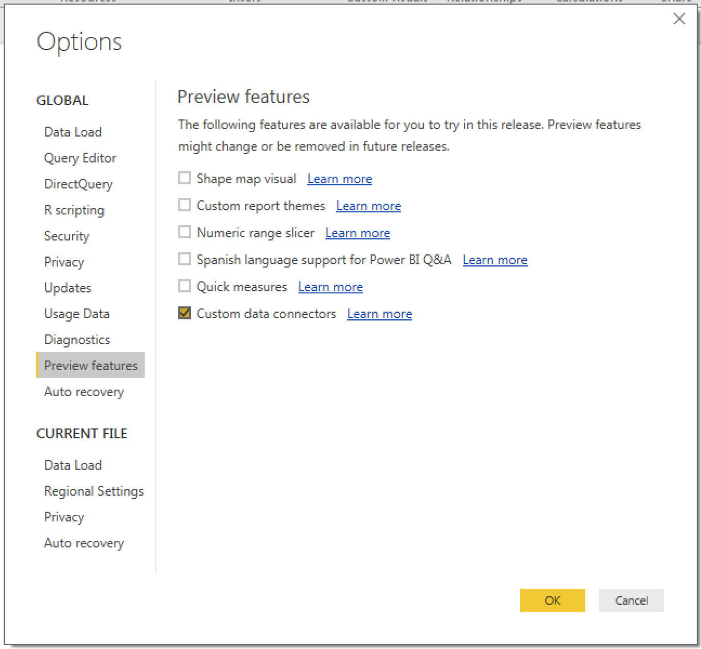
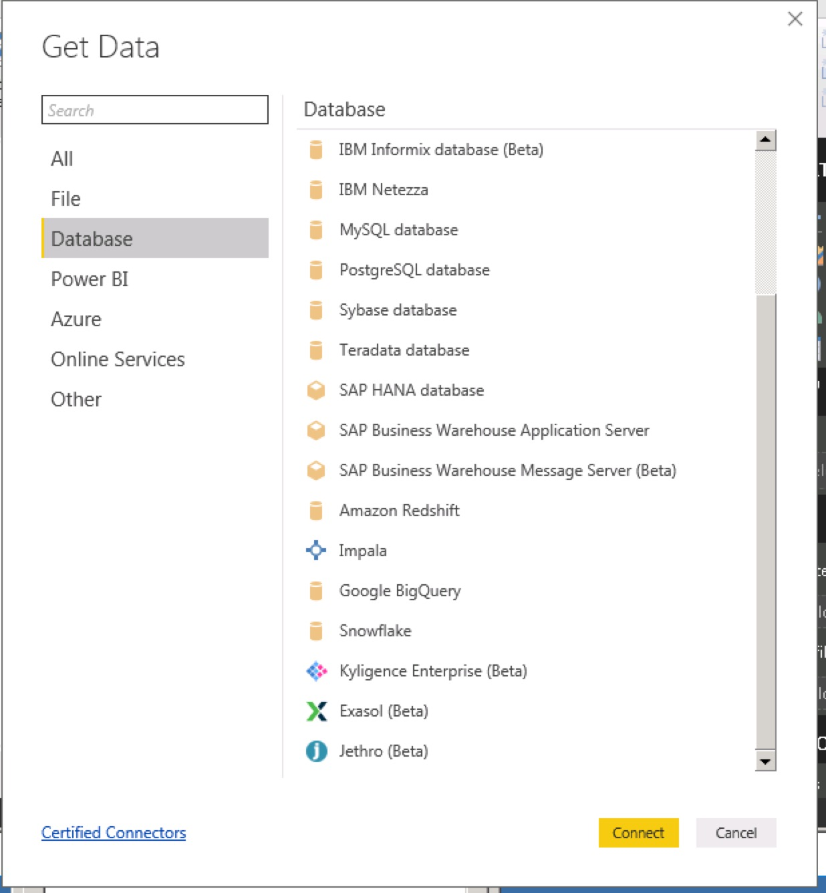
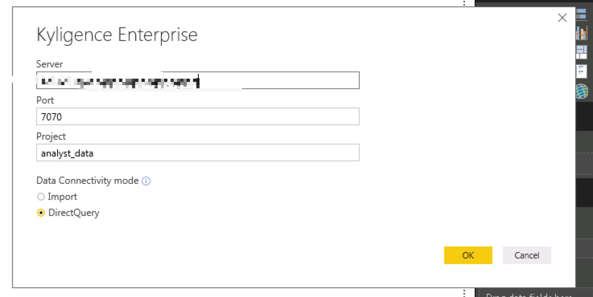
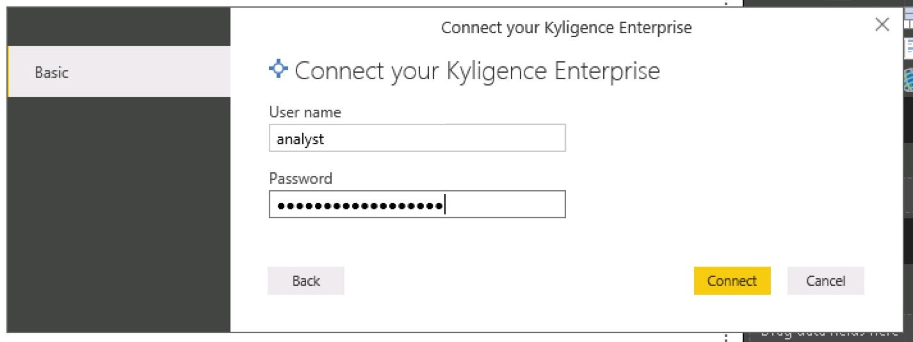
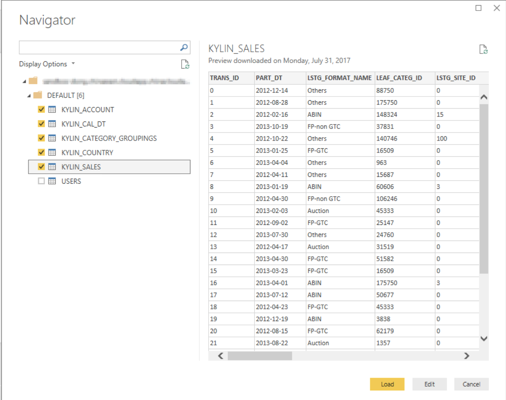
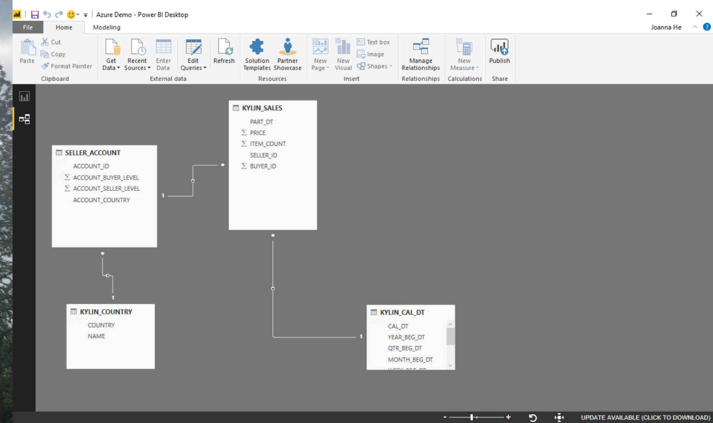
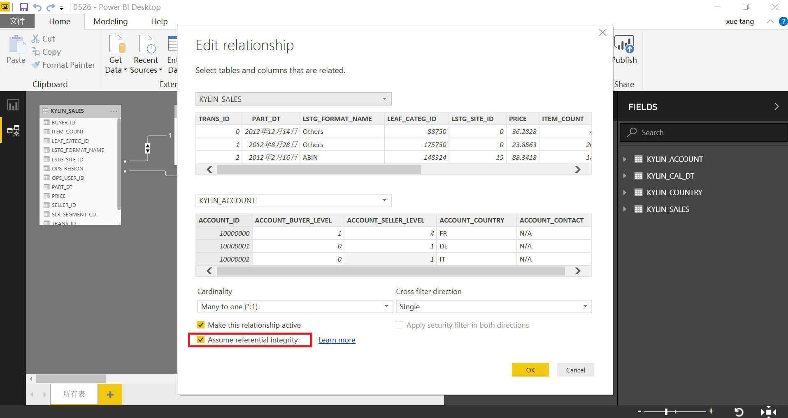
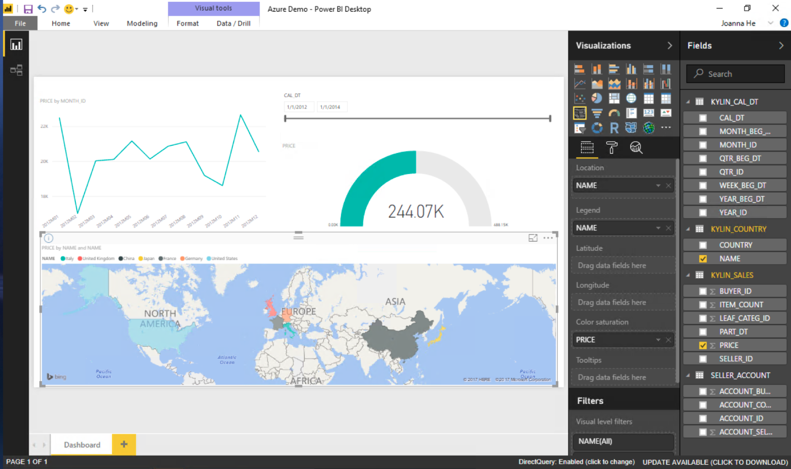

## 与 Power BI Desktop 集成

Microsoft Power BI Desktop 是由微软推出的一款商业智能的专业分析工具，为用户提供简单而丰富的数据可视化及分析功能。

### 安装 Kyligence ODBC 驱动程序

有关安装信息，参考页面 [Kyligence ODBC 驱动程序教程](../../driver/odbc/README.md)。

### 安装 Kyligence Enterprise Data Connector for PowerBI 插件

如果您的 Power BI Desktop 版本 >= **2018年10月版本 (v2.63)**，则您不需要手动安装插件，因为自该版本起 Kyligence 成为其内置的认证数据源。

如果您的 Power BI Desktop 版本 < **2018年10月版本 (v2.63)**，您可以按照以下步骤安装 Kyligence Enterprise Data Connector for PowerBI 插件：

1. 在 [Kyligence Account 页面](http://account.kyligence.io)下载 Kyligence Enterprise Data Connector for PowerBI 插件。

2. 将 DirectQuery 插件文件（.mez 文件）复制到 Power BI 安装目录 `[Documents]\Microsoft Power BI Desktop\Custom Connectors` 文件夹中。如果没有 **Custom Connectors** 这个文件夹，请手动创建。

3. 打开 Power BI Desktop 中 **Options and settings** 下的 **Options**。
   在 **Preview Features** 中勾选 **Custom data connectors**： 

   > **提示：** Power BI 2.61版本无法显示 Kyligence connector，须修改扩展插件安全设置。您可以依次选择**文件**->**选项和设置**->**选项**->**安全**，在**数据扩展插件**下，从两个安全级别中进行选择 **（不推荐）允许加载任何插件而不发出警告**。

4. 重启 Power BI Desktop。

### 使用 Power BI Desktop 连接 Kyligence Enterprise

1. 启动已经安装的 Power BI Desktop，单击 **Get data -> more**，在 **Database** 类别下选中 **Kyligence Enterprise**。

   > **注意：**为了更好地与 PowerBI 集成，请开启Kyligence Enterprises查询下压，操作请参考 [查询下压页面](../../../installation/pushdown/pushdown_to_embedded_spark.cn.md)。

   

2. 在连接字符串文本框中输入所需的数据库信息。请选择 **DirectQuery** 作为数据连接方式。

   > **注意：** 当您的 Kyligence Enterprise 部署在 Azure 时，需要在 Server 处填入 **https://** ，同时填写443端口。

   

3. 输入账号密码进行身份验证。
   

4. 这样 Power BI 会列出项目中所有的表，可以根据需要选择要连接的表。
   

5. 现在可以进一步使用 Power BI 进行可视化分析，首先对需要连接的表进行建模。

   > **注意：** 编辑关系时，请务必勾选 **假设引用完整性**。

   

   

6. 现在可以回到报表页面开始可视化分析。
   