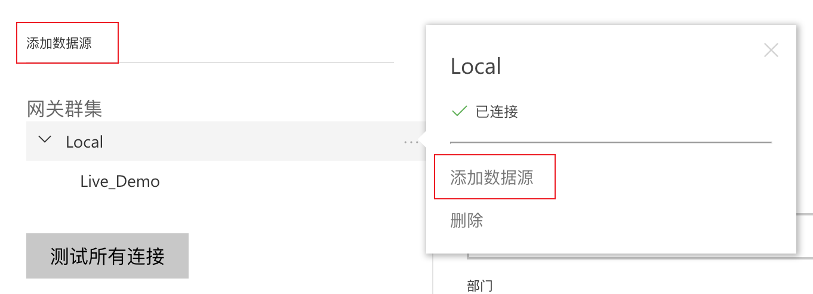
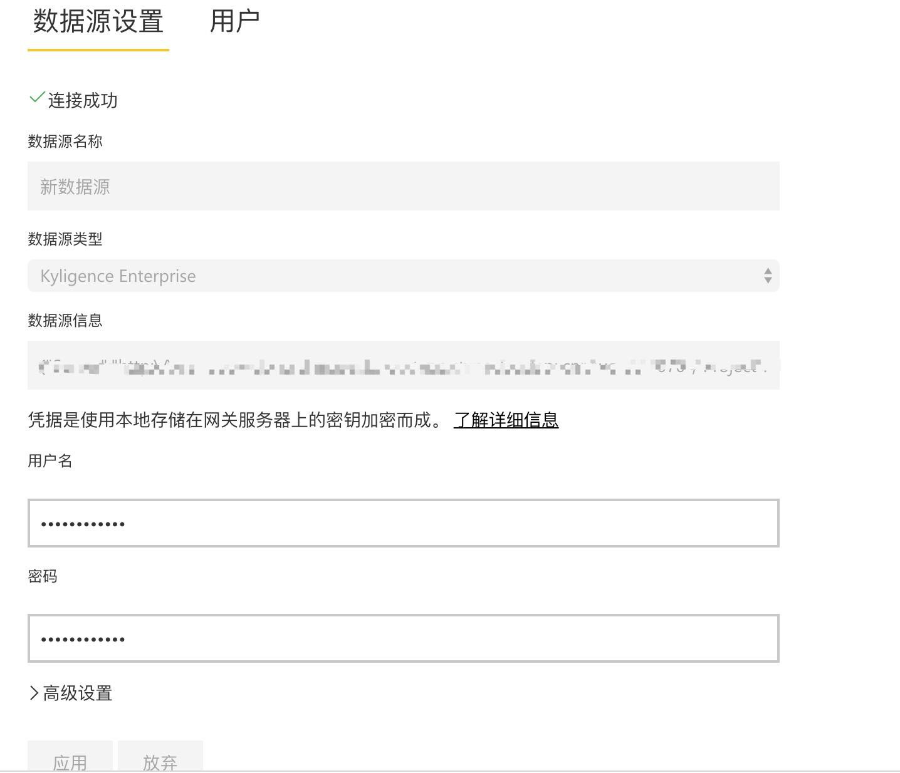
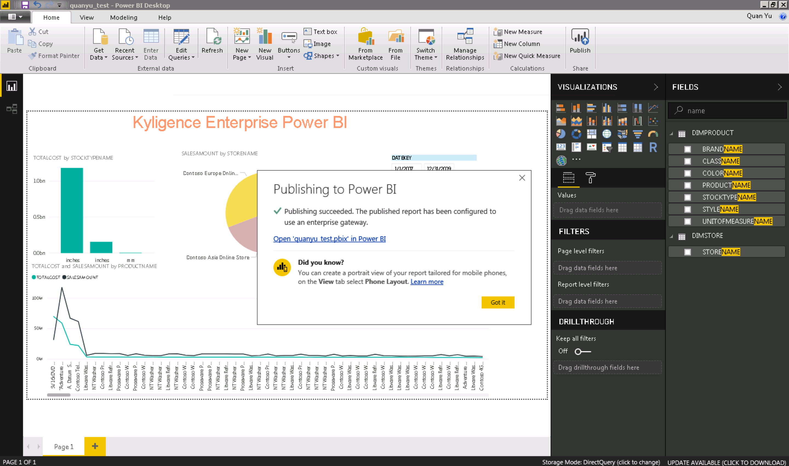
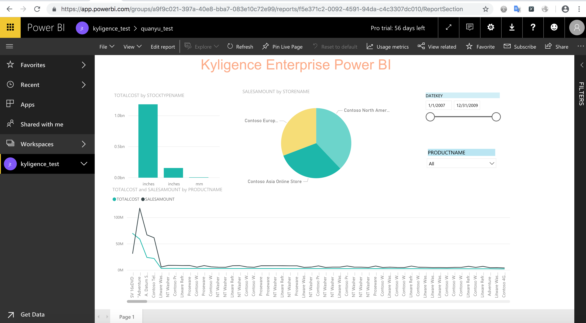

## 与 Power BI Service 集成

Microsoft Power BI Service 也被称为 Power BI online，是一个具有强大的分析能力及协作管理能力的在线 SaaS 服务。可以轻松与 Power BI Desktop 或 Power BI Mobile 进行协作，搭建企业级 BI 平台。


本文将分步介绍如何使用 Power BI Service 连接 Kyligence Enterprise。

### Power BI Desktop 集成

Power BI service 通过 Power BI Desktop 发布报表，需要已经安装 Power BI Desktop 并集成 Kyligence。关于如何使用 Power BI Desktop 连接 Kyligence Enterprise 的信息请参考页面 [Power BI Desktop 集成](powerbi_desktop.cn.md)。

> 注意：Power BI service 和 Power BI Desktop 通过 Power BI 账号进行关联，所以在将报表发布到 Power BI service 时，Power BI Desktop 需处于正确的登录状态。

### 安装 Gateway

Power BI service 通过 Gateway 和本地服务器进行通信，您可以参考 Microsoft 的 [Gateway 安装页面](https://docs.microsoft.com/zh-cn/power-bi/service-gateway-install)完成 Gateway 安装。

> 注意：
>
> 1. Gateway 不需要和 Power BI Desktop 安装在同一机器上。
> 2. 运行 Gateway 的机器网络通畅且**能访问 Kyligence Enterprise Data Connector for PowerBI 配置的数据源**
> 3. 运行 Gateway 的机器**需要安装64位的 Kyligence ODBC 驱动程序**
> 4. 有关如何下载和配置 Kyligence ODBC 驱动程序的详细信息，请参阅 Kyligence Enterprise 用户手册中 [Kyligence ODBC 驱动程序教程](../../driver/odbc/README.md)。

### 配置 Gateway

1. 完成 Gateway 安装后，在运行网关的计算机上，启动管理员命令提示符，运行 ```net start PBIEgwService``` 命令启动 Gateway 服务。

2. 启动 Gateway 服务后，您可以通过双击 **On-premises data gateway** 程序图标进行 Gateway 的配置。详细的本地数据网关配置，请参考 Microsoft 的教程 [本地数据网关](https://docs.microsoft.com/zh-cn/power-bi/service-gateway-onprem)。

3. 您也可以通过在运行网关的计算机上，启动管理员命令提示符，运行 ```net stop PBIEgwService``` 命令停止 Gateway 服务。

### 向 Power BI Service 添加数据源

1. 登录 Power BI service 后，在右上角，选择齿轮图标>管理网关。

   

2. 选择一个网关 >“添加数据源” ，或转到“网关”>“添加数据源” 。

   

3. 选择"选择数据类型"，为 Kyligence Enterprise。

   

4. 输入数据源的信息，数据源的配置信息需与在 Power BI Desktop 上的 Kyligence Enterprise 的连接信息保持一致。

   

5. 您可以在 **Data Source Settings** 的右侧，点击 **Users** 选项，为 DATA SOURCE 增加用户，被增加的用户将拥有发布报表的权限。若要了解更多的 Power BI Service 的配置功能，可以参考 Microsoft 的官方教程 [管理 Power BI 本地网关](https://docs.microsoft.com/zh-cn/power-bi/service-gateway-manage)。

### 通过 Power BI Desktop 发布报表到 Power BI Service

Gateway 配置全部完成后，在已登录的 Power BI Desktop 上编辑并保存报表后，点击 Publish 按钮、选择对应的工作区域，即可发布报表到 Power BI service。
这样，就可以在Power BI service对应的工作区域查看及修改上传的报表。





