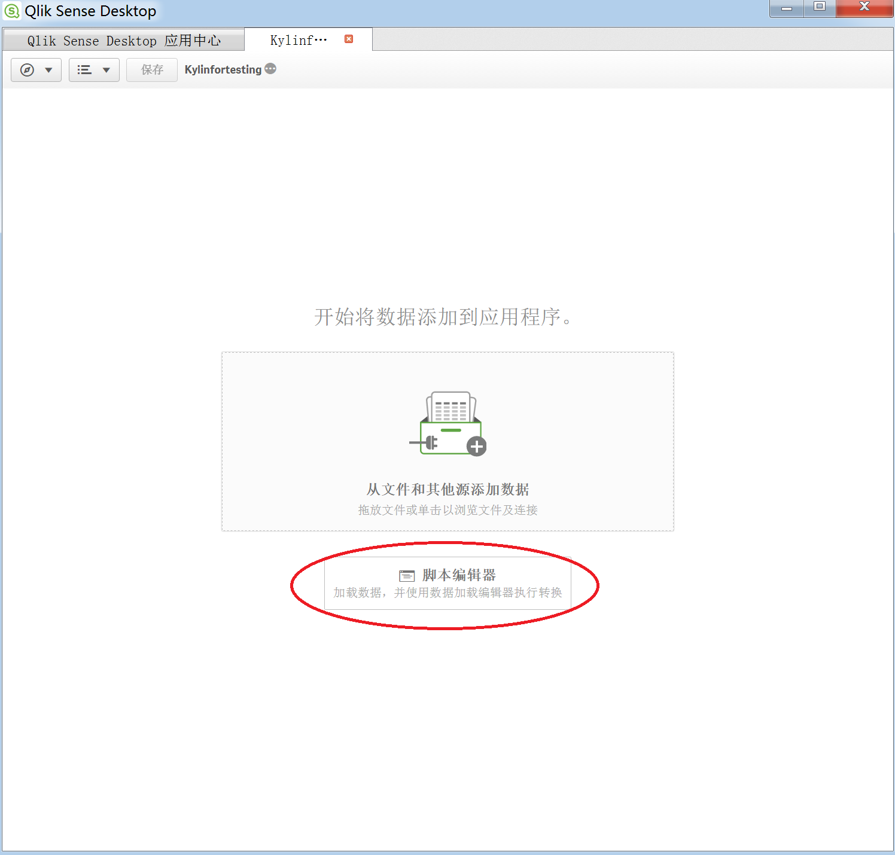
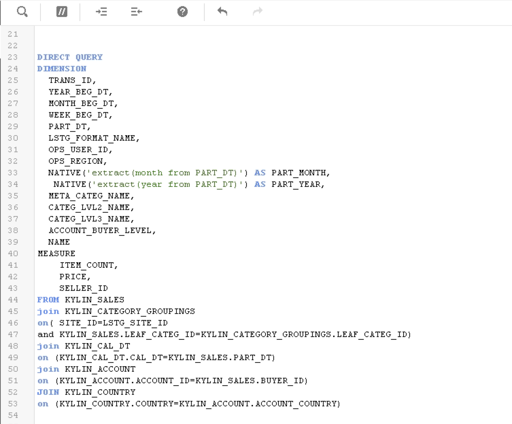
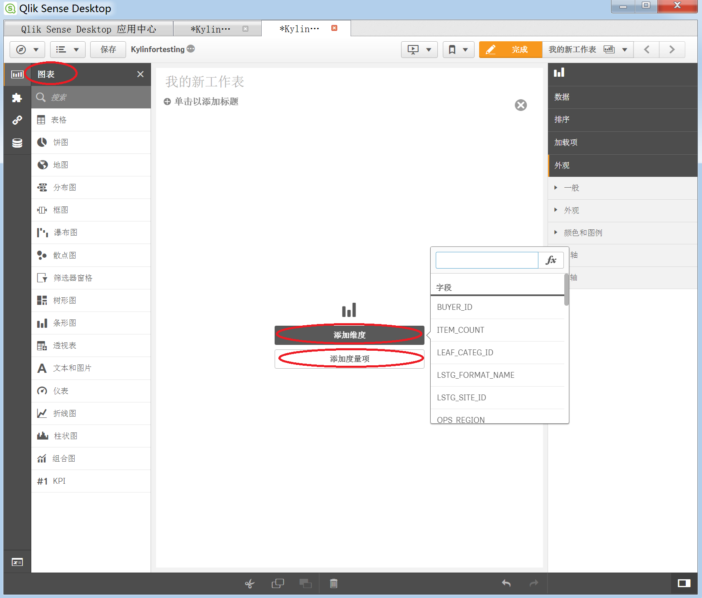

## 与 Qlik Sense 集成

Qlik Sense 是新一代自助式数据可视化工具。它是一款完整的商业分析软件，便于开发人员和分析人员快速构建和部署强大的分析应用。近年来，该工具成为全球增长率最快的 BI 产品。它可以与 Hadoop Database（Hive 和 Impala）集成。现在也可与 Kyligence Enterprise 集成。本文将分步介绍 Kyligence Enterprise 与 Qlik Sense 的连接。

### 前置条件

• 安装 Kyligence ODBC 驱动程序。有关安装信息，参考页面 [Kyligence ODBC 驱动程序教程](../../driver/odbc/README.md)。

• 安装 Qlik Sense。有关 Qlik Sense 的安装说明，请访问 [Qlik Sense Desktop 下载页面](https://www.qlik.com/us/try-or-buy/download-qlik-sense)。


### 与 Qlik Sense Desktop 连接
配置完本地 DSN 并成功安装 Qlik Sense 后，可执行以下步骤来连接 Kyligence Enterprise 与 Qlik Sense：

1. 从 Windows 桌面快捷方式或单击**开始 -> 所有程序 -> Qlik Sense -> Qlik Sense Desktop**，打开应用程序 **Qlik Sense Desktop**。

2. 输入 Qlik 用户名和密码，接着系统将弹出以下对话框。单击**创建新应用程序**。

   为新建的应用程序指定名称，该名称不得与现有的应用程序相同。创建完成后，打开此应用程序。在本例中，我们将此应用程序命名为 “Kylinfortesting”。

3. 应用程序视图中有两个选项，选择下方的**脚本编辑器**。

   此时会显示数据加载编辑器窗口。单击页面右上方的**创建新连接**。

   然后选择创建的 **DSN**，不需要填写帐户信息，单击**创建**即可。

4. 将 “TimeFormat”、“DateFormat” 和 “TimestampFormat” 的默认脚本更改为：

   `SET TimeFormat='h:mm:ss';`

   `SET DateFormat='YYYY-MM-DD';`

   `SET TimestampFormat='YYYY-MM-DD h:mm:ss[.fff]';`

5. 配置 Direct Query 模式：

   在常见的 Kyligence Enterprise 生产场景中， Cube 包含 PB 级数据，我们建议用户在 Qlik Sense 中使用 Direct Query 模式，而不用将数据导入 Qlik Sense。

   在脚本编辑器中查询脚本的最前面，输入 `Direct Query`，即可启用 Direct Query 模式。 

   > **提示**：考虑到本 BI 工具的连接数据源时的探测特性，为了避免在超大数据量情形下连接数据源响应时间过长，请调整 `kylin.properties` 中的 `kylin.query.force-limit` 参数为1000，表示数据源限制 `select *` 探测语句返回的记录数为1000。
   >

   下图是以 `learn_kylin` 项目中的 `kylin_sales_cube` 为例，进行 Direct Query 查询的脚本。

   定义完此脚本后，Qlik Sense 可根据此脚本生成 SQL。建议定义的维度和度量与 Kyligence Enterprise Cube 中的维度和度量对应。下面附上完整的脚本，供您参考。

   也可通过创建 Native 表达式来使用 Kyligence Enterprise 内置函数，如：

   `NATIVE('extract(month from PART_DT)')` 

   请确保将脚本中的 `LIB CONNECT TO 'kylin';` 修改成你创建的 DSN 名称。

   ```
   SET ThousandSep=',';
   SET DecimalSep='.';
   SET MoneyThousandSep=',';
   SET MoneyDecimalSep='.';
   SET MoneyFormat='$#,##0.00;-$#,##0.00';
   SET TimeFormat='h:mm:ss';
   SET DateFormat='YYYY/MM/DD';
   SET TimestampFormat='YYYY/MM/DD h:mm:ss[.fff]';
   SET FirstWeekDay=6;
   SET BrokenWeeks=1;
   SET ReferenceDay=0;
   SET FirstMonthOfYear=1;
   SET CollationLocale='en-US';
   SET CreateSearchIndexOnReload=1;
   SET MonthNames='Jan;Feb;Mar;Apr;May;Jun;Jul;Aug;Sep;Oct;Nov;Dec';
   SET LongMonthNames='January;February;March;April;May;June;July;August;September;October;November;December';
   SET DayNames='Mon;Tue;Wed;Thu;Fri;Sat;Sun';
   SET LongDayNames='Monday;Tuesday;Wednesday;Thursday;Friday;Saturday;Sunday';
   LIB CONNECT TO 'kylin';
   DIRECT QUERY
   DIMENSION 
     TRANS_ID,
     YEAR_BEG_DT,
     MONTH_BEG_DT,
     WEEK_BEG_DT,
     PART_DT,
     LSTG_FORMAT_NAME,
     OPS_USER_ID,
     OPS_REGION,
     NATIVE('extract(month from PART_DT)') AS PART_MONTH,
      NATIVE('extract(year from PART_DT)') AS PART_YEAR,
     META_CATEG_NAME,
     CATEG_LVL2_NAME,
     CATEG_LVL3_NAME,
     ACCOUNT_BUYER_LEVEL,
     NAME
   MEASURE
       ITEM_COUNT,
       PRICE,
       SELLER_ID
   FROM KYLIN_SALES 
   join KYLIN_CATEGORY_GROUPINGS  
   on( SITE_ID=LSTG_SITE_ID 
   and KYLIN_SALES.LEAF_CATEG_ID=KYLIN_CATEGORY_GROUPINGS.LEAF_CATEG_ID)
   join KYLIN_CAL_DT
   on (KYLIN_CAL_DT.CAL_DT=KYLIN_SALES.PART_DT)
   join KYLIN_ACCOUNT 
   on (KYLIN_ACCOUNT.ACCOUNT_ID=KYLIN_SALES.BUYER_ID)
   JOIN KYLIN_COUNTRY
   on (KYLIN_COUNTRY.COUNTRY=KYLIN_ACCOUNT.ACCOUNT_COUNTRY)
   ```

   点击窗口右上角的**加载数据**，这样 Qlik Sense 将发送查询，根据脚本来测试连接。

   

6. 创建新报告。单击窗口左上方的**应用程序视图**。

   

   在弹出页面上单击**创建新工作表**。

   

   选择所需的图表类型，并根据需要添加维度和度量项。

   

   这样，新的工作表创建完成，Kyligence Enterprise 与 Qlik Sense 相连。现在您可以在 Qlik Sense 中查看 Kyligence Enterprise 数据。

   

   注意，如果要使查询击中 Cube，创建的度量应与 Cube 中定义的度量匹配。例如，在 `learn_kylin` 项目的 `kylin_sales_cube` 中，我们使用 Sum(price)：

   

### 与 Qlik Sense Hub 连接 


#### 将 Qlik Sense Desktop 中的应用上传到 Qlik Sense Hub

1. 从浏览器进入 **Qlik Management Console(QMC)**，选择 **License and tokens**模块。


2. 在 **QMC -> License and tokens -> User access allocations** 中选择 **Allocate**，增加当前用户，开启 **Qlik Sense Hub** 的使用权限。


3. 在 QMC 中选择 **Apps** 模块。


4. 在 QMC 中选择 Apps 模块，选择 **Import**，从本地导入由 **Qlik Sense Desktop** 所创建的应用。


5. 选择 **Publish**，可以发布刚才导入或之前已经存在的应用。


6. 进入 **Qlik Sense Hub**，在 **Streams** 模块中即可发现刚才发布的应用，如果只是导入而没有发布的话，应用则存在于 **Personal** 模块中。


7. 进入刚才发布的 KAP_QLIK 应用，可以查看在 **Qlik Sense Desktop** 中所创建的图表。


#### 直接在 Qlik Sense Hub 中连接 Kyligence Enterprise

1. 通过浏览器在 **Qlik Sense Hub** 中新建应用，连接到 Kyligence Enterprise 数据源，连接方法同在 **Qlik Sense Desktop** 中连接 Kyligence Enterprise。


2. 编辑刚才创建的应用，自由使用 Kyligence Enterprise 中的数据。


3. 编辑图表，制作方法和在 **Qlik Sense Desktop** 中一样。


