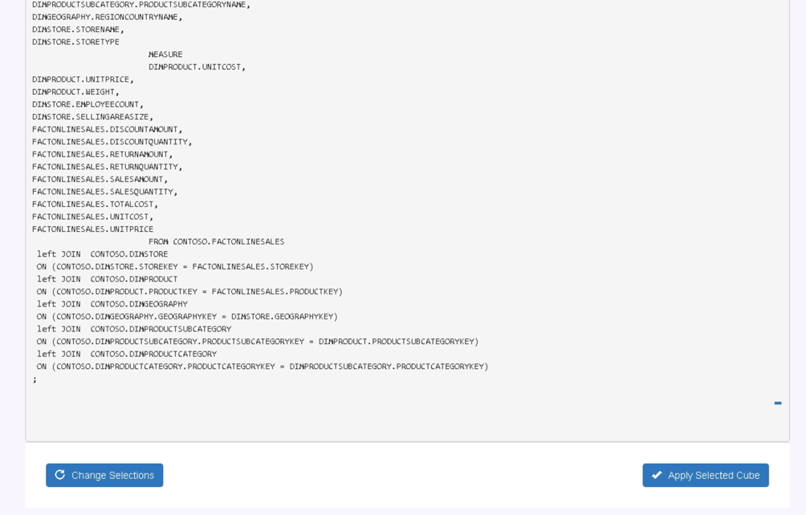

## 与 Qlik Sense Enterprise 集成

Qlik Sense 是新一代的的商业智能软件，提供完善而易用的数据分析及数据可视化能力，能够快速构建和部署强大的分析应用。

本文将分步介绍如何使用 Qlik Sense 的企业版 Qlik Sense Enterprise 连接 Kyligence Enterprise。

### 前置条件

* 安装 Kyligence ODBC 驱动程序。相关信息请参考页面 [Kyligence ODBC 驱动程序教程](../../driver/odbc/README.md)。
* 安装 Qlik Sense Enterprise。
* 在 Kyligence 下载页面下载 **Kyligence Data Connector for Qlik**，解压后放到 Qlik 安装目录下的 `Qlik\Sense\Client` 目录，保持文件夹名为 *KyligenceDataConnectorForQlik*。


### 修改配置

找到解压后的文件目录下文件名为 `KE_METADATA_LOADER.qvf` 的文件，在 **QMC - APP** 中点击 **Import**，导入该文件，导入成功后记录其 **APP ID**。


找到解压后的文件目录中 json 文件夹下的 qdc_config.json，将上一步找到的 **APP ID** 拷贝到该文件中替换原有 **appid** 的值，并将 **connect** 链接串中的 *kyligence-pc* 替换为您安装 Qlik 的机器的 hostname 。完成后保存并关闭该配置文件。


接下来我们需要使用该 APP 将目标 Kyligence Enterprise 中的 Cube 的元数据加载进 Qlik，提供给插件使用。

第一步：在 Qlik Hub 中找到刚刚上传的 QVF 文件生成的 APP（KE_METADATA_LOADER），并将其打开，进入 **Data loader editor** 界面。


第二步：点击 **Create new Connection** 按钮增加新连接串，选择连接类型为 **REST**。在 URL 中填入需要连接的 Kyligence Enterprise 的连接串，格式为 `http://ip:port/kylin/api/cubes`。在 **Authentication Schema** 中选择 **Basic** 选项，并在下方填写 Kyligence Enterprise 的用户名／密码作为验证信息。点击 **Test Connection**， 显示测试成功后，点击 **Save** 按钮保存。


第三步：保存后点击图中右边按钮以插入连接串，同时需将连接串下方的 KE_HOST 和 KE_PORT 变量也改成您实际的 Kyligence Enterprise 地址和端口。


修改完之后，执行右上角 **Load data** 按钮，将 Kyligence Enterprise 的 CUBE 元数据加载进 QLIK。（如果您的 Kyligence Enterprise 的 Cube 元数据发生变化，需要重新执行一次 LOAD。）

### 使用 Kyligence Data Connector for Qlik 创建基于 Cube 的 Qlik App

打开浏览器，访问如下地址：

```
https://[安装 Qlik 的机器的 hostname]/resources/KyligenceDataConnectorForQlik/index.html
```

点击第一个应用入口，开始创建 **Qlik APP**。


第一步，输入连接 Kyligence 的信息，然后点击 **Apply Data Connection** 按钮。


第二步，选择 **Cube**。


第三步，点击 **Add Cube** 后，再点击 **Create Script** 生成 **Qlik load script** 脚本。预览脚本无误后，点击 **Apply Selected Tables** 应用所选 **Cube**。


第四步，点击 Create Application，等待 APP 创建完成后，点击弹出消息的 **Click  To Open App** 打开应用，可以看到 **Cube** 中的模型已经被同步到了 Qlik 中。


现在，您可以在生成的 App 中分析 Kyligence 中的数据了：


### 已知限制

1. Qlik Direct Query 模式不支持 ***Join As*** 语法， 因此通过表别名的方式多次 Join 同一张表的模型和 cube 无法被 Qlik 加载。
2. 在 Qlik 中制作可视化报表时，如果先拖拽维度，Qlik 会给 Kyligence 发送一个维度的明细查询，导致前端产生一个报错。因此我们建议您先拖拽度量，再拖拽维度，避免产生报错。
3. 使用 Kyligence Data Connector for Qlik 可以同步在 Kyligence 中定义好的 Measure，但目前只能同步部分基础 Measure，包括 *Count*，*SUM*，*MAX*，*MIN* 等。
