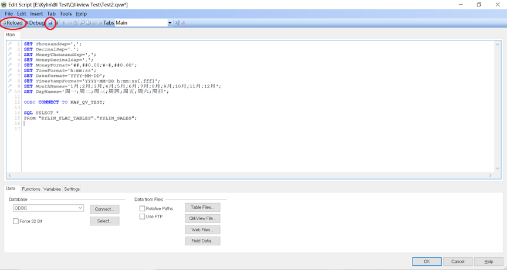

## 与 QlikView 集成

QlikView 是一款业务发现平台，可让您分析业务数据和进行数据探索。本文将分步介绍 Kyligence Enterprise 与QlikView 的连接。

* [与 QlikView Desktop 连接](#desktop)
* [与 QlikView Server 连接](#server)

### 与 QlikView Desktop 连接 {#desktop}

### **前置条件**

* 安装 Kyligence ODBC 驱动程序。有关安装信息，参考页面 [Kyligence ODBC 驱动程序教程](../../driver/odbc/README.md)。
* 安装 QlikView Desktop。有关 QlikView 的安装说明，请访问 [QlikView Desktop 下载页面](https://www.qlik.com/us/try-or-buy/download-qlikview)。

### 连接步骤

配置完本地DSN并成功安装 QlikView后，可执行以下步骤来连接 Kyligence Enterprise与 Qlik View Desktop：

1. 从 Windows 桌面快捷方式或单击**开始 -> 所有程序 -> QlikView -> QlikView Desktop**，打开应用程序 **QlikView Desktop**。

2. 在 QlikView Desktop 启动页的左上方，点击 **Edit Script**

3. 将 `TimeFormat`、`DateFormat` 和 `TimestampFormat` 的默认脚本更改为：

   `SET TimeFormat='h:mm:ss';`

   `SET DateFormat='YYYY-MM-DD';`

   `SET TimestampFormat='YYYY-MM-DD h:mm:ss[.fff]';`

4. 配置ODBC：

   进入QlikView脚本编辑器，点击窗口下方Database选择 **ODBC** 并点击 **Select**，选择已创建好的本地 DSN 并点击 **Test Connection**，测试通过后，界面弹出 ”Connection Test Succeed“ 。点击 **OK** 确认关闭。

   

5. 选择需要查询的 Cube

   您可以选择 Cube 所涉及的表也可以自定义地编写SQL。

   

   在您完成配置后，请您点击脚本编辑器上的 **保存** 和 **加载** 按钮。

   

   

   保存并加载成功后，点击 **Close** 关闭。此时，Cube 数据已导入至 QlikView 中，您可以开始创建报告。

6. 配置 Direct Query 模式：

   在常见的 Kyligence Enterprise 生产场景中， Cube 包含 PB 级数据，我们建议用户在 QlikView 中使用 Direct Query 模式，而不用将数据导入 QlikView。

   在脚本编辑器中查询脚本的最前面，输入 `Direct Query`，即可启用 Direct Query 模式。 

   > **提示**：考虑到本 BI 工具的连接数据源时的探测特性，为了避免在超大数据量情形下连接数据源响应时间过长，请调整 `kylin.properties` 中的 `kylin.query.force-limit` 参数为1000，表示数据源限制 `select *` 探测语句返回的记录数为1000。

   下图是以 `learn_kylin` 项目中的 `kylin_sales_cube` 为例，进行 Direct Query 查询的脚本。

   定义完此脚本后，QlikView 可根据此脚本生成 SQL。建议定义的维度和度量与 Kyligence Enterprise Cube 中的维度和度量对应。下面附上完整的脚本，供您参考。

   也可通过创建 Native 表达式来使用 Kyligence Enterprise 内置函数，如：

   `NATIVE('extract(month from PART_DT)')` 

   请确保将脚本中的 `LIB CONNECT TO 'kylin';` 修改成你创建的 DSN 名称。

   ```
   SET ThousandSep=',';
   SET DecimalSep='.';
   SET MoneyThousandSep=',';
   SET MoneyDecimalSep='.';
   SET MoneyFormat='¥#,##0.00;¥-#,##0.00';
   SET	TimeFormat='h:mm:ss';	
   SET	DateFormat='YYYY-MM-DD';	
   SET	TimestampFormat='YYYY-MM-DD	h:mm:ss[.fff]';	
   SET MonthNames='1月;2月;3月;4月;5月;6月;7月;8月;9月;10月;11月;12月';
   SET MonthNames='Jan;Feb;Mar;Apr;May;Jun;Jul;Aug;Sep;Oct;Nov;Dec';
   SET DayNames='Mon;Tue;Wed;Thu;Fri;Sat;Sun'; 
   
   ODBC CONNECT TO KAP_QV_TEST;
   
   Direct Query 
   DIMENSION			
   TRANS_ID,		
   YEAR_BEG_DT,		
   MONTH_BEG_DT,		
   WEEK_BEG_DT,		
   PART_DT,		
   LSTG_FORMAT_NAME,		
   OPS_USER_ID,		
   OPS_REGION,		
   NATIVE('extract(month	from	PART_DT)')	AS	PART_MONTH,			
   NATIVE('extract(year	from	PART_DT)')	AS	PART_YEAR,		
   META_CATEG_NAME,		
   CATEG_LVL2_NAME,		
   CATEG_LVL3_NAME,		
   ACCOUNT_BUYER_LEVEL,		
   NAME 
   
   MEASURE				
   ITEM_COUNT,				
   PRICE
   
   FROM KYLIN_SALES	 
   join KYLIN_CATEGORY_GROUPINGS on(SITE_ID=LSTG_SITE_ID and KYLIN_SALES.LEAF_CATEG_ID=KYLIN_CATEGORY_GROUPINGS.LEAF_CATEG_ID) 
   join KYLIN_CAL_DT on (KYLIN_CAL_DT.CAL_DT=KYLIN_SALES.PART_DT) 
   join KYLIN_ACCOUNT on (KYLIN_ACCOUNT.ACCOUNT_ID=KYLIN_SALES.BUYER_ID) 
   join KYLIN_COUNTRY on (KYLIN_COUNTRY.COUNTRY=KYLIN_ACCOUNT.ACCOUNT_COUNTRY);
   
   ```

   点击窗口右上角的**保存**和**加载**，这样 QlikView 将发送即时查询，您根据脚本来测试连接，查询 Cube 数据。

   

7. 创建新报告。单击窗口左上方的 **Create Chart**。

      

      选择所需的图表类型，并根据需要添加维度和度量项。

      

      

      

      这样，新的工作表创建完成，Kyligence Enterprise 与 Qlik Sense 相连。现在您可以在 Qlik Sense 中查看 Kyligence Enterprise 数据。

      

8. 已知限制：

   * QlikView Direct Query 模式不支持 Join As 语法，因此通过表别名的方式多次 Join 同一张表的模型和Cube无法被QlikView加载。
   * QlikView Direct Query 模式支持以下聚合函数用于 MEASURE字段：Sum，Avg，Count，Max，Min，不支持高级计算（集合分析、复杂表达式）


### 与 QlikView Server 连接{#server}

QlikView Server 提供了一个通过局域网或广域网发布、共享Qlikview商务智能信息平台。QlikView Server通过与QlikView的紧密整合，提供了一个面向多终端用户的数据分析技术。

### 前提条件

* 安装Kyligence ODBC驱动程序。有关安装信息，参考页面 [Kyligence ODBC 驱动程序教程](../../driver/odbc/README.md)。
* 安装 QlikView Server。有关QlikView Server的安装说明，请访问[Qlik官网](https://www.qlik.com/us)寻求帮助。

### 连接步骤

配置完服务器DSN并成功安装 QlikView Server后，可执行以下步骤来连接 Kyligence Enterprise与 QlikView Server。

1. 切换DSN：

   首先，通过QlikView Desktop创建连接Kyligence Enterprise的报表，操作步骤可参考[与QlikView Desktop 连接](#desktop)，然后，在QlikView服务器上，打开已创建好的Qlikview报告，编辑脚本，将本地DSN替换成服务器DSN。

   

2. 发布报告：

   在 **QlikView Management Console** 查看发布根目录，将切换DSN后的QlikView报表拷贝至该目录后进行发布。

   

   

3. 查看报告：

   在**QlikView AccessPoint**查看与Kyligence Enterprise集成的报告。

   