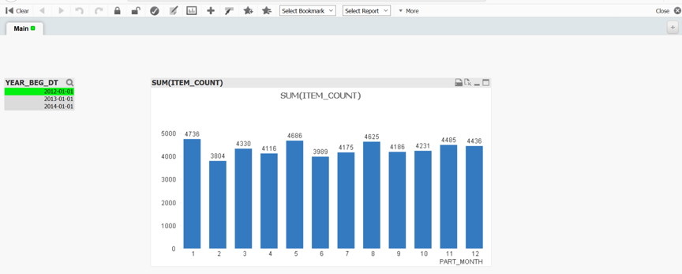

## 与 QlikView Server 连接{#server}

QlikView Server 提供了一个通过局域网或广域网发布、共享Qlikview商务智能信息平台。QlikView Server通过与QlikView的紧密整合，提供了一个面向多终端用户的数据分析技术。

### 前提条件

- 安装Kyligence ODBC驱动程序。有关安装信息，参考页面 [Kyligence ODBC 驱动程序教程](../../driver/odbc/README.md)。
- 安装 QlikView Server。有关QlikView Server的安装说明，请访问[Qlik官网](https://www.qlik.com/us)寻求帮助。

### 连接步骤

配置完服务器DSN并成功安装 QlikView Server后，可执行以下步骤来连接 Kyligence Enterprise与 QlikView Server。

1. 切换DSN：

   首先，通过QlikView Desktop创建连接Kyligence Enterprise的报表，操作步骤可参考[与QlikView Desktop 连接](#desktop)，然后，在QlikView服务器上，打开已创建好的Qlikview报告，编辑脚本，将本地DSN替换成服务器DSN。

   

2. 发布报告：

   在 **QlikView Management Console** 查看发布根目录，将切换DSN后的QlikView报表拷贝至该目录后进行发布。

   

   

3. 查看报告：

   在**QlikView AccessPoint**查看与Kyligence Enterprise集成的报告。

   