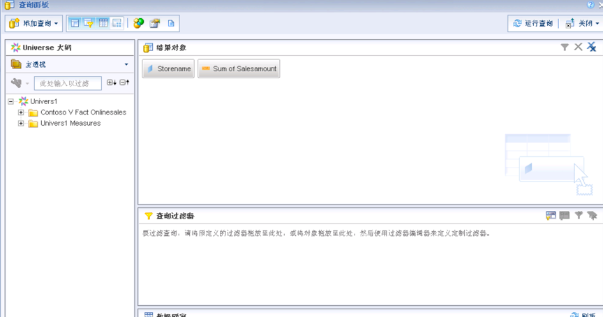
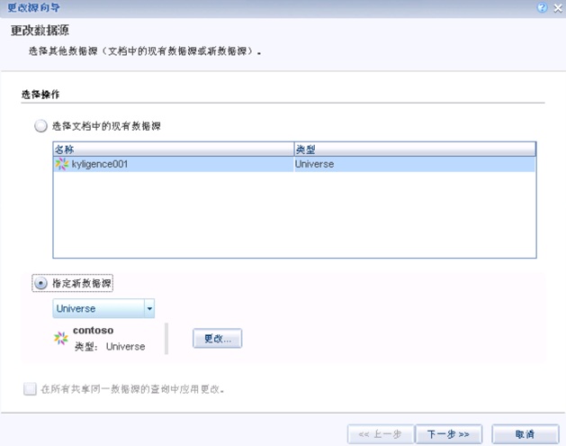

## 与 SAP BusinessOjects 集成

SAP BusinessObjects（SAP BO）是SAP公司旗下的商务智能产品，自Kyligence Enterprise3.0版本开始，支持与SAP BO 进行集成。
本文将分步介绍 SAP BO Web Intelligence 4.1 与 Kyligence Enterprise 连接的方法。

### 前置条件

已经在安装 SAP BO 的机器上安装了64位的Kyligence ODBC 驱动程序并配置好DSN。

 有关如何下载和配置 Kyligence ODBC驱动程序的详细信息，请参阅 Kyligence Enterprise 用户手册中 [Kyligence ODBC 驱动程序教程](../driver/odbc/win_odbc.cn.md)章节。

### 使用 Universe 设计工具进行建模

1. **管理数据连接**

   打开桌面上的 Universe 设计工具

   

   点击**connections**，管理数据连接。

   

   点击**新增**连接，增加连接。

   

   连接类型选择**共享**，并输入连接名称。

   

   选择 Generic ODBC 数据源。

   

   输入Kyligence Enterprise的用户名、密码和 DSN 名称即可。

   

   选择连接池类型为始终保持连接，然后保存该连接即可。

   

2. **创建数据模型**

   打开**Universe 设计工具**，打开快速设计向导，使用刚才新建的数据连接创建模型。

   在快速设计向导中第一步输入Universe 名称，并在`选择数据库连接`选择上一步创建的共享连接。

   

   在快速向导第二步将需要使用的表增加到右侧。

   

   在快速向导第三步将度量按照聚合形式增加到右侧，点击完成保存完成快速设计向导即可。

   > 如需要利用到Cube中的预计算结果，此处需要确保定义的度量和Cube中定义的一致。

   

   导入表后会进入建模，首先会根据列名自动匹配连接关系，如果没有被连接的表可以点击**插入联结**进行连接。

   

   编辑全部关系后点击保存即可。点击连接线即可修改已定义的连接关系。

   

###  创建报表

  打开Web Intelligence 胖客户端， 选择Universe中刚才创建的模型为数据源创建查询。

进入到查询面板，将左侧显示的维度度量拖拽到右侧的结果对象中。

   点击右上方的运行结果，即可得到查询结果。

### 替换数据源的方法

   ***方法一 在报表内修改***

 首先创建一个Kyligence Enterprise的universe，然后在现有报表设计页面点击数据访问-更改源。

选择其他Universe，点击**运行查询**以恢复报表。

   

   选择其他universe

   

   字段映射完毕后点击完成即可

   

   字段映射完毕后点击完成即可

   

   在查询界面点击运行查询即可还原报表

   

   ***方法二 在 universe 设计工具中修改***

   在 universe 里编辑 Connection

   

   修改 DSN 为连接Kyligence Enterprise的 DSN，然后保存即可。

### FAQ

**Q: BO 发出的查询都会带上 schema,包括 default database，而 default 在 Kyligence Enterprise 查询中是一个关键字不能使用 default.table 的形式的查询语句。**
解决方法：在**kylin.properties**中把`kylin.query.escape-default-keyword`设为 true，Kyligence Enterprise 会自动为 default 转为"DEFAULT"。

