## 与 SAP BusinessOjects Client 集成

SAP BusinessObjects（SAP BO）是 SAP 公司旗下的商务智能产品，自 Kyligence Enterprise 3.0 版本开始，支持与 SAP BO 进行集成。
本文将分步介绍 SAP BO Web Intelligence 4.1 与 Kyligence Enterprise 连接的方法。

### 配置 ODBC 及 DSN

有关 Kyligence ODBC 的配置，请参考 [Windows 下安装与配置 Kyligence ODBC驱动](../../driver/odbc/win_odbc.cn.md)。

### 使用 Universe 设计工具进行建模

#### **1. 管理数据连接**

1.1 点击 **connections**，管理数据连接。

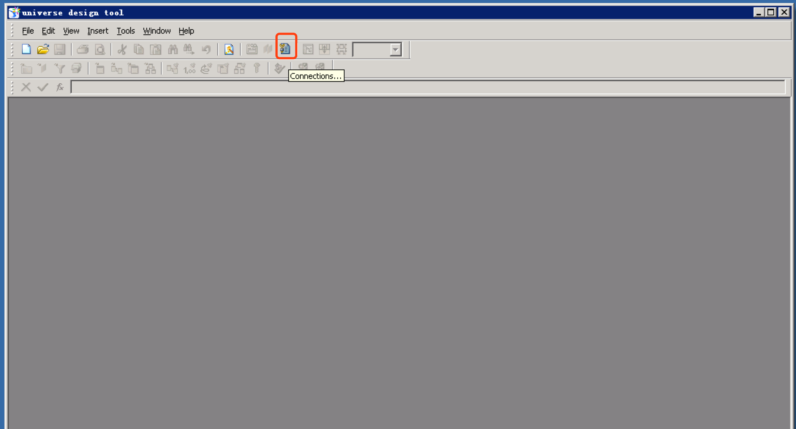

点击**新增**连接，增加连接。

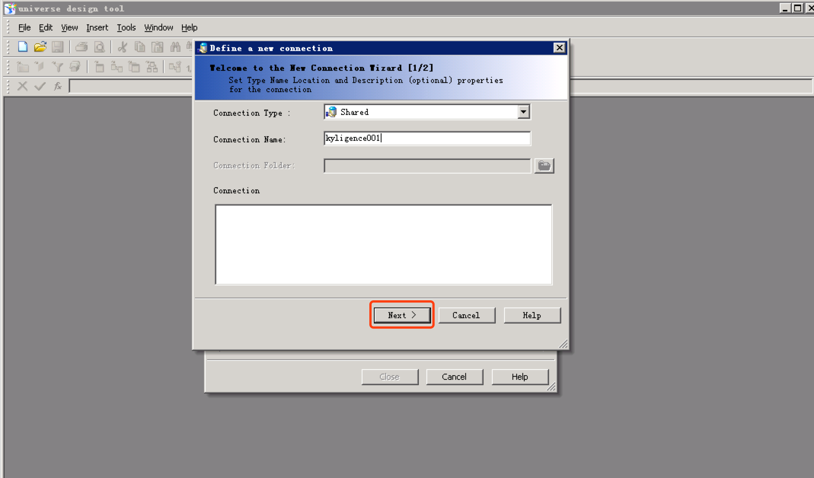

1.2 选择 Generic ODBC 数据源。

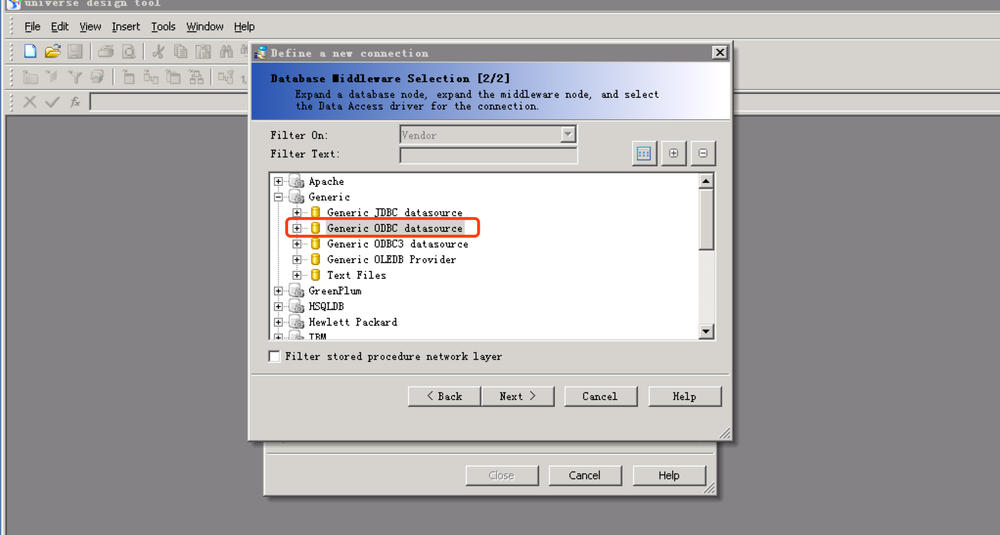

1.3 输入用户名、密码和 DSN 名称即可。

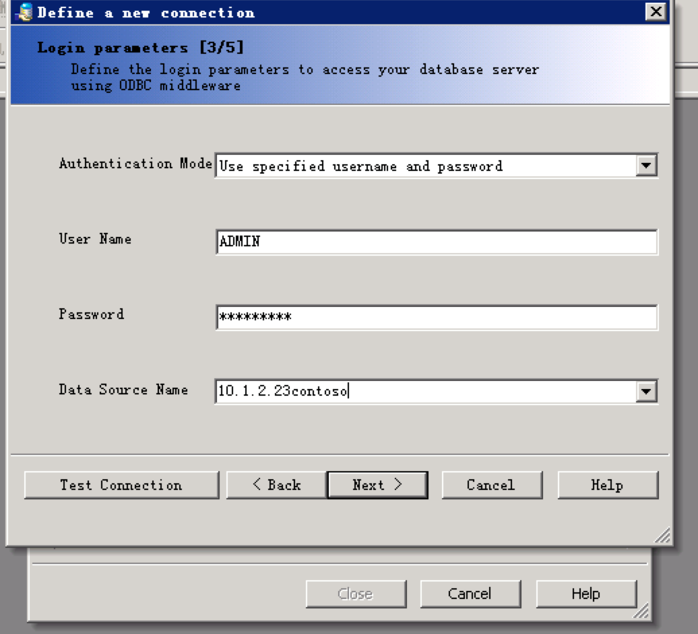

1.4 选择连接池类型为始终保持连接，然后保存该连接即可。

#### **2. 创建数据模型**

2.1 打开 **Universe** 设计工具，使用刚才新建的数据连接创建模型。

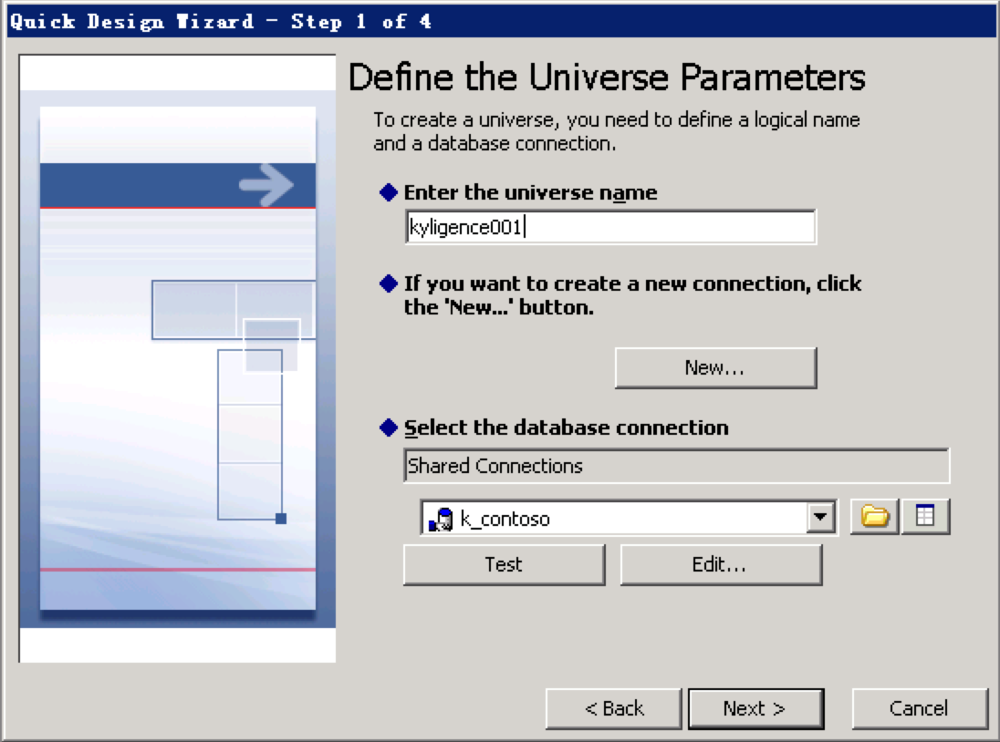

2.2 将需要使用的表增加到右侧。

2.3 将度量按照聚合形式增加到右侧，点击完成保存即可。

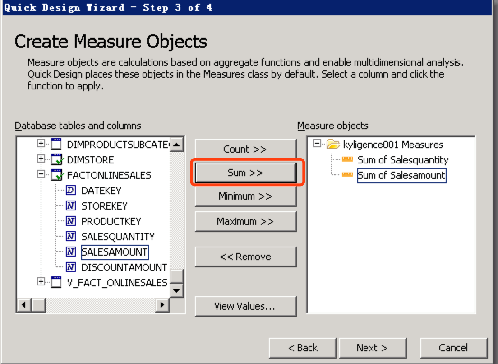

2.4 导入表后会进入建模，首先会根据列名自动匹配连接关系，如果没有被连接的表可以点击**增加连接**进行连接。

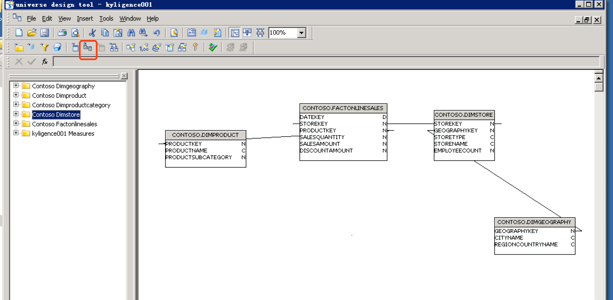

2.5 点击连接线即可修改连接关系编辑全部关系后，点击保存即可。

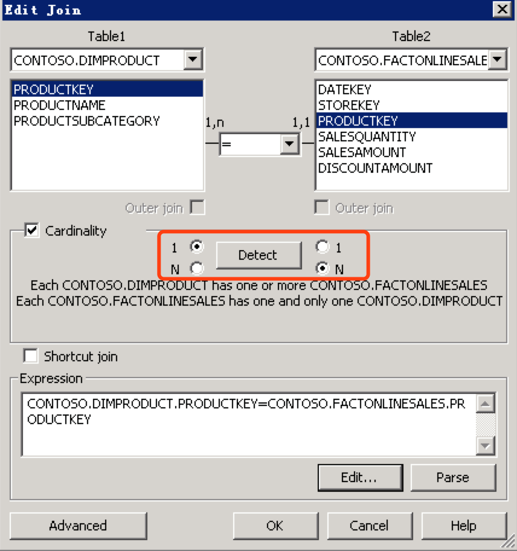

#### 3. 发布至服务器

另存为，发布到 CMC Server 模型路径下。

### 在胖客户端中创建报表

选择 Server上的 Universe 为数据源 (本地也可以)，并使用新建的 Universe，把需要分析的字段拖动到右侧，点击运行查询。

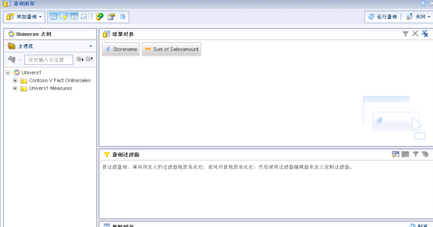

得到查询结果，如图所示

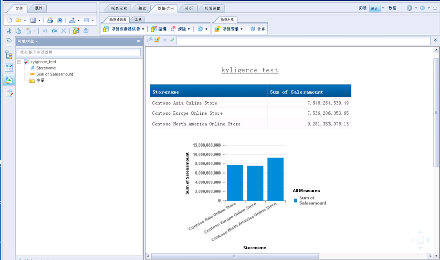

保存，即发布至 BO Server。

### 替换数据源的方法

**方法一 在报表内修改**

首先创建 Kyligence Enterprise 的 universe，然后在报表设计页面点击数据访问-更改源

   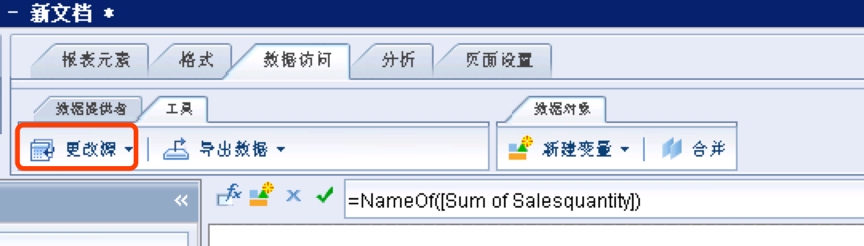

选择其他 universe

   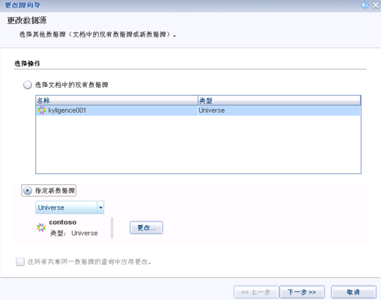

设置字段映射，完毕后点击完成

   

   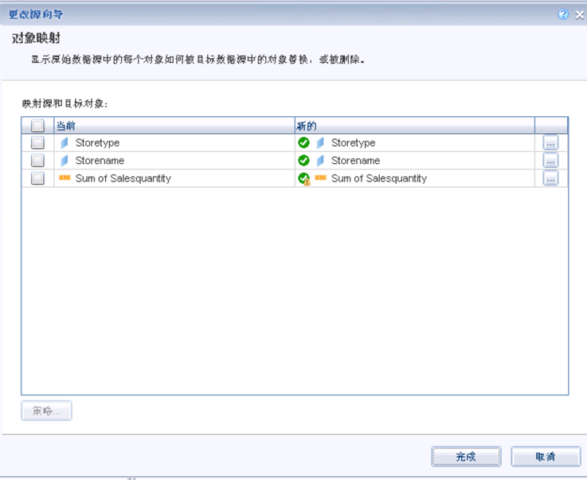

   在查询界面点击运行查询即可还原报表

   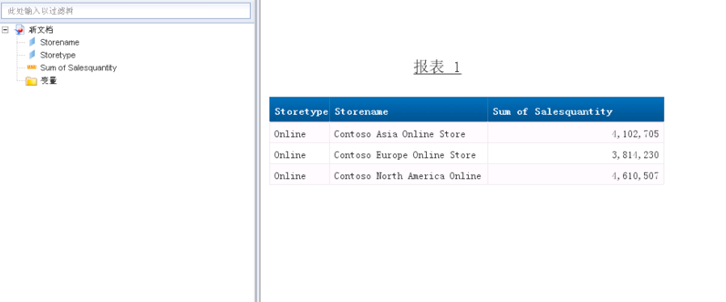

***方法二 在 universe 上修改***

在 universe 里编辑 Connection

   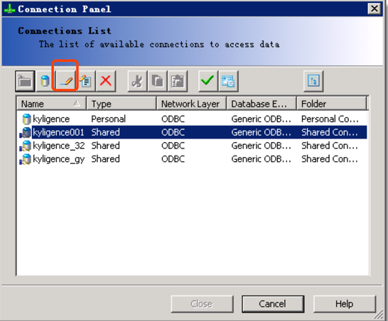

修改 DSN 为需要的 DSN，然后保存即可。

### FAQ

**Q: BO 发出的查询都会带上 schema,包括 default database，而 default 在 Kyligence Enterprise 查询中是一个关键字不能使用 default.table 的形式的查询语句。**
解决方法：在**kylin.properties**中把 `kylin.query.escape-default-keyword`设为 true，Kyligence Enterprise 会自动为 default 转为"DEFAULT"。