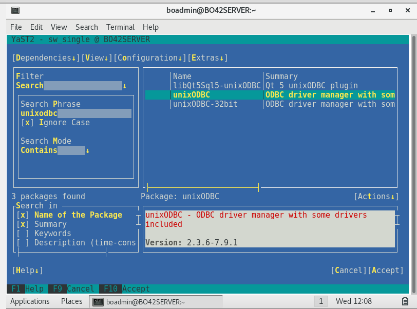
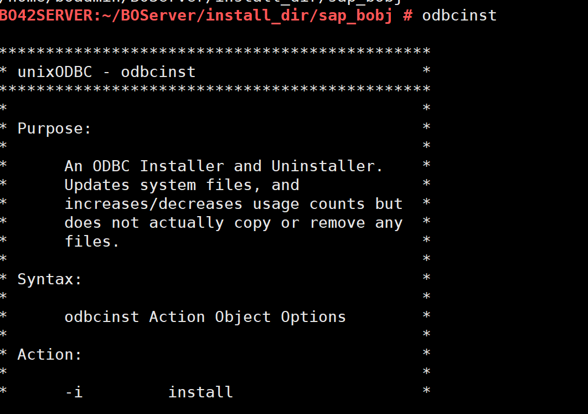
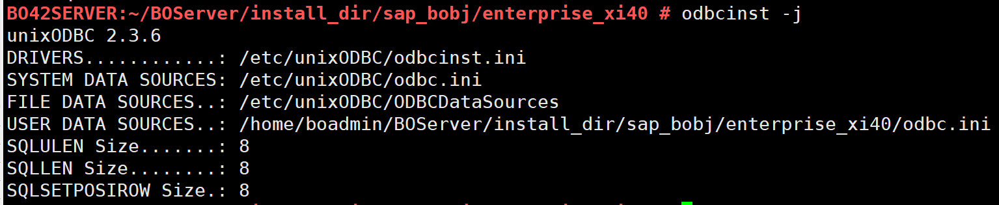
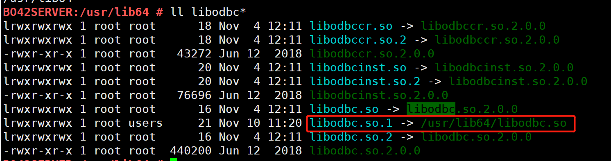
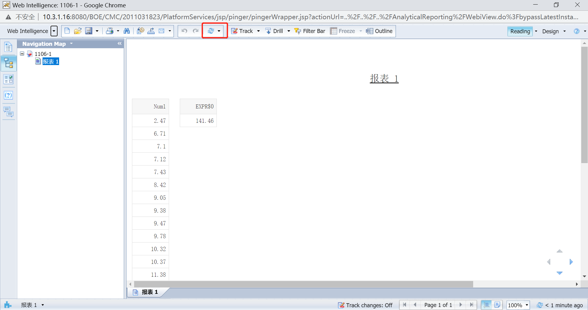

## 与 SAP BusinessOjects Server 集成

本章节以 Suse 12 SAP BO Server 4.2 为例，介绍如何与 SAP BO Server 集成。

### Server 配置操作

#### 安装 Unix ODBC Manager 

```
sudo -i yast
```

转至 Software Management。在搜索框，输入 unixodbc，Enter 确认。



选择 64-bit 位 安装包，按 Tab+Enter 打开操作菜单，选择 Install *+*，Enter 确认。

安装完成后，按 F10 完成退出，然后按 F9 退出以退出 YaST。

使用命令 `odbcinst` 验证 Unix ODBC Manager 安装是否成功。如出现如下信息，证明安装成功。



使用命令 `odbcinst -j` 确认 Unix ODBC Manager 版本。



> **注意**：不同版本的 unix odbc manager，BO Server odbc.sbo  配置不同 

#### 安装 Kyligence ODBC Driver

[Download](http://download.kyligence.io/#/download) 下载安装包，拷贝至 BO Server 指定目录，解压

```
tar -zxvf Kyligence.ODBC.{version}.tar.gz
```

如，拷贝至 {BO 安装目录}/sap_bobj/enterprise_xi40/linux_x64/odbc/KyligenceODBC

#### 确认 libodbc 路径，设置 libodbc.so.1 软链

libodbc 是 Suse 环境 BO Server 安装的前置条件，无须再次安装  

```
cd /usr/lib64
ll libodbc*
```

确认 libodbc.so 存在，设置 libodbc.so.1 软链。

```
ln -s /usr/lib64/libodbc.so libodbc.so.1
```

使用命令 `ll libodbc*`  确认软链是否正确。



#### 配置环境变量

1）修改 /etc/profile 

```
vi /etc/profile 
```

新增变量 ODBCINI 指向 DSN 路径 ，LD_LIBRARY_PATH 指向 libodbc 和 Kyligence ODBC lib 

```
export ODBCINI=/home/boadmin/BOServer/install_dir/sap_bobj/enterprise_xi40/odbc.ini
export LD_LIBRARY_PATH=/usr/lib64:/home/boadmin/BOServer/install_dir/sap_bobj/enterprise_xi40/linux_x64/odbc/KyligenceODBC
source /etc/profile 
```

2）修改 env.sh

```
vi {BO 安装目录}/sap_bobj/setup/env.sh
```

找到 LIBRARYPATH，新增 libodbc 和 Kyligence ODBC lib 路径

```
:/usr/lib64:${BOBJEDIR}enterprise_xi40/linux_x64/odbc/KyligenceODBC
```

#### 新建 DSN 

编辑 ODBCINI 路径的 odbc.ini 文件，新增 Kyligence Enterprise DSN

```
cd {BO 安装目录}/sap_bobj/enterprise_xi40
vi odbc.ini
```

新增 DSN **KyligenceDataSource** 

> **注意** ：DSN 名称必须与客户端自建的 DSN 一致。

```
[KyligenceDataSource]
SERVER=10.1.2.43
PORT = 7070
PROJECT = learn_kylin
Driver=/home/boadmin/BOServer/install_dir/sap_bobj/enterprise_xi40/linux_x64/odbc/KyligenceODBC/libKyligenceODBC64.so
```

#### ISQL 验证 DSN

```
isql KyligenceDataSource ADMIN 'KYLIN'
select * from KYLIN_SALES limit 1;
```

SQL 结果正常返回，即验证 DSN 有效。

#### 配置 BO Server odbc.sbo

进入 odbc.sbo 所在路径，odbc.sbo 相关介绍，请参考[ SAP 手册](https://help.sap.com/viewer/aa4cb9ab429349e49678e146f05d7341/4.2.6/en-US/4594fbce6e041014910aba7db0e91070.html)。

```
cd {BO 安装目录}/sap_bobj/enterprise_xi40/dataAccess/connectionServer/odbc
vi odbc.sbo
```

参考 odbc.sbo 备注信息，基于安装的 ODBC Manager 版本，修改 odbc.sbo  文件，保存。

比如，当 Unix ODBC Manager 版本为 2.3.6，需要修改 odbc.sbo 中的 <Library Platform="Unix"> 参数值，并注释掉 Table parameter。

#### 重启 BO Server

```
cd {BO 安装目录}/sap_bobj
./stopservers
./startservers
```


## 创建并发布报表

使用 Universe + Web Intelligence 胖客户端创建，并发布报表，可参考手册 [与 SAP BusinessOjects Web Intelligence 集成](sap_bo_client.cn.md)。


## Server 查看报表

浏览器进入 CMC Server http://ip:port/BOE/CMC，进入报表发布目录，选择报表，右键**查看**。




