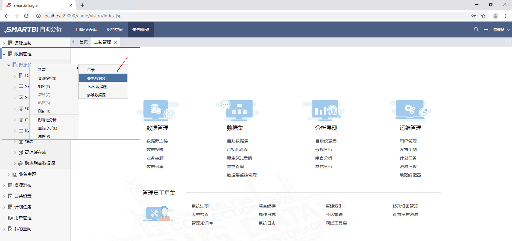
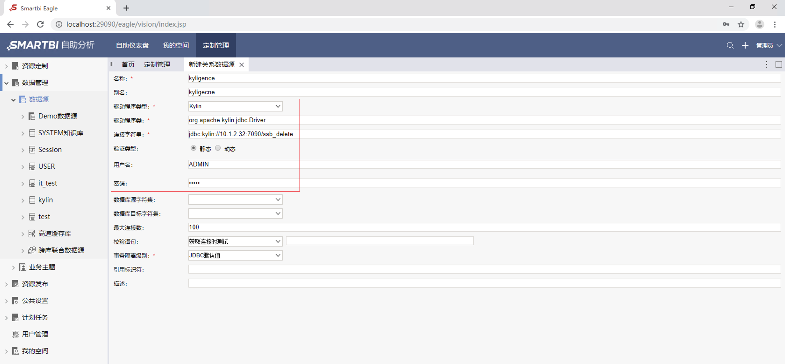
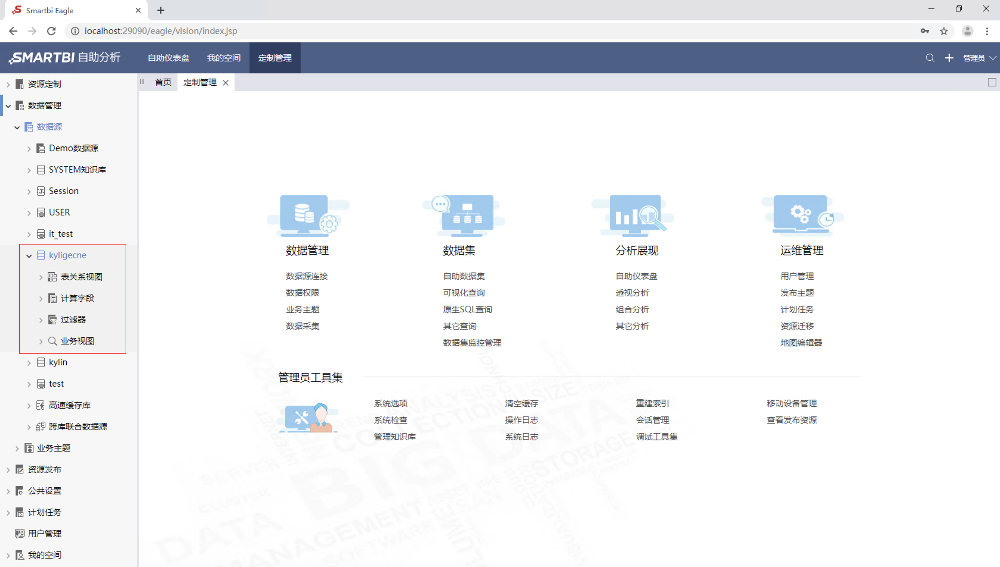
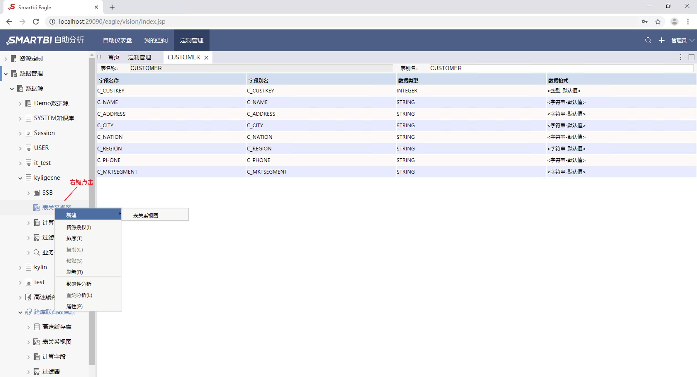
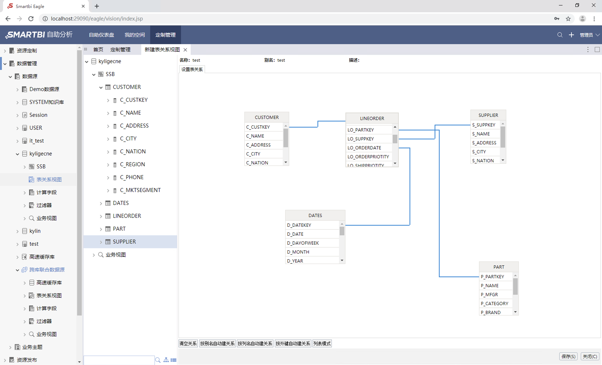
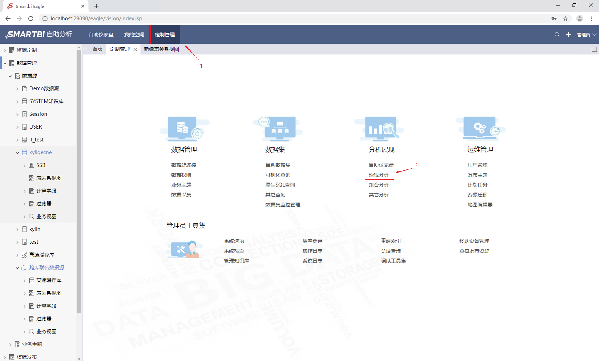
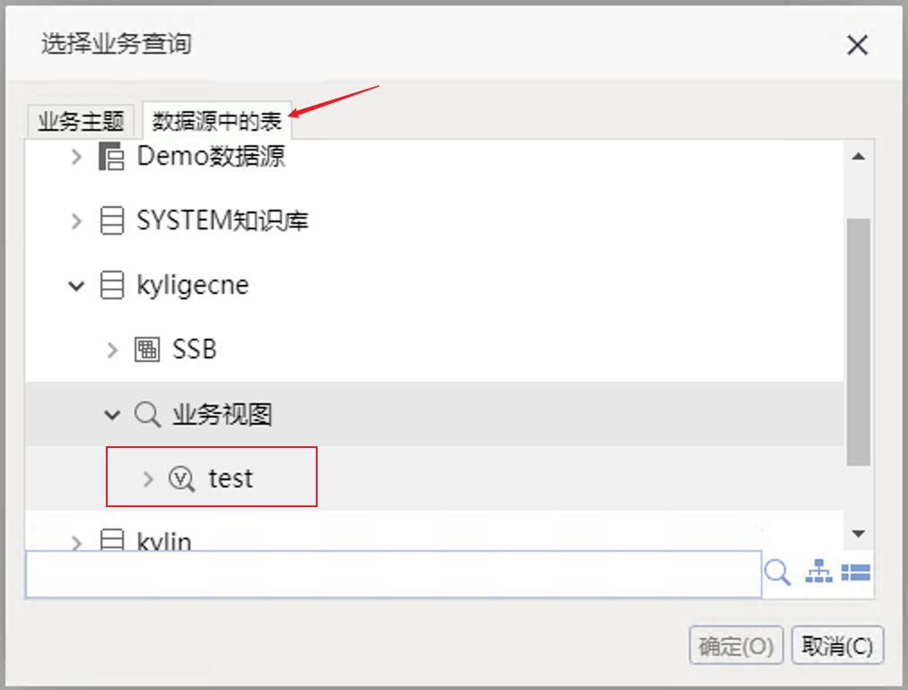
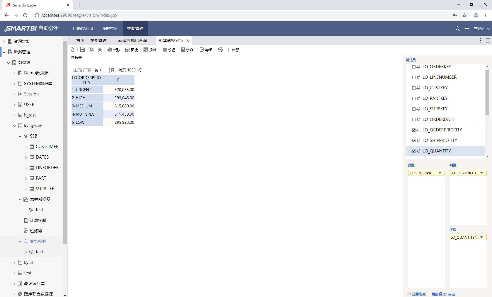
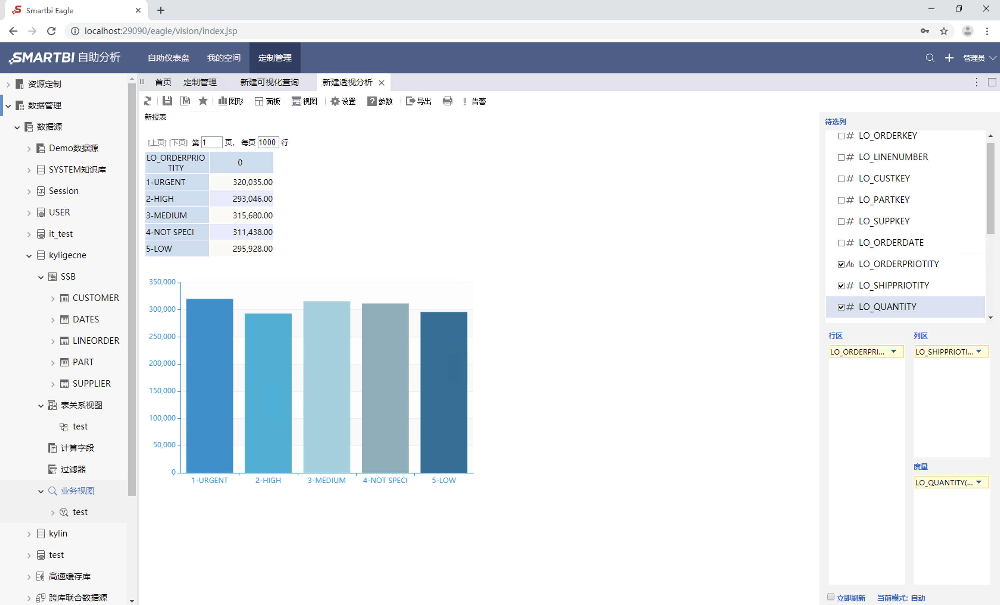

## 与 SmartBI Insight 集成

SmartBI Insight 是企业级的商业智能分析平台，定位于前端数据分析，对接各种数据库、数据仓库和大数据平台，构建交互式仪表盘，满足多样性的数据分析应用需求，如大数据分析、企业报表平台、自主探索分析等。本文将分步介绍 SmartBI Insight 与 Kyligence Enterprise 的连接。

### 安装 SmartBI Insight

有关 SmartBI Insight 的安装说明，请访问 [SmartBI Insight 下载页面](http://www.SmartBI.com.cn/download)

### 安装 Kyligence JDBC 驱动程序

+ SmartBI Insight 通过 JDBC 连接 Kyligence Enterprise，所以首先需要在SmartBI Insight 上安装 Kyligence JDBC 驱动程序，获取 Kyligence JDBC 驱动程序：请参考 [Kyligence JDBC 驱动程序说明](../driver/jdbc.cn.md)

+ 向 SmartBI Insight 增加 JDBC 驱动程序：

  具体步骤如下：

  + 停止 SmartBI
  + 将 JDBC 的驱动放到 **Smart BI 安装目录\Tomcat\webapps\eagle\WEB-INF\lib**下
  + 重启 SmartBI

### 建立 Kyligence Enterprise 数据源连接 

+ **进入界面**

  在 **定制管理**->**数据管理**->**数据源** 节点下右键选择新建关系数据源，或是在定制管理快捷按钮选择 **数据源连接**，则打开数据源连接窗口。

  

+ **新建数据源**

  选择 **Kylin** 驱动程序类型，将服务器IP地址等信息填写到连接字符串（ 字符串格式为:```jdbc:kylin://<hostname>:<port>/<project_name>``` ），然后**保存**数据源连接。

  这里默认选择用户验证类型为**静态验证**，输入 Kyligence Enterprise 的用户名和密码进行连接。

  

+ **管理数据源**

  点击保存后，您将在 **定制管理**->**数据管理**->**数据源**下看到您此前建立的 Kyligence 数据源。

  

  右键点击数据源名称，点击管理数据库，即可进入管理页面

  

  对数据源进行管理，将表结构信息（表名、字段名、字段类型等）添加到 SmartBI Insight 中。

  
  
  右键点击您创建的数据源下的**表关系视图**，点击其中的**新建**->**表关系视图**，即可进入关系图页面
  
  
  
  对于星型模型的多表关联，会按照按外键、列名等方式自动创建表之间的关联关系，也可以手动拖拽建立关联关系。（注：这里的关联关系需要与接下来使用的 Cube 中的**关联关系**相匹配）
  
  

### 创建业务视图

+ 右键点击**数据库**->**数据库名**->**业务视图**->**可视化查询**，即可进入新增业务视图的界面。

  

+ 将字段拖入后，创建业务视图。

  

### 透视分析

+ 点击**定制管理**->**透视分析**，即可进入透视分析页面。

  

+ 在选择业务查询页面，选择数据源中的表选项卡，并找到之前创建的业务视图。

  

+ 拖拽字段到行列区和过滤区，点击刷新，进行自助式探索分析。

  

+ 根据分析需要，生成各种分析图表。

  

> 注意：若想使用多维模式连接 Kyligence 产品，需要使用 Kyligence Insight 。更多信息请看 [Kyligence Insight 对接 SmartBI 操作手册](https://docs.kyligence.io/books/insight/v1.0/zh-cn/integration/smartbi_integration.cn.html)。