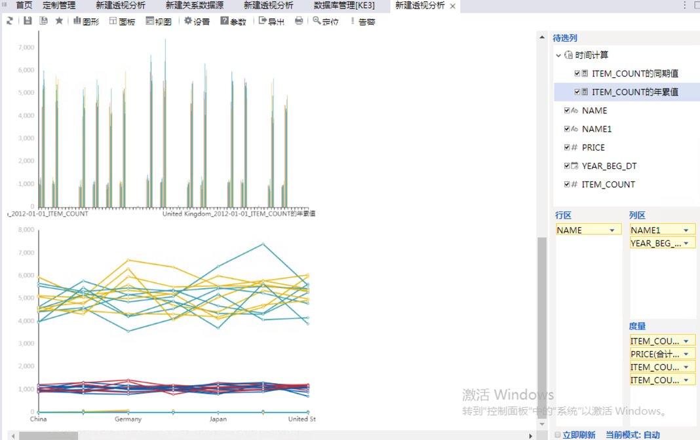

## 与 SmartBI Insight 集成

SmartBI Insight 是企业级的商业智能分析平台，定位于前端数据分析，对接各种数据库、数据仓库和大数据平台，构建交互式仪表盘，满足多样性的数据分析应用需求，如大数据分析、企业报表平台、自主探索分析等。本文将分步介绍 SmartBI Insight 与 Kyligence Enterprise 的连接。

### 支持的 SmartBI 版本

本文档验证的smartbi版本为 smartbi 8.5。

### 安装 SmartBI Insight

有关 SmartBI Insight 的安装说明，请访问 [SmartBI Insight 下载页面](http://www.SmartBI.com.cn/download)

### 安装 Kyligence JDBC 驱动程序

SmartBI Insight 通过 JDBC 连接 Kyligence Enterprise，所以首先需要在 SmartBI Insight 上安装 Kyligence JDBC 驱动程序，获取 Kyligence JDBC 驱动程序：请参考 [Kyligence JDBC 驱动程序说明](../driver/jdbc.cn.md)

向 SmartBI Insight 增加 JDBC 驱动程序：

* 删除 SmartBI 自带的 Apache Kylin JDBC 驱动程序，通常可在以下路径找到：

```
[SmartBI_Insight安装路径]\Tomcat\webapps\smartbi\WEB-INF\lib
```

* 确认 SmartBI 的动态目录

进入 SmartBI 的配置界面，URL 为 `http://server:port/smartbi/vision/config.jsp`（根据实际情况修改 server 和 port ），将界面滚动到底部，找到**动态驱动存放路径**一项


下载  Kyligence 的 JDBC 的驱动并放到 ** SmartBI 的动态驱动路径下**, 默认安装路径为：

```
[SmartBI_Insight 安装路径]\Tomcat\bin\dynamicLibraryPath\KYLIN
```

> 直接将文件添加到上述步骤中配置的存放路径即可，无需重启服务。系统每隔 10 秒会自动监听该目录里 jar 文件的变化。


### 建立 Kyligence Enterprise 数据源连接

#### 新建数据源

在 **定制管理**->**数据管理**->**数据源** 节点下右键选择新建关系数据源，或是在定制管理快捷按钮选择 **数据源连接**，则打开数据源连接窗口。

名称：输入任意名称

别名：输入任意别名

驱动程序类型：Kylin

驱动程序类：org.apache.kylin.jdbc.Driver

连接字符串：`jdbc:kylin://<servername>:<port>/<projectName>`

验证类型: 根据需要选择静态或动态，如直接输入单一验证账户，则选择静态。

用户名: 输入连接的 Kyligence 环境的用户名

密码: 输入连接的 Kyligence 环境的密码

数据库源字符集: 留空

数据库目标字符集: 留空

最大连接数:不修改，默认值 100

引用标识符:查询中的转义符号，请使用英文的双引号


点击测试连接，显示连接通过，然后点击保存数据源。


#### **管理数据源**

点击保存后，您将在 **定制管理**->**数据管理**->**数据源**下看到您此前建立的 Kyligence 数据源。

右键点击数据源名称，点击管理数据库，即可进入管理页面


对数据源进行管理，将表结构信息（表名、字段名、字段类型等）添加到 SmartBI Insight 中。


对于需要在模型上重复使用的表需要复制表，并修改表的别名。

点击您创建的数据源，右键点击需要重复使用的表，点击**复制表**。


右键点击需要表名，点击属性，修改表的别名。在本例中，我们将需要重复使用的表 KYLIN_ACCOUNT 分别修改别名为 BUYER_ACCOUNT 和 SELLER_ACCOUNT 


右键点击您创建的数据源下的**表关系视图**，点击其中的**新建**->**表关系视图**，即可进入关系图页面


输入名称、别名、描述。

拖拽左侧的表到画布中，进行建模，对于星型模型的多表关联，会按照按外键、列名等方式自动创建表之间的关联关系，也可以手动拖拽建立关联关系。


> 注：在 SmartBI 中定义的模型需要与 Kyligence Enterprise 中定义的模型的**关联关系**相匹配

对于需要多列关联的表，可点击关联模型的线，修改关联表达式


### 创建业务视图

右键点击**数据库**->**数据库名**->**业务视图**->**可视化查询**，即可进入新增业务视图的界面。


将字段拖入后，创建业务视图。


>注意：对于在 Kyligence 的 Cube 上定义了聚合的度量请双击字段，并定义字段的聚合方式。
>
>如 Kylin_sales_cube 上度量 GMV 定义为 sum(price)，则在业务视图中需要将PRICE字段的聚合方式定义为合计。


### 透视分析

点击**定制管理**->**透视分析**，即可进入透视分析页面。


在选择业务查询页面，选择**数据源中的表**选项卡，并找到之前创建的业务视图。


拖拽字段到行列区和过滤区，点击刷新，进行自助式探索分析。


根据分析需要，生成各种分析图表。




> 注意：若想使用多维模式连接 Kyligence 产品，需要使用 Kyligence MDX 。更多信息请看 [Kyligence MDX 对接 SmartBI 操作手册](https://docs.kyligence.io/books/mdx/v1.0/zh-cn/integration/smartbi_integration.cn.html)。

### 自助仪表盘

#### 创建业务主题

使用自助仪表盘功能需要先创建业务主题，在菜单中选择**定置管理>业务主题**。


在数据源中选择创建好的 Kyligence 数据源，如果您好没有创建 Kyligence 数据源 请参考 [**建立 Kyligence Enterprise 数据源连接**](#建立 Kyligence Enterprise 数据源连接 ) 部分文档创建数据源。


使用数据源中的需要使用的表拖拽到左侧栏位，并在表关系视图定义表之间的关联。


如果您需要对数据进行过滤，您可以右键过滤器，选择新建过滤器


在过滤器中定义过滤器的表达式。


#### 创建自助仪表盘

选择**定置管理>自主仪表盘**


在左侧数据栏位下拉选择刚才创建的业务主题


即可进行拖拽可视化分析。


