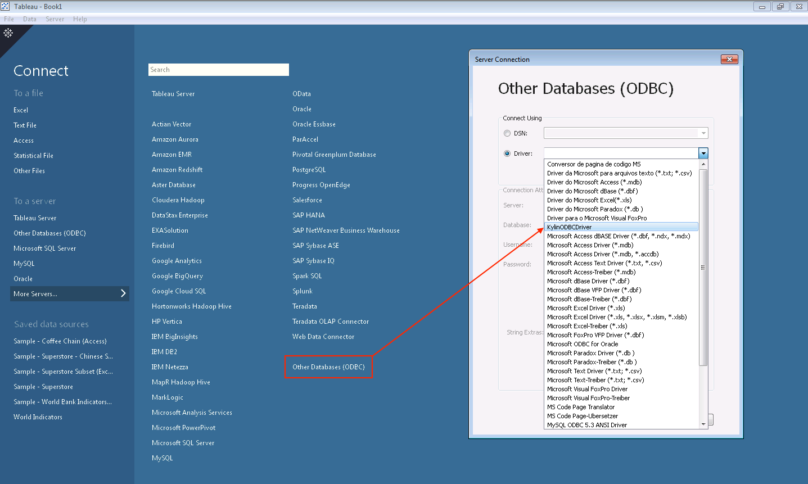
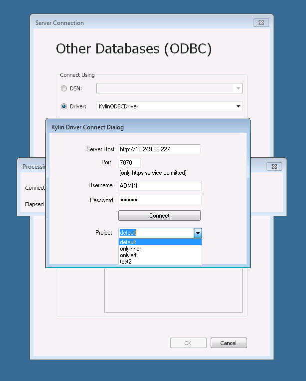
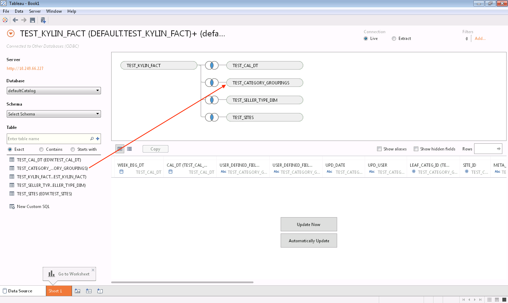
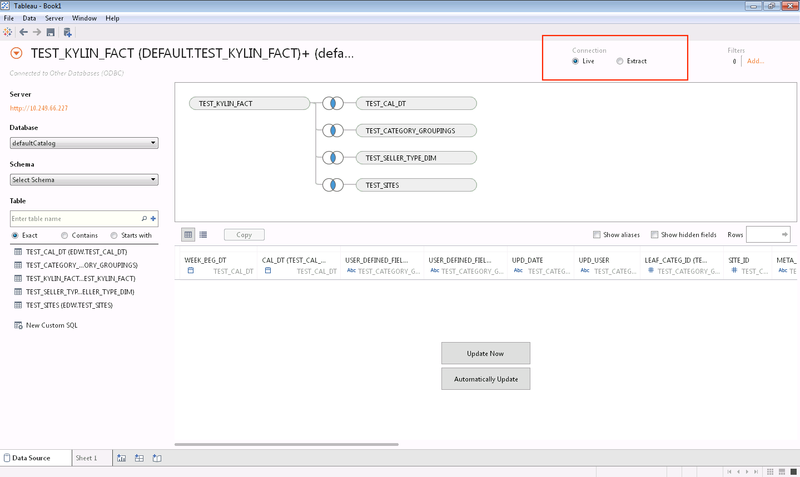
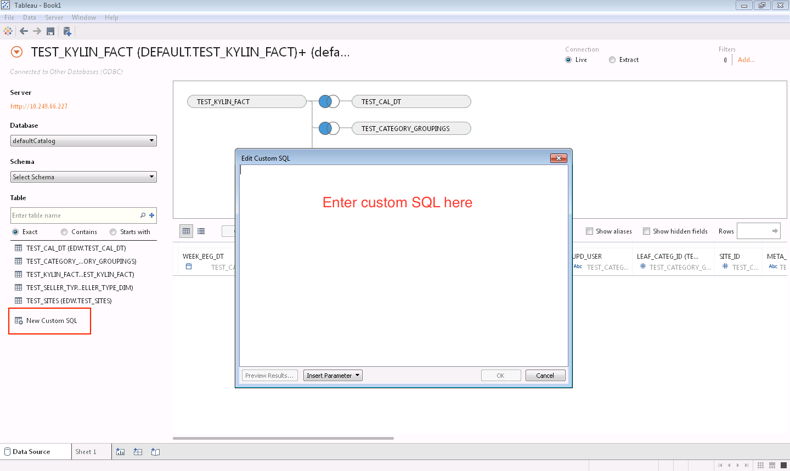
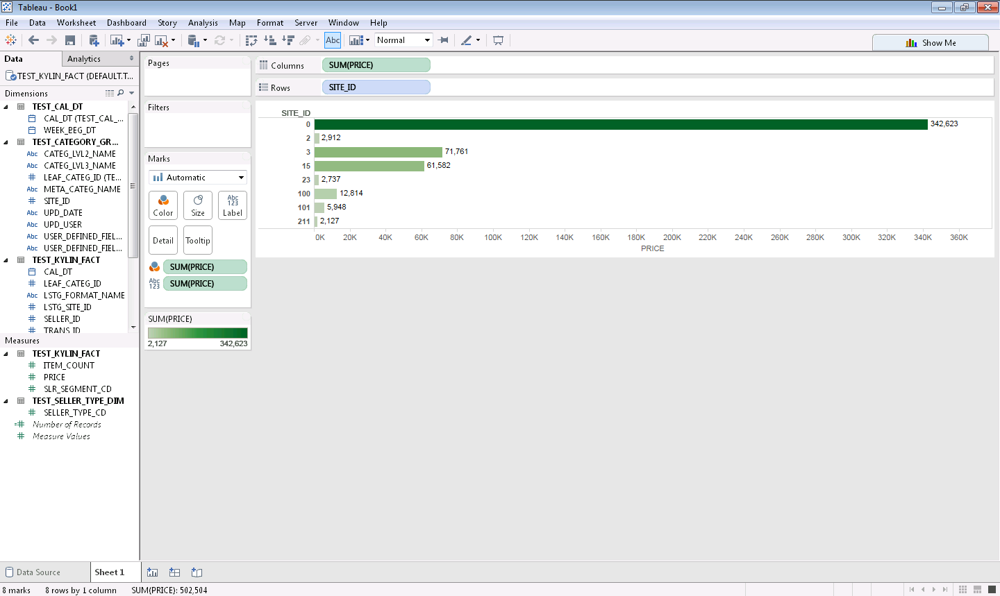
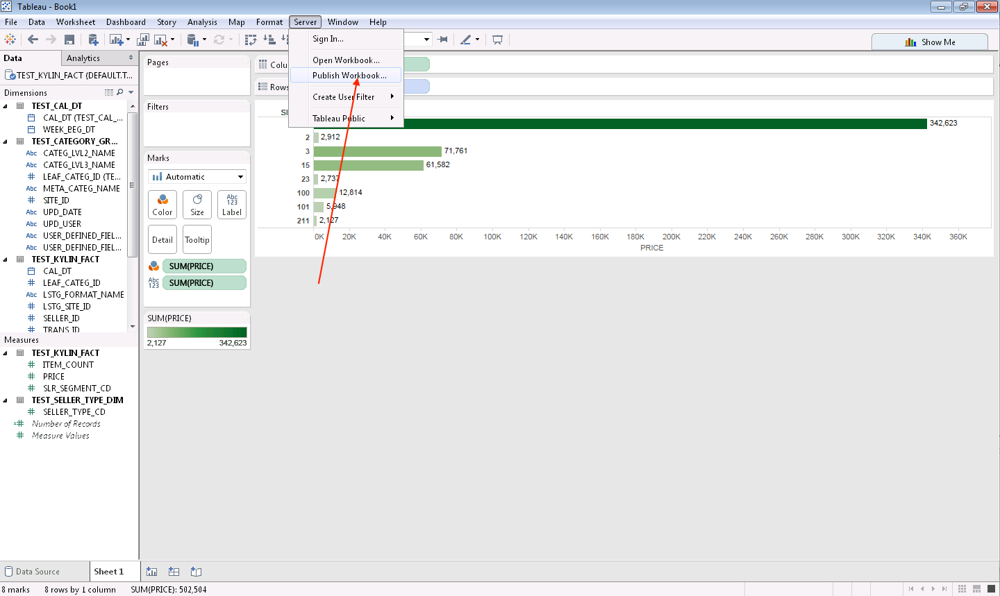

## 与 Tableau 9.x 集成

### Install ODBC Driver
参考页面[Kyligence Enterprise ODBC 驱动程序教程](../../driver/odbc/README.md)Kyligence Enterprise ODBC Driver __v1.2__. 如果你安装有早前版本，请卸载后再安装。 

### Connect to Kyligence Enterprise Server
在Tableau 9.1创建新的数据连接，单击左侧面板中的`Other Database(ODBC)`，并在弹出窗口中选择`KylinODBCDriver` 

输入你的服务器地址、端口、项目、用户名和密码，点击`Connect`可获取有权限访问的所有项目列表。

### 映射数据模型
在左侧的列表中，选择数据库`defaultCatalog`并单击”搜索“按钮，将列出所有可查询的表。用鼠标把表拖拽到右侧区域，就可以添加表作为数据源，并创建好表与表的连接关系

### Connect Live
Tableau 9.1中有两种数据源连接类型，选择｀在线｀选项以确保使用'Connect Live'模式

### 自定义SQL
如果需要使用自定义SQL，可以单击左侧｀New Custom SQL｀并在弹窗中输入SQL语句，就可添加为数据源.

### 可视化
现在你可以进一步使用Tableau进行可视化分析：

### 发布到Tableau服务器
如果希望发布到Tableau服务器, 点击`Server`菜单并选择`Publish Workbook`

