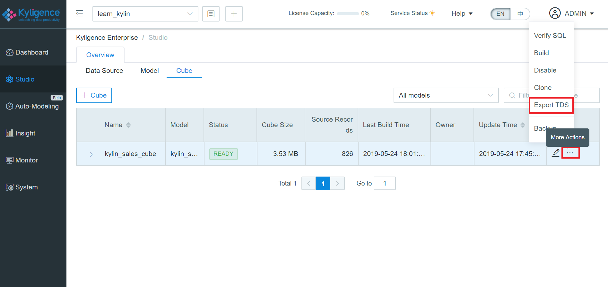
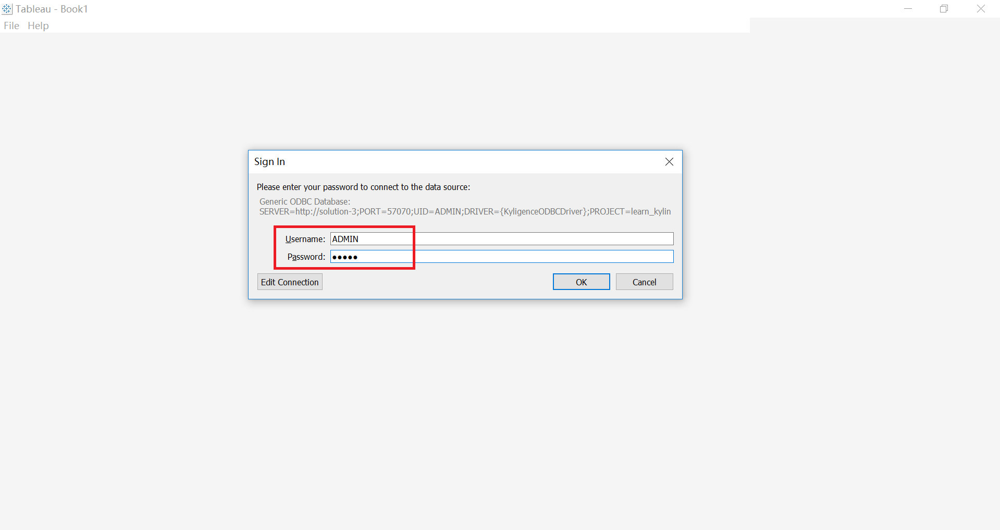
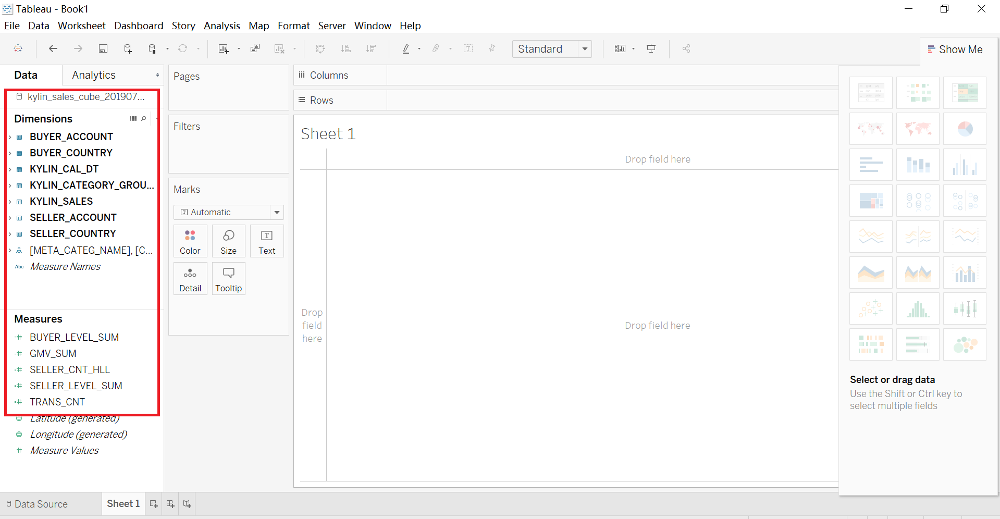
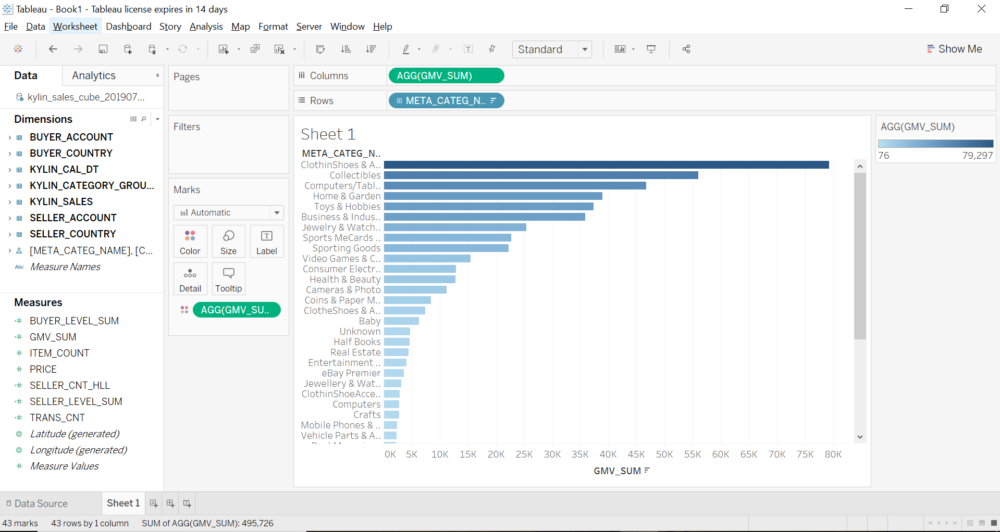
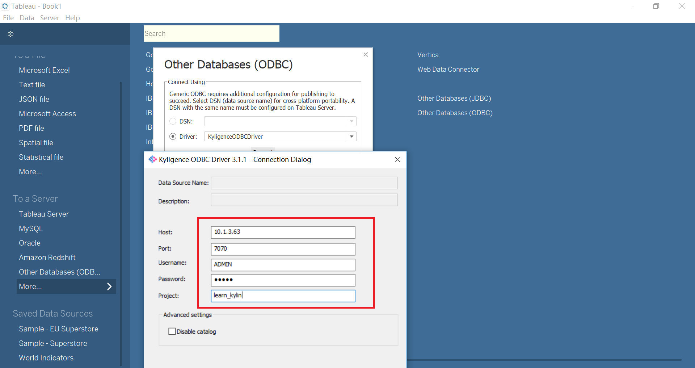
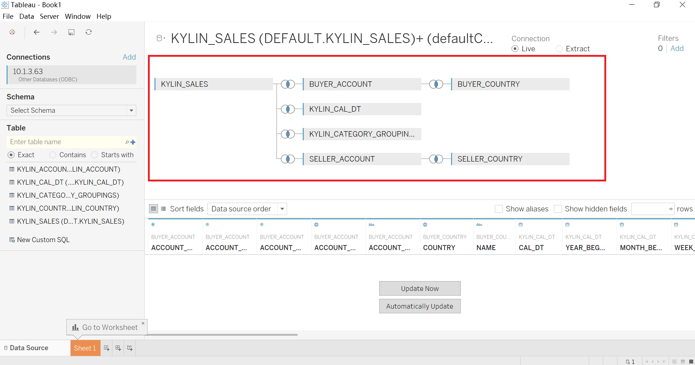
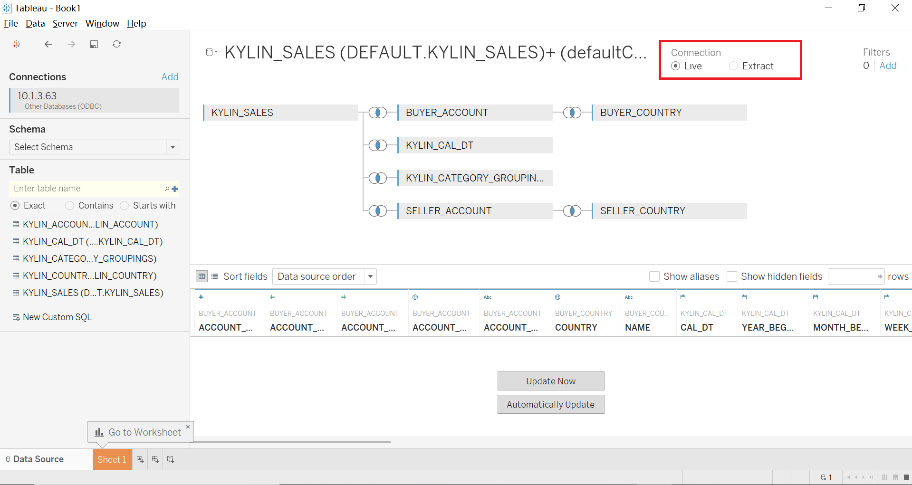
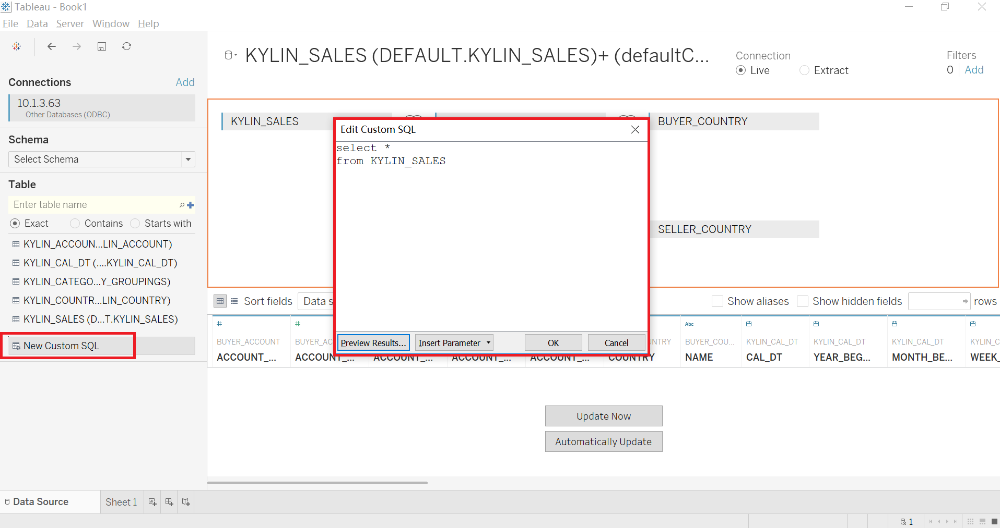

## 与 Tableau Desktop 集成

Tableau 是 Windows 平台上最流行的商业智能工具之一，它操作简洁，功能强大，通过简单地拖拽就可以将大量数据体现在可视化图表中。Kyligence Enterprise 提供与 Tableau Desktop 不同的集成方式。

Kyligence Enterprise支持与Tableau 8.X，9.X，10.X，2018.X，2019.X集成，本小节以Tableau10.3为例，将分步介绍Kyligence Enterprise与Tableau Desktop集成操作。

### 前置条件

- 安装Kyligence ODBC驱动程序。有关安装信息，参考页面[Kyligence ODBC驱动程序教程](../../driver/odbc/README.md)。

- 安装Tableau Desktop。有关Tableau的安装说明，请访问[Tableau Desktop下载页面](https://www.tableau.com/products/desktop/download)。

- 配置Tableau Datasource Customization (TDC) 文件

  Tableau 支持配置TDC文件，以达到自定义和调整ODBC连接。针对该特性，Kyligence提供满足Kyligence Enterprise特殊的查询规范的TDC文件，以帮助Tableau 更好的连接 Kyligence 数据。

  配置步骤如下：

  1. 在[Kyligence下载中心](http://download.kyligence.io/#/download)下载 “Tableau Datasource Customization“ (TDC)文件

  2. 将TDC文件拷贝至Tableau Desktop相关安装目录下即可

  ​       Tableau Desktop 缺省目录：

  ​       Documents\My Tableau Repository\Datasources
  
  > **注意：** tdc文件必须以`.tdc` 为扩展名，但是命名可以为任意名称。

  3. 重启 Tableau Desktop 以使 TDC 文件生效。

Kyligence Enterprise 与 Tableau Desktop 支持2种集成方式，下文将分别介绍具体集成步骤。

- Kyligence Enterprise 快捷导入导出同步模型方式
- Kyligence Enterprise 手动映射模型方式

### 方式一：Kyligence Enterprise 快捷导入导出同步模型方式

您在Kyligence Enterprise 完成建模与创建Cube后，可以直接导出 Tableau 对应的数据源文件(.TDS)，

并在 Tableau 中一键导入该文件，快速完成模型同步。

> **注意：** 仅 Kyligence Enterprise 3.0.1 以上版本支持该方式

该方式主要步骤如下：

#### Kyligence Enterprise 导出 Tableau Data Source (.TDS) 文件

- 进入**建模**模块下的**Cube**页面
- 选择**Ready**状态的的**Cube**
- 在**更多操作**中选择**导出TDS** 

#### 将导出的.TDS文件导入至 Tableau

- 在已部署的 Tableau 环境中，双击导出的**TDS**文件
- 在弹出的认证窗口中，输入连接认证信息
- 点击**OK**

#### 在 Tableau 中，检查导入的模型内容, 如维度，度量

#### 创建可视化图表

现在您可以进一步使用Tableau进行可视化分析，拖拽维度、度量字段，就可以生成自己的图表了。

### 方式二：Kyligence Enterprise 手动映射模型方式 

您可通过Kyligence ODBC Driver 连接 Kyligence Enterprise 数据源, 并在 Tableau 中重新建立模型完成映射。

该方式主要步骤如下：

#### 连接到Kyligence Enterprise

打开Tableau Desktop，单击左侧面板中的Other Database(ODBC)，并在弹出窗口中输入连接认证信息（服务器地址、端口、项目、用户名、密码）或下拉选择本地已创建好的DSN ，点击”连接”，验证通过后，即可获取该账户下所有有权限访问的表和数据。 

#### 创建数据模型

在Tableau Desktop左边面板中，选择 “default” 作为数据库，在搜索框中点击“Search”图标，将会列出所有的表，可通过拖拽的方式把表拖到右边面板中，创建表与表的连接关系 。

#### 设置“实时”连接

Tableau 中提供两种数据源连接类型，大数据场景下，建议您选择“实时“连接。

#### 自定义SQL

如果用户想通过自定义SQL进行交互，可以点击模型界面左下角的“新自定义SQL”，在弹出的框中输入SQL即可实现。

#### 可视化

现在您可以进一步使用Tableau进行可视化分析，拖拽维度、度量字段，就可以生成自己的图表了。

