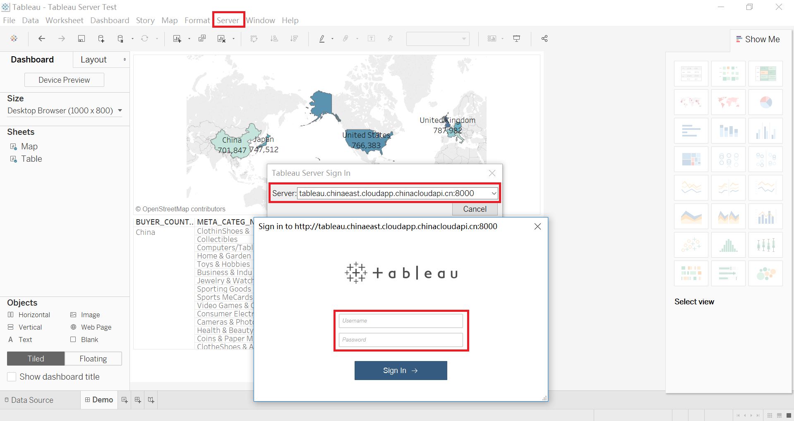
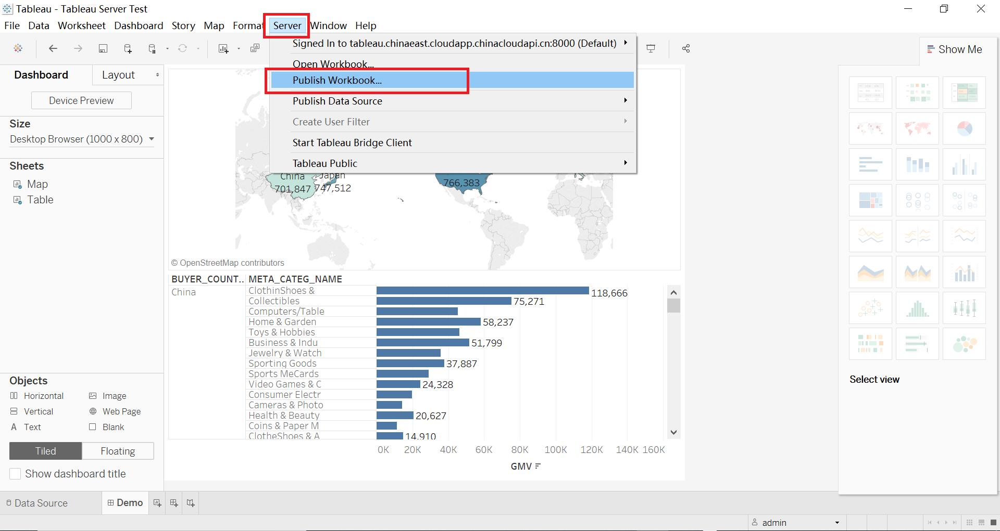
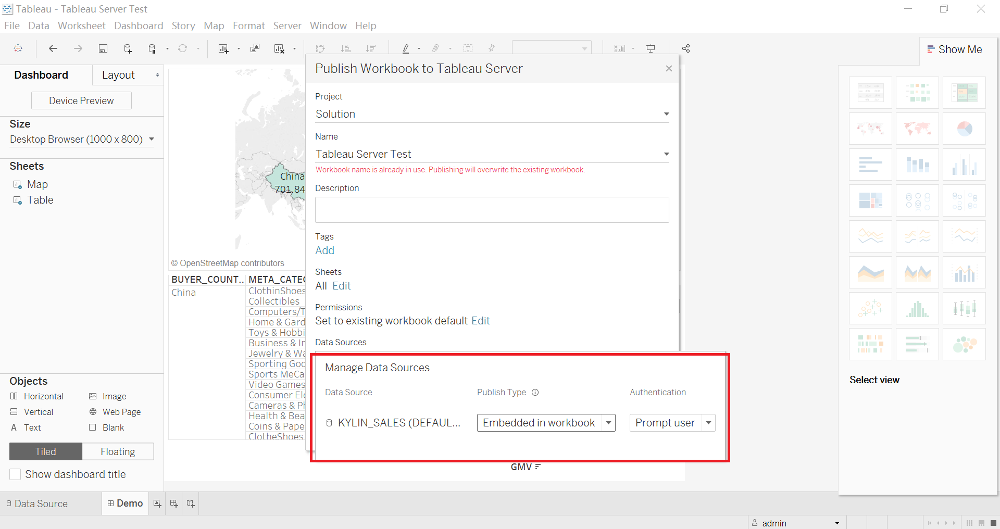
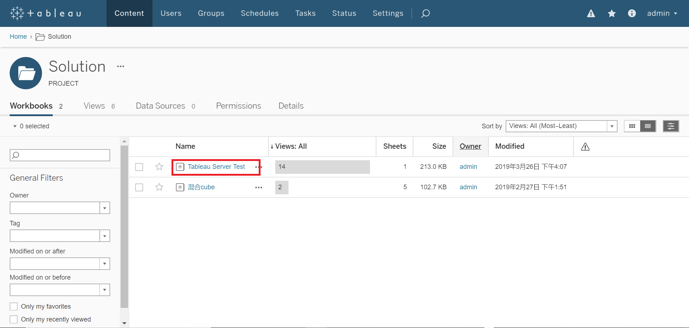
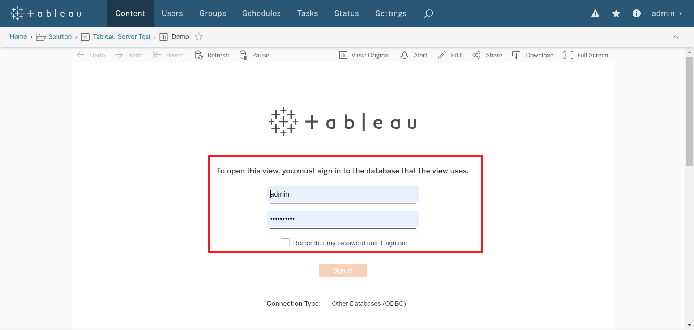
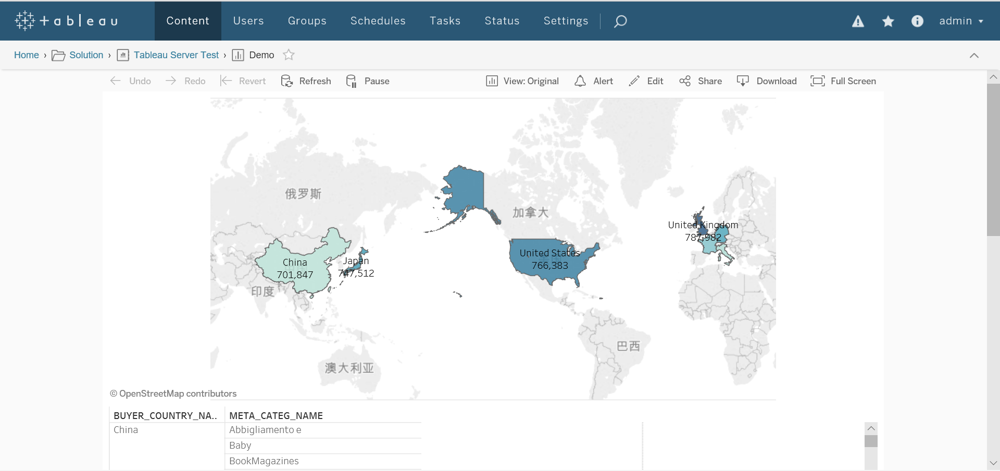

## 与 Tableau Server 集成

### 前置条件
- 安装 Kyligence ODBC 驱动程序。有关安装信息，参考页面 [Kyligence ODBC驱动程序教程](../../driver/odbc/README.md)。

- 安装 Tableau Server。有关 Tableau Server 的安装说明，请访问 [Tableau Server下载页面](https://www.tableau.com/products/server)。

- 配置Tableau Datasource Customization (TDC) 文件

  与Desktop类似，步骤如下：

  1. 在[Kyligence下载中心](http://download.kyligence.io/#/download)下载 “Tableau Datasource Customization“ (TDC)文件

  2. 将TDC文件拷贝至Tableau Server相关安装目录下即可

     Tableau Server 缺省目录：

     Windows环境：

     Program Files\Tableau\Tableau Server\<version>\bin

     或者

     ProgramData\Tableau\Tableau Server\data\tabsvc\vizqlserver\Datasources

     Linux 环境：

     /var/opt/tableau/tableau_server/data/tabsvc/vizqlserver/Datasources/

> **注意：**Tableau Server 配置连接 Kyligene Enterprise 的 ODBC 驱动时，请确保 DSN 名称和本地一致
>
> ​            TDC文件必须以`.tdc` 为扩展名，但是命名可以为任意名称。
>
> ​            TDC 文件必须应用在所有服务器节点以保证行为一致。

  3. 重启 Tableau Server 以使 TDC 文件生效。

### 登录到 Tableau Server

在 Tableau Desktop 界面上方，点击**服务器**->**登录**，在弹出的窗口输入 Tableau Server 地址，登录 Server 的 Tableau 账号密码

### 发布工作簿到 Tableau Server

登录成功后，点击**发布工作簿**

发布时，Tableau 支持两种数据源身份验证类型：**嵌入式密码**或**提示用户**。选择**嵌入式密码**时，Tableau 会有效地嵌入其发布者的连接权限，并允许可以查看工作簿的任何人查看工作簿连接到的数据。当选择**提示用户**时，将提示经允许可以对数据源使用“连接”能力的 Viewer（查看者）输入其凭据，详细介绍可参考[Tableau权限参考](https://onlinehelp.tableau.com/current/server/zh-cn/license_permissions.htm)。

为了Tableau Server和Kyligence Enterprise做到权限集成，请选择**提示用户**模式发布。

### 在Tableau Server中查看工作簿

发布成功后，浏览器进入 Tableau Server，登录 Tableau 账号密码，进入发布工作簿所在路径，查看视图。首次查看时，需要输入 Kyligence Enterprise 的账号密码，验证后即可查看有权访问的数据。

1. 进入发布路径

   

2. 输入Kyligence Enterprise账号密码

   

3. 查看报告

   

有编辑权限的Tableau用户可在server端编辑报告

### 注意事项

- Tableau Server 配置连接 Kyligene Enterprise 的 ODBC 驱动时，请确保 DSN 名称和本地一致

- Kyligence Server与Tableau Server账号相互独立，在 Desktop 以“提示用户”模式发布工作簿，在 Tableau Server 输入 Kyligence Enterprise 账号密码，实现权限集成

- Tableau Server 支持保存 Kyligence Enterprise 账号密码，通过**设置**->**常规**->**保存的凭据**->用户可保存其密码实现
