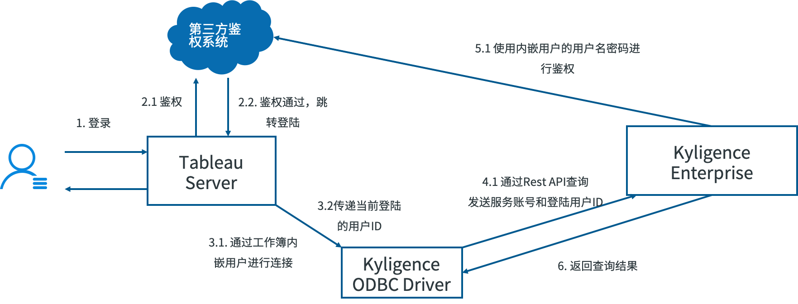
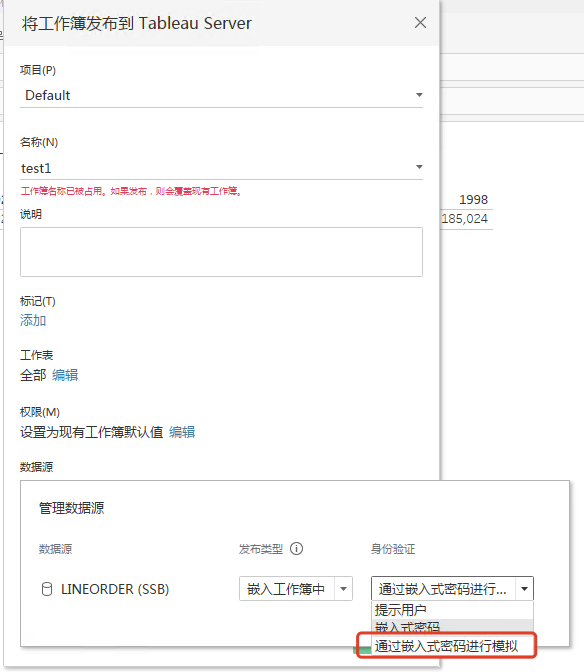
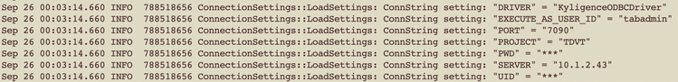

# 启用 Tableau Server 用户委任

本文将引导您配置 Tableau Server 和 Kyligence Enterprise 的用户委任。

从 Kyligence Enterprise 3.4.5.2117 开始，通过在 Tableau Server 启用透传 Execute as user 为当前登陆用户账号，您可以使用一个认证的用户委任查询请求给另一个用户。Tableau Server 发送给 Kyligence Enterprise 的查询会以委任的 Execute as user 来执行。

这样就实现了 Tableau Server 与 Kyligence Enterprise 用户账户的单点登录，用户在 Tableau Server 中查询 Kyligence Enterprise 数据时，无需进行二次登陆。且通过用户委任，您也可以让 Tableau Server 和 Kyligence Enterprise 实现统一的数据权限配置，用户在 Tableau Server 上查看报表时，直接复用在 Kyligence Enterprise 中设置的行级、列级、表级权限。

### 前置条件

- 使用 Tableau Desktop 和 Server 2019.4 版本及以上

- 使用 Kyligence Enterprise 3.4.5.2117 版本及以上

- 使用 Kyligence ODBC Driver 3.1.9 及以上

- 在安装 [Tableau Desktop](tableau_desktop.cn.md) 及 [Tableau Server](tableau_server.cn.md) 的机器上配置了 Kyligence 数据源连接器
- 请确保您要使用的 Tableau Server 用户名在 Kyligence Enterprise 中有同名的认证用户。我们称之为 Execute as user。您可以通过手动设置、LDAP 服务或者其他第三方用户认证系统来配置 Tableau Server 和 Kyligence Enterprise 用户
- 在 Kyligence Enterprise 的配置文件 /conf/kylin.properties 中将 kylin.query.query-with-execute-as 配置成 true，并重启 Kyligence Enterprise 服务使参数生效

### 配置用户委任

用户委任仅在 Tableau Server 上生效。当您使用 Tableau Desktop 发布工作簿到 Tableau Server 时，请确保使用了 Kylgience Connector 作为数据源连接，并在发布工作簿时，配置身份验证方式为“通过嵌入式密码进行模拟”。

### 验证用户委任是否生效

如果用户委任生效，当用户登陆 Tableau Server 查看报表时，你可以在 ODBC 的日志中查看到 Execute as user ID 的参数。[了解如何启用 Kyligence ODBC 日志](../../driver/odbc/win_odbc.cn.md#windows-odbc-驱动日志----使用日志记录对话框)。

### 问题排查

下面是在使用用户委任过程中一些常见的报错信息以及具体的问题解释和解决方案。如果您遇到更多问题无法解决请联系 Kyligence 技术支持。

| **报错**                                                     | **解释**                                                     | **解决方案**                                                 |
| :----------------------------------------------------------- | :----------------------------------------------------------- | :----------------------------------------------------------- |
| EXECUTE_AS_USER_ID cannot be empty, please check its value in the Kyligence ODBC connection string. | Tableau 没有将委任的用户账号正确的传给 Kyligence ODBC        | 请确认您是否在安装Tableau Server 的机器正确配置 Kyligence connector 。 |
| value of EXECUTE_AS_USER_ID cannot exceed 1024 characters.   | Execute user id 参数的长度超过最大长度 1024 个字符时         | 请使用更加简短的用户ID。                                     |
| KE-10024001(Access Denied): Access is denied"                | 当前的 Tableau 没有 Kyligence 数据源的访问权限               | 请为用户授权 Kyligence 访问权限                              |
| User [xxx] does not have permissions for all tables, rows, and columns in the project [xxx] and cannot use the executeAs parameter | 上传 Tableau 工作簿的嵌入式账号在 Kyligence Enterprise 中没有足够的访问权限 | 使用在 Kyligence 中没有限制行级、列级、表级权限的用户作为嵌入式账号 |
| User [xxx] in the executeAs field does not exist             | 当前登录的 Tableau 用户在Kyligence Enterprise 中不存在       | 请为用户授权 Kyligence 访问权限                              |