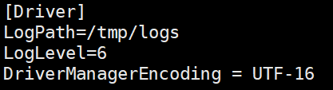

## Kyligence ODBC 驱动（Linux 版本）

在本文中，我们将向您介绍如何在 Linux 系统下安装和配置 Kyligence ODBC 驱动（Linux 版本)

### 安装库的依赖

我们建议您使用 unixODBC(http://www.unixodbc.org/) 作为驱动管理器来管理 ODBC 连接信息。

> **注意：** 由于64位 unixODBC 将会覆盖32位 unixODBC 的一些依赖库，这将会导致在使用32位 unixODBC 驱动时会出现依赖库的冲突，可能无法正常使用32位 Kyligence ODBC 驱动。因此，若您要使用 Linux 32 位版本的 Kyligence ODBC 驱动，需要卸载环境中的64位 unixODBC。

对于不同的 Linux 系统：

1. Redhat 和 CentOS 环境, 请参考如下操作安装

      * 若您需要使用64位 Kyligence ODBC 驱动，您可以直接使用以下命令进行64位 unixODBC 的安装

        ```
        sudo yum install unixODBC-devel -y
        ```

      * 若您需要使用32位 Kyligence ODBC 驱动，建议您依次使用以下命令进行32位 unixODBC 的安装

        ```
      sudo yum install unixODBC.i686 -y
        sudo yum install unixODBC-devel.i686 -y
        ```
        
        

2. Ubuntu 环境，请参考如下操作安装

   * 若您需要使用64位 Kyligence ODBC 驱动，您可以直接使用以下命令进行64位unixODBC的安装

     ```
    sudo apt-get install unixODBC-devel
     ```
   
   - 若您需要使用32位 Kyligence ODBC 驱动，建议您依次使用以下命令进行32位unixODBC的安装
   
     ```
     sudo apt-get install unixODBC.i686
     sudo apt-get install unixODBC-devel.i686
     ```

  

### 下载 ODBC 驱动程序

您可以在 [Kyligence Account](http://account.kyligence.io) 申请下载 Kyligence ODBC Driver (Linux版本）安装包。


### 安装 ODBC 驱动程序

1. 解压下载的压缩包

   ```
   tar -zxf KyligenceODBC_linux.tar.gz
   ```

   > **注意：** 请不要将 ODBC 安装文件放在 root 目录下，否则会因为读写权限问题可能导致 BI Server 访问失败。

2. 检查库的依赖

   ```
cd ODBCDriver/
   ldd libKyligenceODBC64.so
   ```
   
   > **提示：** 使用32位的 Kyligence ODBC 驱动请使用`ldd libKyligenceODBC32.so`命令检查库的依赖。
   
   如果检查成功，您将会看到如下输出：
   
   ```
   linux-vdso.so.1 =>  (0x00007fffca9eb000)
   librt.so.1 => /lib64/librt.so.1 (0x00007fe826b3f000)
   libdl.so.2 => /lib64/libdl.so.2 (0x00007fe82693b000)
   libm.so.6 => /lib64/libm.so.6 (0x00007fe8266b6000)
   libpthread.so.0 => /lib64/libpthread.so.0 (0x00007fe826499000)
   libc.so.6 => /lib64/libc.so.6 (0x00007fe826105000)
   lib64/ld-linux-x86-64.so.2 (0x00007fe829aac000)
   ```
   
   
   如果检查失败，依赖库不存在，您将看到如下输出：
   
   ```
   linux-vdso.so.1 =>  not found
   librt.so.1 => /lib64/librt.so.1 (0x00007fe826b3f000)
   libdl.so.2 => /lib64/libdl.so.2 (0x00007fe82693b000)
   libm.so.6 => /lib64/libm.so.6 (0x00007fe8266b6000)
   libpthread.so.0 => /lib64/libpthread.so.0 (0x00007fe826499000)
   libc.so.6 => /lib64/libc.so.6 (0x00007fe826105000)
   lib64/ld-linux-x86-64.so.2 (0x00007fe829aac000)
   ```


### 设置ODBC DSN 

1. 将 Kyligence ODBC 添加入配置文件

   > **提示：** 一些 BI 工具需要 ODBC 配置文件放置在自己的安装目录下，如[样例说明](#样例说明)中的 **MicroStrategy**。因此请您根据所使用的 BI 工具进行配置。

   **ODBC驱动配置文件** – /etc/odbcinst.ini 
   
   ```
   [{DriverName}]
   APILevel=1
   ConnectFunctions=YYY
   Description={Description}
   Driver={DriverPath}
   Setup={DriverPath}
   DriverODBCVer=03.80
   SQLLevel=1
   Locale=en-US
   ```
   
   **DSN配置文件** – /etc/odbc.ini 
   
   ```
   [{DSName}]
   Driver = {DriverName}
   PORT = {KE_Port}
   PROJECT = {KE_Project}
   SERVER = {KE_Url}
   ```
   
    
   
   样例配置： 
   
    **/etc/odbcinst.ini**
   
   ```
   [KyligenceODBCDriver]
   APILevel=1
   ConnectFunctions=YYY
   Description=Sample 64-bit Kyligence ODBC Driver
   Driver=/home/kylin/KyligenceODBC/ODBC_DRIVER/libKyligenceODBC64.so
   Setup=/home/kylin/KyligenceODBC/ODBC_DRIVER/libKyligenceODBC64.so
   DriverODBCVer=03.80
   SQLLevel=1
   Locale=en-US
   ```
   
   
      **/etc/odbc.ini**
   
   ```
   [KyligenceDataSource]
   Driver = KyligenceODBCDriver
   PORT = 80
   PROJECT = learn_kylin
   SERVER = http://kapdemo.chinaeast.cloudapp.chinacloudapi.cn
   ```
   
   > **注意：** 请确认 `odbc.ini` 文件中的 DSN 名称和 BI 桌面环境下配置的 DSN 名称完全一致，保证 BI 应用由桌面客户端发布至服务器端时连接正常
   
2. 使用命令行工具`isql DSN [UID '[PWD]']`测试连接

   ```
   isql KyligenceDataSource ADMIN 'KYLIN'
   ```


3. 发送查询测试 

   ```
   SQL> select count(*) from kylin_sales;
   ```

   如果连接成功，则会返回如下结果

   ```
   +---------------------+
   | EXPR$0              |
   +---------------------+
   | 4957                |
   +---------------------+
   SQLRowCount returns 1
   1 rows fetched
   ```

   


### 样例说明

这里我们以 **MicroStrategy Linux Intelligence Server** 为例，介绍如何创建 DSN。

1. 在 Linux shell 下，浏览至 MicroStrategy 的**安装目录**。

2. 打开文件`ODBC.ini`，按如下格式添加 DSN 配置信息。

   ```
   [DSN_Name]
   ConnectionType=Direct
   Driver=<ODBC_HOME>/libKyligenceODBC64.so
   PORT=<PORT_NUMBER>
   PROJECT=<PROJECT_NAME>
   SERVER=<SERVER_NAME>
   ```


3. 添加如下配置信息，映射 DSN 至 ODBC。 

   ```
   [ODBC Data Sources]
   <DSN_Name>=KyligenceODBC
   ```
   
   
   以下就是一个名为 *EAT1_WH* 的 DSN 配置样例：
   
   ```
   [ODBC Data Sources]
   KyligenceDataSource=KyligenceODBC
   
   [EAT_WH1]
   ConnectionType=Direct
   Driver=/home/kylin/ODBCDriver/libKyligenceODBC64.so
   PORT=57070
   PROJECT=mstr
   SERVER=http://106.75.137.52
   ```
   
   
   
4. 完成 DSN 配置后，我们建议您重启 MicroStrategy Intelligence Server，确保刚创建的 DSN 已经生效。 

5. 现在您就可以在 MicroStrategy Linux I-Server 上使用该 DSN 创建新的数据库连接了。

## Linux ODBC 驱动日志

您可以启用驱动程序中的日志记录来跟踪活动和故障排除问题。

**重要:** 启动详细的的日志记录用来捕获问题，但日志记录会降低性能并消耗大量磁盘空间。

1. 在文本编辑器中打开ODBC驱动程序配置文件。

   例如，您可打开{[ODBC安装路径]}/kyligence.odbc.ini文件

2. 下面列出了所有日志级别的信息。6 在大多数情况下是最佳的。

   - **0** 禁用所有日志记录。
   - **1** 记录非常严重的错误事件，可能导致驱动程序中止。
   - **2** 记录错误事件，可能仍然允许驱动程序继续运行。
   - **3** 记录潜在的有害情况。
   - **4** 记录描述驱动程序进程的一般信息。
   - **5** 记录对调试驱动程序有用的详细信息。
   - **6 (TRACE)** 记录比日志级别5更详细的信息。

   例如: **LogLevel=6**

3. 将LogPath属性设置为要保存日志文件的文件夹完整路径。这个路径确保存在，并且是可写的，包括如果使用驱动程序的应用程序作为特定用户运行，其他用户也可以写。

   例如: **LogPath=/localhome/username/Documents**

         

4. 配置**LogFileCount**属性以保留最大数量的日志文件。

   例如: **LogFileCount=5**

   > **注意**: 在达到日志文件的最大数量之后，每次创建一个额外的文件，驱动程序都会删除最旧的文件。

5. 配置**LogFileSize**属性设置为每个日志文件的最大大小(以MB为单位)。

   例如: **LogFileSize=20**

   > **注意:** 在达到最大文件大小之后，驱动程序创建一个新文件并继续日志记录。

6. 保存驱动程序配置文件。

7. 重新启动使用驱动程序的应用程序。在重新加载驱动程序之前，应用程序不会应用配置更改。


### FAQ

**Q: isql 测试连接失败**   

请使用`isql -v DSN [UID '[PWD]']`获取更多报错信息，然后根据报错检查 ODBC 配置文件和 DSN 配置文件是否正确。

以下为一个`SERVER` 配置项错误写为`SEVER`后，系统无法正确识别`SERVER`配置项的样例：

输入命令`isql -v KyligenceDataSource ADMIN 'KYLIN'`

您可以看到报错：

```
08001][unixODBC][Simba][ODBC](10380) Unable to establish connection with data source. Missing settings: {[SERVER]}
[ISQL]ERROR: Could not SQLConnect
```


**Q:isql测试连接报错 "Can't open lib '/usr/local/ODBCDriver/libKyligenceODBC32.so' : file not found"，但是文件实际在对应目录下存在**

这通常是因为环境中有64位 unixODBC 导致依赖库冲突，需要彻底卸载64位 unixODBC。您可以通过运行`odbcinst -j`命令查看 unixODBC 的相关安装信息。

若安装了32位 unixODBC，您可以看到如下结果：

```
unixODBC 2.2.14
DRIVERS............: /etc/odbcinst.ini
SYSTEM DATA SOURCES: /etc/odbc.ini
FILE DATA SOURCES..: /etc/ODBCDataSources
USER DATA SOURCES..: /root/.odbc.ini
SQLULEN Size.......: 4
SQLLEN Size........: 4
SQLSETPOSIROW Size.: 2
```


若安装了64位 unixODBC，您可以看到如下结果：

```
unixODBC 2.2.14
DRIVERS............: /etc/odbcinst.ini
SYSTEM DATA SOURCES: /etc/odbc.ini
FILE DATA SOURCES..: /etc/ODBCDataSources
USER DATA SOURCES..: /root/.odbc.ini
SQLULEN Size.......: 8
SQLLEN Size........: 8
SQLSETPOSIROW Size.: 8
```


**Q: 如何卸载 unixODBC**

首先您需要使用命令`yum list installed | grep unixODBC`查看您安装的 unixODBC 包名；其次，您需要使用`sudo yum remove {package name}`命令进行卸载。

这里以卸载64位 unixODBC 为例：

输入命令`yum list installed | grep unixODBC `，您可以看到以下信息：

```
unixODBC.x86_64           2.2.14-14.el6           @base
unixODBC-devel.x86_64     2.2.14-14.el6           @base
```


接下来依次使用以下命令，完成64位 unixODBC 的卸载：

```
sudo yum remove unixODBC-devel.x86_64
sudo yum remove unixODBC.x86_64
```


**Q: 报错提示：(11560) Unable to locate SQLGetPrivateProfileString function.**

请您运行以下命令：  

```
export LD_PRELOAD=/usr/lib/libodbcinst.so
```

