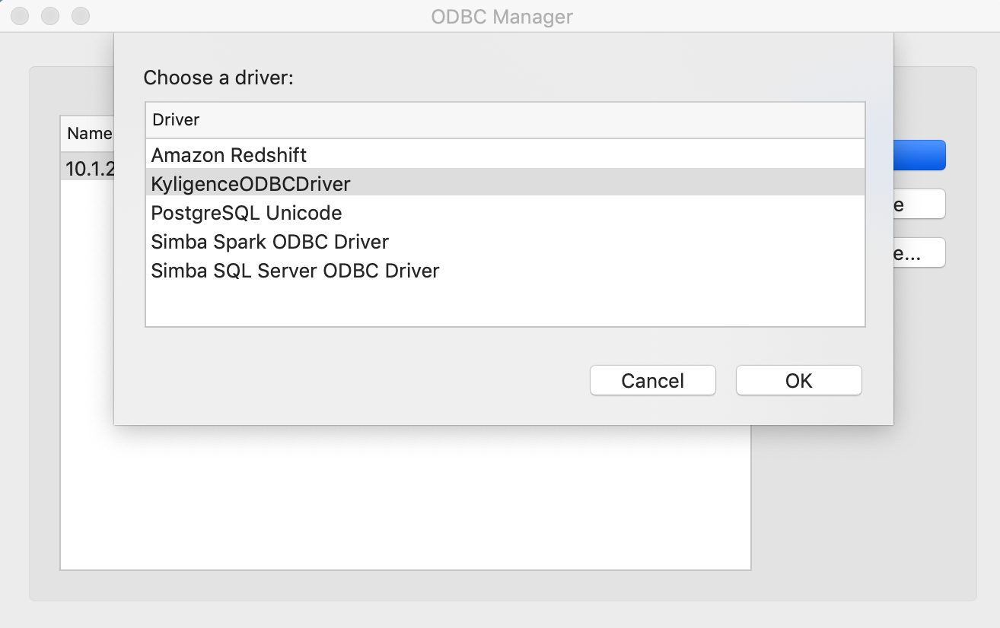

## Kyligence ODBC 驱动（Mac 版本）

在本文中，我们将向您介绍如何在Mac 系统下通过ODBC Manager或unixODBC安装和配置 Kyligence ODBC 驱动（Mac 版本)。

您可以使用 ODBC Manager 通过界面创建DSN或者也可以直接编辑`odbc.ini` 文件

### 使用ODBC Manger安装

- #### 安装 Kyligence ODBC Driver 

  您可以在 [Kyligence 下载页面](http://download.kyligence.io/#/download) 申请下载 Kyligence ODBC Driver 安装包，并运行安装。

  64 位应用程序：请安装使用 Kyligence.ODBC.{version}.x64.pkg

  > **注意：** 请不要将 ODBC 安装文件放在 root 目录下，否则会因为读写权限问题可能导致 BI Server 访问失败。

- #### 安装ODBC Manger

  您可以在 [ODBC Manager](http://www.odbcmanager.net) 页面下载ODBC Manager安装包，并运行安装。

  > **注意：**若安装后，/Library/下没有ODBC文件夹，请手动创建，并配置odbcinst.ini、odbc.ini
  >
  > ```
  > mkdir ODBC
  > cd ODBC
  > touch odbcinst.ini
  > touch odbc.ini
  > ```
  >
  > **ODBC驱动配置文件** –  /Library/ODBC/odbcinst.ini
  >
  > ```
  > [ODBC Drivers]
  > [{DriverName}] = Installed
  > 
  > [{DriverName}]
  > Driver={DriverPath}
  > ```
  >
  > **DSN配置文件** – /Library/ODBC/odbc.ini 
  >
  > ```
  > [ODBC Data Sources]
  > {DSNName} = {DriverName}
  > 
  > [{DSNName}]
  > Driver = {DriverPath}
  > Host = {KE_Url}
  > Port = {KE_Port}
  > Project = {KE_Project}
  > ```
  >
  > 样例配置： 
  >
  > /Library/ODBC/odbcinst.ini
  >
  > ```
  > [ODBC Drivers]
  > KyligenceODBCDriver  = Installed
  > 
  > [KyligenceODBCDriver]
  > Driver = /Library/KyligenceODBCLib/libKyligenceODBC64.dylib
  > ```
  >
  > /Library/ODBC/odbc.ini
  >
  > ```
  > [ODBC Data Sources]
  > KyligenceDataSource = KyligenceODBCDriver
  > 
  > [KyligenceDataSource]
  > Driver = /Library/KyligenceODBCLib/libKyligenceODBC64.dylib
  > Host = http://kapdemo.chinaeast.cloudapp.chinacloudapi.cn
  > Port = 7070
  > Project = learn_kylin
  > ```
  >
  > 配置好后，您就可以直接在BI工具中使用了，可跳过下面的界面配置Driver、DSN操作。

- #### 配置KyligenceODBCDriver

  打开ODBC Manger，进入“Drivers” 页面​ ，确认已成功添加 **KyligenceODBCDriver**

  > **注意：**请务必保证 Driver Name 为 “KyligenceODBCDriver”

  

  

  

- #### 配置DSN

  进入“System DSN”或“User DSN”页面，点击“Add”新建

  > **注意**：**用户 DSN** 只有特定的用户可以调用，**系统 DSN** 对该系统的所有登录用户可用。如果用户需要在Web BI Server 通过 ODBC 访问 Kyligence Enterprise，应使用**系统 DSN**。    

  

  选择“KyligenceODBCDriver”

  

  确认后，输入Host、Port、Project等信息，点击“OK”即可

  - Host：本产品服务器地址
  - Port：本产品服务器端口号
  - Username：本产品服务登录用户名，不区分大小写
  - Password：本产品服务登录密码
  - Project：查询所使用的本产品项目名称，不区分大小写

  

DSN配置好后您就可以直接在BI工具中使用了。

### 使用UnixODBC 安装
如您已经通过ODBC Manager 完成了ODBC的安装及 DSN的配置，可跳过本章节。

- #### 安装 unixODBC 

  我们建议您使用 unixODBC(http://www.unixodbc.org/) 作为驱动管理器来管理 ODBC 连接信息​ 

  ```
  brew install unixODBC
  ```

  安装完成后，执行下述命令，确认结果是否为 /usr/local/bin/isql

  ```
  which isql 
  ```

  执行下述命令，确认DRIVERS路径是否是 /usr/local/etc/odbcinst.ini， 确认SYSTEM DATA SOURCES路径是否是 /usr/local/etc/odbc.ini

  ```
  odbcinst -j
  ```

- #### 配置KyligenceODBCDriver

  将 Kyligence ODBC 添加入配置文件

  **ODBC驱动配置文件** –  /usr/local/etc/odbcinst.ini 

  ```
  [{DriverName}]
  APILevel=1
  ConnectFunctions=YYY
  Description={Description}
  Driver={DriverPath}
  Setup={DriverPath}
  DriverODBCVer=03.80
  SQLLevel=1
  Locale=en-US
  ```

- #### 配置DSN

  **DSN配置文件** – /usr/local/etc/odbc.ini 

  ```
  [{DSName}]
  Driver = {DriverName}
  SERVER = {KE_Url}
  PORT = {KE_Port}
  PROJECT = {KE_Project}
  ```

  样例配置： 

  **/etc/odbcinst.ini**

  ```
  [KyligenceODBCDriver]
  APILevel=1
  ConnectFunctions=YYY
  Description=Sample 64-bit Kyligence ODBC Driver
  Driver=/Library/KyligenceODBCLib/libKyligenceODBC64.dylib
  Setup=/Library/KyligenceODBCLib/libKyligenceODBC64.dylib
  DriverODBCVer=03.80
  SQLLevel=1
  Locale=en-US
  ```

  **/etc/odbc.ini**

  ```
  [KyligenceDataSource]
  Driver = KyligenceODBCDriver
  SERVER = http://kapdemo.chinaeast.cloudapp.chinacloudapi.cn
  PORT = 7070
  PROJECT = learn_kylin
  ```

- #### 查询验证

1. 使用命令行工具`isql DSN [UID '[PWD]']`测试连接

   ```
   isql KyligenceDataSource ADMIN 'KYLIN'
   ```

2. 发送查询测试 

   ```
   SQL> select count(*) from kylin_sales;
   ```

   如果连接成功，则会返回如下结果

   ```
   +---------------------+
   | EXPR$0              |
   +---------------------+
   | 10000               |
   +---------------------+
   SQLRowCount returns 1
   1 rows fetched
   ```

- #### 拷贝ini文件至/Library/ODBC下

  ```
  sudo cp /usr/local/etc/odbcinst.ini /Library/ODBC/
  sudo cp /usr/local/etc/odbcinst.ini /Library/ODBC/
  sudo chown -R {UserName} odbc.ini
  sudo chown -R {UserName} odbcinst.ini
  ```

  > **注意**：若您本机环境没有/Library/ODBC文件夹，需要手动创建 

  ```
  cd /Library
  sudo mkdir /ODBC
  ```

## Mac ODBC 驱动日志

您可以启用驱动程序中的日志记录来跟踪活动和故障排除问题。

**重要:** 启动详细的的日志记录用来捕获问题，但日志记录会降低性能并消耗大量磁盘空间。

1. 在文本编辑器中打开ODBC驱动程序配置文件。

   例如，您可打开{[ODBC安装路径]}/kyligence.odbc.ini文件

2. 下面列出了所有日志级别的信息。6 在大多数情况下是最佳的。

   - **0** 禁用所有日志记录。
   - **1** 记录非常严重的错误事件，可能导致驱动程序中止。
   - **2** 记录错误事件，可能仍然允许驱动程序继续运行。
   - **3** 记录潜在的有害情况。
   - **4** 记录描述驱动程序进程的一般信息。
   - **5** 记录对调试驱动程序有用的详细信息。
   - **6 (TRACE)** 记录比日志级别5更详细的信息。

   例如: **LogLevel=6**

3. 将LogPath属性设置为要保存日志文件的文件夹完整路径。这个路径确保存在，并且是可写的，包括如果使用驱动程序的应用程序作为特定用户运行，其他用户也可以写。

   例如: **LogPath=/localhome/username/Documents**

         

4. 配置**LogFileCount**属性以保留最大数量的日志文件。
   例如: **LogFileCount=5**

   > **注意**: 在达到日志文件的最大数量之后，每次创建一个额外的文件，驱动程序都会删除最旧的文件。

5. 配置**LogFileSize**属性设置为每个日志文件的最大大小(以MB为单位)。
   例如: **LogFileSize=20**

   > **注意:** 在达到最大文件大小之后，驱动程序创建一个新文件并继续日志记录。

6. 保存驱动程序配置文件。

7. 重新启动使用驱动程序的应用程序。在重新加载驱动程序之前，应用程序不会应用配置更改。


### FAQ

**Q: 如何卸载 unixODBC**

输入命令`brew uninstall unixodbc `，您可以看到以下信息：

```
Uninstalling /usr/local/Cellar/unixodbc/2.3.7... (46 files, 1.8MB)
```

