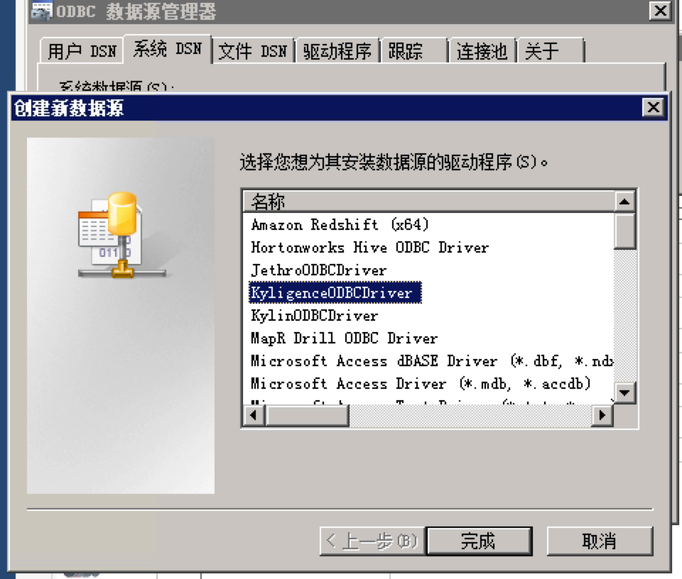

## Kyligence ODBC 驱动（Windows 版本）


在本文中，我们以 Windows 7 为例，介绍 Kyligence ODBC 驱动程序（Windows版本）的安装和使用步骤。

## 前提条件

1. Microsoft Visual C++ 2015 Redistributable

   在安装 Kyligence ODBC 驱动程序的过程中，系统会首先自行安装 Microsoft Visual C++ 2015 Redistributable。如果操作系统中已经安装了 Microsoft Visual C++ 2015 Redistributable，安装步骤会跳过此步。

2. 一个运行的Kyligence Enterprise服务器（仅在配置DSN时）

   Kyligence ODBC 驱动程序安装成功后，在配置DSN时会连接 Kyligence Enterprise 服务器，请务必先确保 Kyligence Enterprise 服务已正常运行。

## 安装

1. 如果机器上已经安装过 Kyligence ODBC 驱动程序，首先卸载已有 Kyligence ODBC 驱动程序。
2. 在 [Kyligence Account 页面](http://account.kyligence.io)申请下载 Kyligence ODBC 驱动程序，并运行安装。

   - 32 位应用程序：请安装使用 kyligence_odbc.x86.exe

   - 64 位应用程序：请安装使用 kyligence_odbc.x64.exe


## 配置 DSN

1. 打开 ODBC 数据源管理器：

   32 位 ODBC 驱动：单击**开始 -> 运行**，并打开 C:\Windows\SysWOW64\odbcad32.exe

   64 位 ODBC 驱动：单击**控制面板 ->管理工具**，找到并打开**数据源(ODBC)**

2. 切换至**系统 DSN** 选项卡，单击**添加**，在弹出的驱动程序选择框中选择 **KyligenceODBCDriver**，然后单击**完成**按钮。

   > **注意**：**用户 DSN**只有特定的用户可以调用，而**系统 DSN** 对该系统的所有登录用户可用。如果用户需要在Web BI Server 通过 ODBC 访问 Kyligence Enterprise，应使用**系统 DSN**。    

   

3. 在弹出的对话框中输入 Kyligence Enterprise 服务器信息，如图所示：
   

   其中，各项参数介绍如下：

   * Data Source Name：数据源名称
   * Description：数据源描述
   * Host：本产品 服务器地址
   * Port：本产品 服务器端口号
   * Username：本产品 服务登录用户名
   * Password：本产品 服务登录密码
   * Project：查询所使用的 本产品 项目名称
   * Disable catalog：是否关闭catalog层，默认为**开启**状态，如果勾选Disable catalog则为关闭状态

4. 单击 **Test** 按钮，连接成功后，将显示如下对话框。

   

## 是否需要开启catalog层

   需要**关闭**catalog层的BI工具有：Cognos

   需要**开启**catalog层的BI工具有：OBIEE

## 连接字符串

有一些BI工具支持不使用DSN而直接配置ODBC连接字符串的形式访问数据源。在这种场景下，用户可以使用下面的字符串格式进行配置：

```
DRIVER={KyligenceODBCDriver};SERVER=locahost;PORT=7070;PROJECT=learn_kylin
```

> **提示：**请将SERVER，PORT及PROJECT中的信息替换成您所使用的本产品的信息。

### Windows ODBC 驱动日志  - 使用日志记录对话框

您可以启用驱动程序中的日志记录来跟踪活动和故障排除问题。

> **重要:** 启动详细的的日志记录用来捕获问题，但日志记录会降低性能并消耗大量磁盘空间。

1. 单击**控制面板 ->管理工具**，找到并打开**ODBC 数据源管理程序**

2. 选择要记录连接活动的DSN，然后单击**配置**


3. 在DSN安装对话框中，单击**Logging Options**


4. 下面列出了所有日志级别的信息。在大多数情况下，LOG_TRACE是最佳的。
   - **LOG_FATAL**  记录可能导致驱动程序中止的非常严重的错误事件。
   - **LOG_ERROR**  记录可能仍然允许驱动程序继续运行的错误事件。
   - **LOG_WARNING**  记录潜在的预警情况。
   - **LOG_INFO**  记录描述驱动程序进程的一般信息。
   - **LOG_DEBUG**  记录对调试驱动程序有用的详细信息。
   - **LOG_TRACE**  记录比LOG_DEBUG级别更详细的信息。

5. 在**Log Path**字段中，键入要保存日志文件的文件夹完整路径。


6. 在**Max Number Files**字段中，键入要保留的最大日志文件数。

   > **注意:** 到达日志文件的最大数量后，每次创建一个额外的文件，驱动程序都会删除最旧的文件。

7. 在**Max File Size**字段中，键入每个日志文件的最大大小(以MB为单位)。

   > **注意:** 达到最大文件大小后，驱动程序创建一个新文件并继续日志记录。

8. 单击**OK**关闭日志记录选项对话框。

9. 单击**OK**保存设置并关闭DSN配置对话框。

   > **注意:** 在DSN配置对话框中单击**OK**后，驱动程序才会保存配置更改。单击**Cancel**按钮将放弃更改。

10. 重新启动使用驱动程序的应用程序。在重新加载驱动程序之前，应用程序不会应用配置更改。

## 特别提醒

如果用户希望在其他应用程序中使用 Kyligence ODBC 驱动程序连接本产品，可访问本手册[ 与BI 工具连接](../../bi/README.md)章节，了解相关信息。
