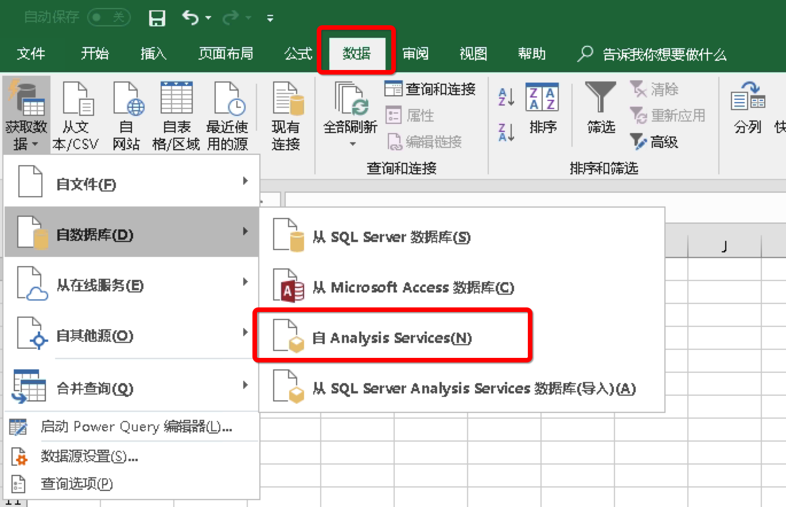
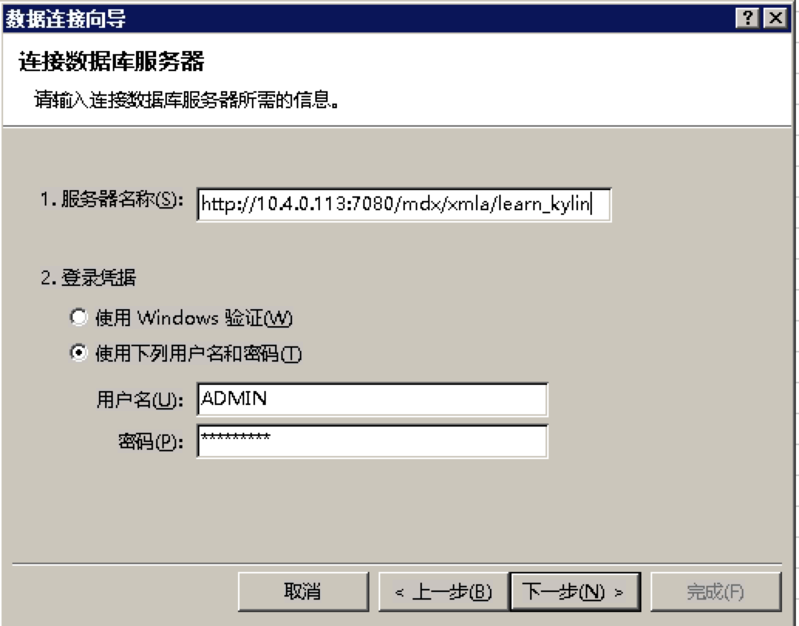
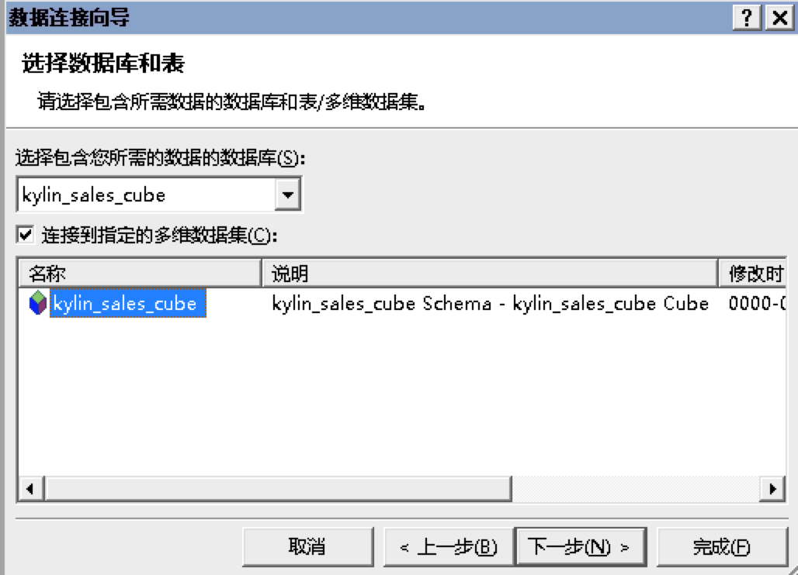
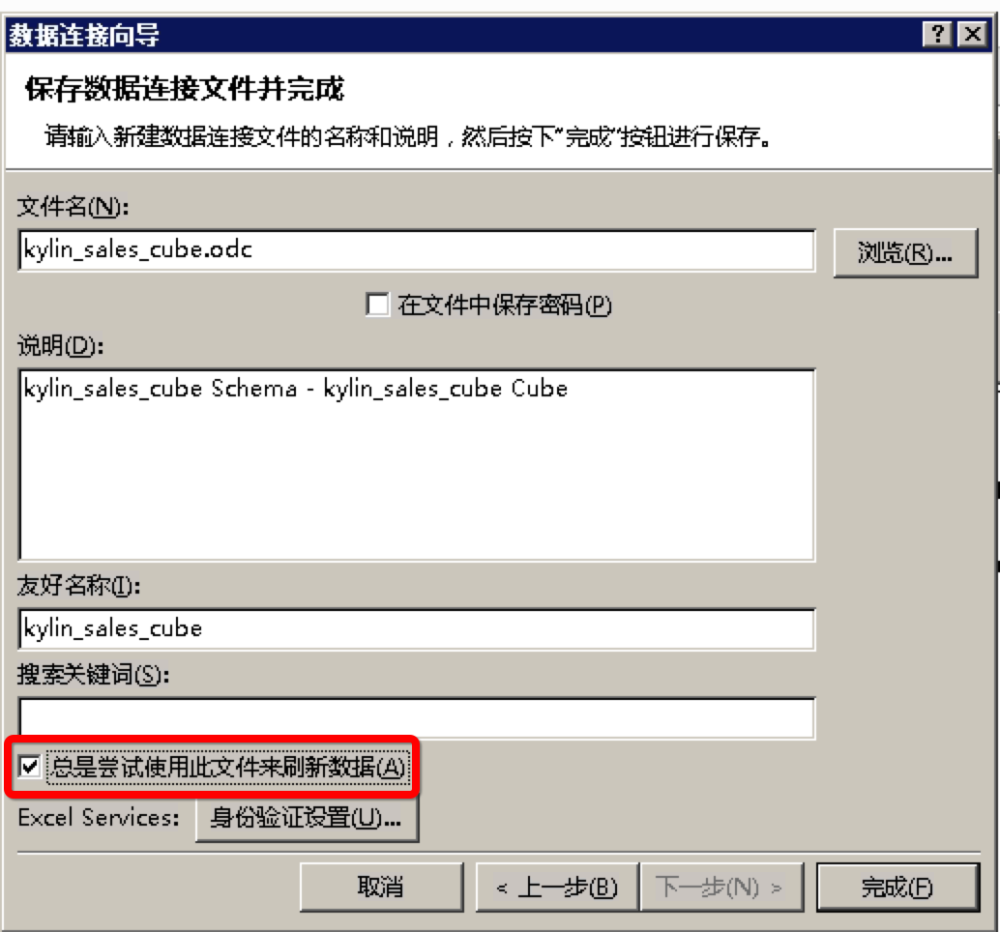
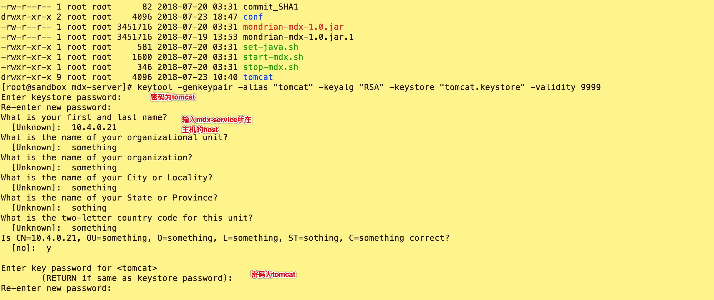
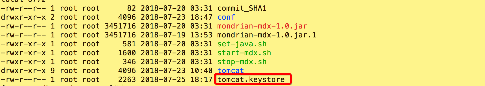
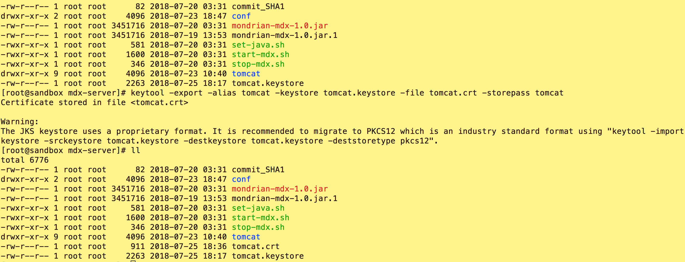
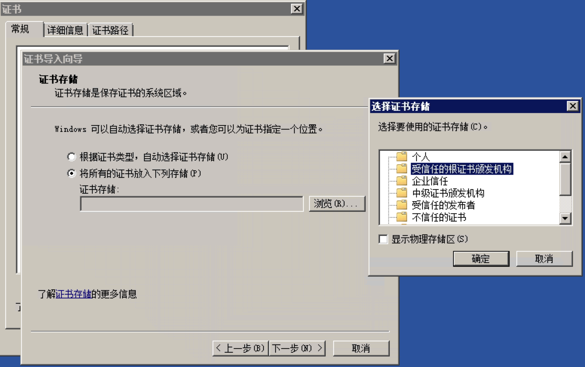
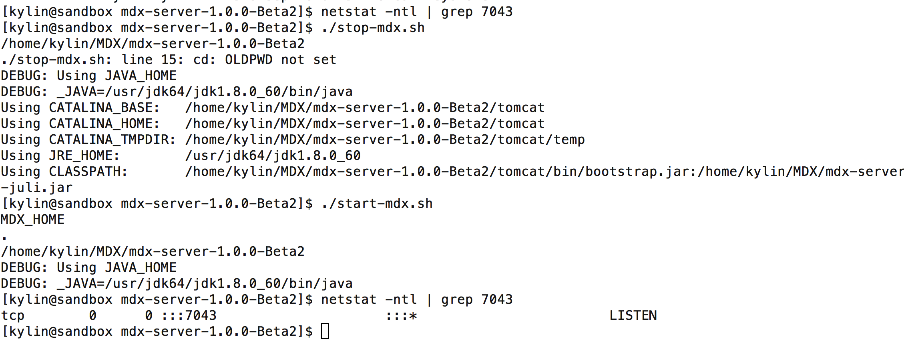
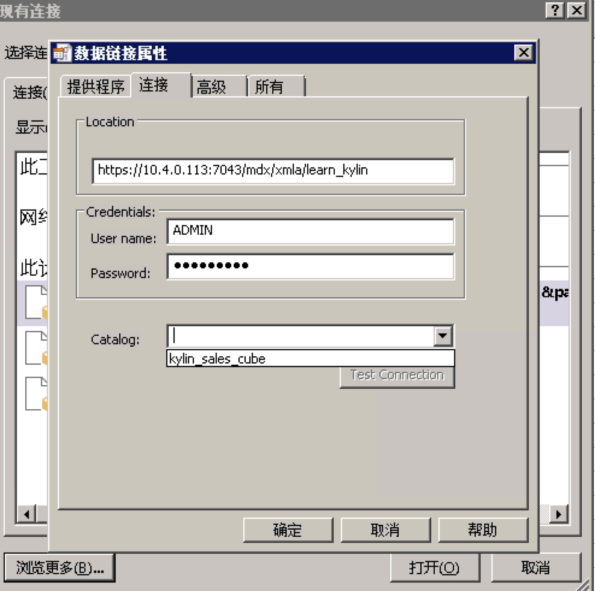

## 与 Excel 集成

本章节将介绍如何使用 Excel 分析 Kyligence Enterprise 中的数据，使用 Excel 的数据透视表功能，通过 MDX Service 直接在线查询分析 Kyligence Enterprise 的数据，而不需要导入数据到 Excel 中。

### 运行原理

Excel 通过 SSAS 接口连接 MDX Service，协议使用 XMLA。MDX Service 将 Excel 发送的 MDX 查询转换为 SQL，通过 JDBC 查询 Kyligence Enterprise，然后将查询结果转换后返回给 Excel，最终展现在透视表中。

### 使用条件

1. 安装部署 MDX Service

2. 安装 Excel 2007 版及以上

### 部署 MDX Service
+ 下载 [MDX Service ](http://download.kyligence.io)二进制包（在**扩展包**标签页中），并拷贝至您的环境中。
> 提示：我们推荐您把 MDX Service 安装在和 Kyligence Enterprise 同一个环境上。

+ 解压安装包。

   `tar -xvf MDX Service-{version}.tar.gz`

+ 配置mdx参数 。

  `vi mdx-server-{version}/conf/mdx/properties`

|配置项|配置说明|默认值|备注|
| :------| :------| :------| :------|
|kyligence.host|KE 主机名|localhost|
|kyligence.port|KE 端口号|7070|
|mdx.calculate.total.need|是否开启计算 total/subtotal 的功能|true|关闭后，返回结果将不会携带 total/subtoal，查询速度更快。如果在 url 中加入请求参数 needCalculateTotal=false，将会关闭计算 total/subtotal 的功能，并且会忽略配置文件对此项的配置。示例 url (http://localhost:7080/mdx/xmla/learn_kylin?needCalculateTotal=false)|
|mdx.optimize.enable|是否开启 MDX 语句优化功能|true|如果在 url 中加入请求参数 enableOptimizeMdx=true, 同样也会打开 MDX 优化功能，并且会忽略配置文件对此项的配置。示例 url(http://localhost:7080/mdx/xmla/learn_kylin?enableOptimizeMdx=true)|

+ 启动 MDX Service 服务。

   `./start-mdx.sh`
> 提示：
>
> 1. MDX Service 默认端口号为7080，如果存在端口冲突， 请自行修改安装目录 tomcat/conf/server.xml 文件
> 2. 首次启动 MDX Service 会自动下载依赖包 mondrian-kylin。如在无网络环境下， 您需要手动下载 mondrian-kylin 依赖包, 并拷贝至安装目录的 tomcat/webapps/mdx/WEB-INF/lib 目录下，[点击此处开始下载](http://repository.kyligence.io:8081/repository/maven-releases/pentaho/mondrian/mdx-1.0/mondrian-mdx-1.0.jar)。
>

+ 停止 MDX Service 服务。

   `./stop-mdx.sh`

### 使用 Excel 连接 MDX Service

1. 选择 **数据** -> **来自 Analysis Services**。

   

2. 接下来，您需要在**服务器名称**一栏中填写连接 MDX Service 的地址信息，样本如下：

   `http://{host}:{port}/mdx/xmla/{project}`

   MDX Service 默认端口号是7080，用户名和密码是您的 Kyligence Enterprise 登陆用户名和密码。

   

3. 现在 Cube 已经被连接到 Excel 了。在下拉框中选择您需要使用的Cube，点击下一步。

   

4. 勾选总是尝试文件来刷新数据，点击完成。

   

5. 现在，您可以使用 Excel 透视表分析 Kyligence 的 Cube 了。

   

### 如何升级 MDX Service
1. 停止当前正在运行的 MDX Service。

    `./stop-mdx.sh`

2. 将 MDX Service 文件夹重命名。

    `mv MDX Service-{version} MDX Service.old`

3. 解压新版本的 MDX Service。

    `tar -xvf MDX Service-{new_version}`

4. 拷贝原有的配置文件至新的 MDX Service 中。

    `cp -rf MDX Service.old/conf MDX Service-{new_version}`

5. 启动 MDX Service。

    `./start-mdx.sh`

### 如何使用 HTTPS 连接 MDX Service

1. 制作 SSL 秘钥和证书。

   * 在 MDX Service 根目录下使用如下命令生成秘钥

     `keytool -genkeypair -alias "tomcat" -keyalg "RSA" -keystore "tomcat.keystore" -validity 9999`

     

   * 秘钥生成后，保存在当前目录
     
   
   * 利用如下命令生成一份证书
     `keytool -export -alias tomcat -keystore tomcat.keystore -file tomcat.crt -storepass tomcat`
     

2. 在 Excel 环境中安装证书。

   拷贝一份刚才生成的证书至安装了 Excel 的环境，双击证书，开始安装
    
   
3. 重启 MDX Service

   安装证书后, 你需要重启 MDX Service。
   
   

4. 使用 HTTPS 连接。

   MDX Service 的 HTTPS 默认端口为7043，所以连接样式为

    `https://{host}:7043/mdx/xmla/{project}`
    
   