## 与 OBIEE 12c 集成

OBIEE 是 Oracle 旗下的 BI 产品，可提供完整的 BI 功能，包括交互式信息板、完全即席的主动式智能和警报、企业和财务报表、实时预测智能以及离线分析等。本文将分步介绍使用 OBIEE 12c 连接 Kyligence Enterprise 的方法。

**前置条件**：
- Kyligence Enterprise 版本高于 3.0
- Kyligence ODBC 驱动版本高于 2.2

### 配置 ODBC 及 DSN

1. 配置 OBIEE Client

   需要先安装 BI Adminstrator tool ，安装后在 ODBC 管理器中增加对 BIEE server 的连接 DSN。

   

   连接后在 BI Adminstrator tool 中点击菜单**打开** -> **联机**，即可管理 BIEE server 中的数据模型。

    

2. 设置 DSN

   在 client 端和 server 端都需要安装 Kylignece ODBC 并配置 DSN，且两端的 DSN 名称应**保持一致**。

   有关 Windows 下 Kyligence ODBC 的配置，请参考[Windows下安装与配置Kyligence ODBC驱动](../driver/kyligence_odbc_win.cn.html)。

   有关 Linux 下 Kyligence ODBC 的配置，请参考[Linux 下安装与配置 Kyligence ODBC 驱动](https://docs.oracle.com/middleware/12212/biee/BIEMG/GUID-CCDD9782-BC2A-497A-8ED0-AECA2ECFB3AE.htm#config_native_dbs)中的Configuring Database Connections Using Native ODBC Drivers 部分。

   在`odbc.ini`文件中增加的 Kyligence 数据源格式为：

   ```
   [KyligenceDataSource]
   Driver = KyligenceODBC64
   PORT = 7070
   PROJECT = learn_kylin
   SERVER = http://kapdemo.chinaeast.cloudapp.chinacloudapi.cn   
   UID = KYLIN  
   PWD = ADMIN
   ```

### 创建数据模型

1. 在 BI Administrator tool 中点击**导入元数据**来增加数据源。

    

2. 选择 ODBC 2.0，将 Kyligence Enterprise 中的表导入。

    

3. 导入成功后，在物理模型里找到 Kyligence Enterprise 数据源，复选需要建模的表右键，选择**物理图表**进行建模。

   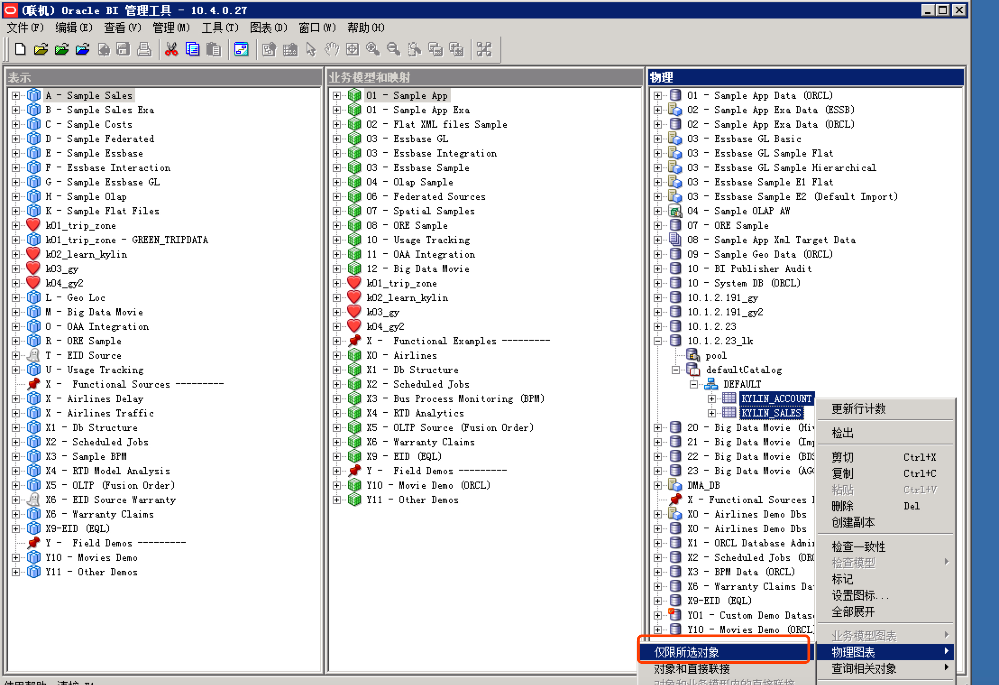

4. 点击**新建联接**定义表关联关系，然后保存物理模型。

   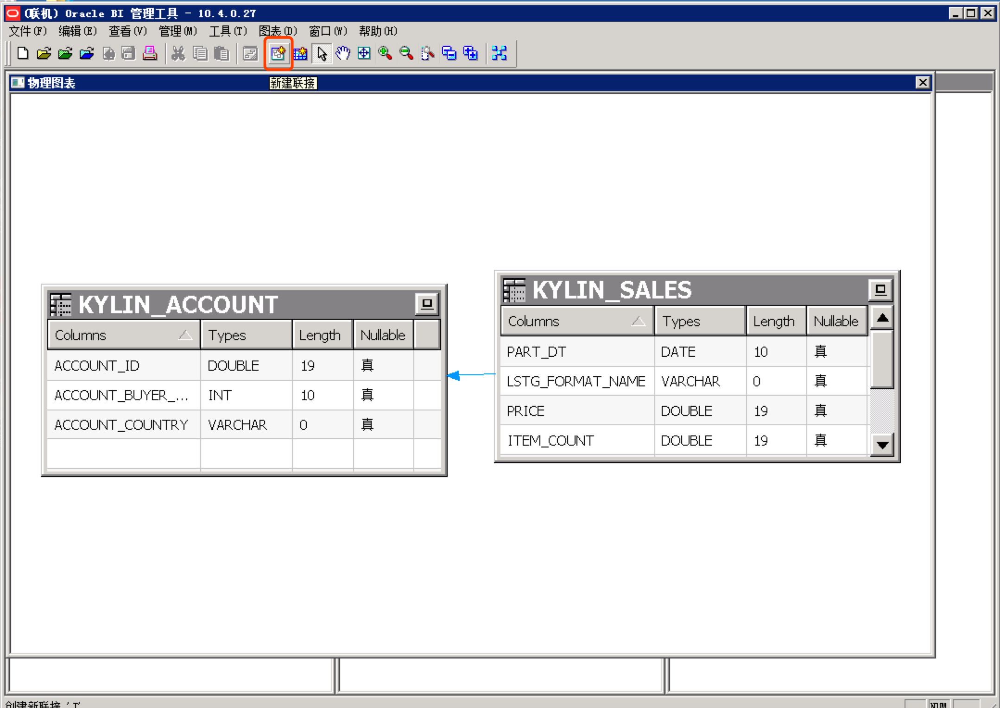

5. 保存模型后需要手动检索并更改数据类型为字符串的物理列，如果长度显示为0，则需要更改为 Kyligence Enterprise 中字段的实际长度。

    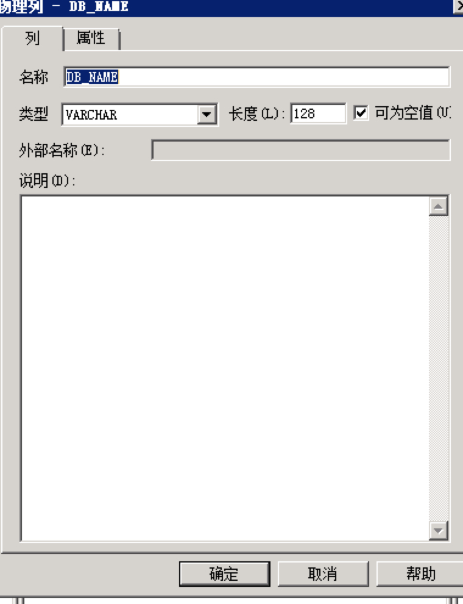

6. 保存物理模型后新建业务模型，然后将刚才增加的物理模型拖动到业务模型，如需 outer join 可以选择编辑业务模型, 在此处设置为外部连接， 并保存到业务模型。然后将刚才增加的逻辑模型拖动到表示层，并保存到表示层。

   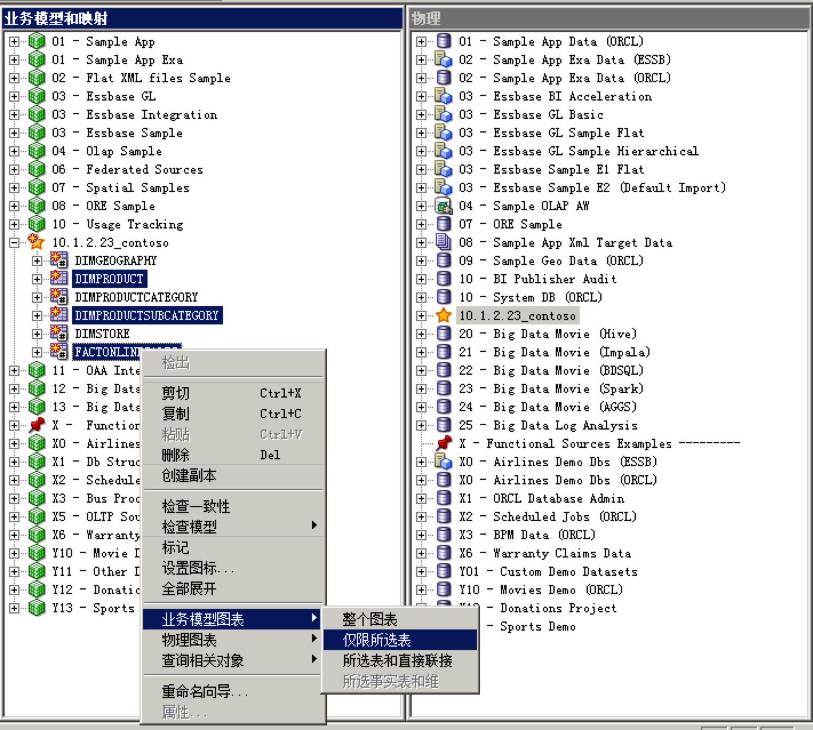

   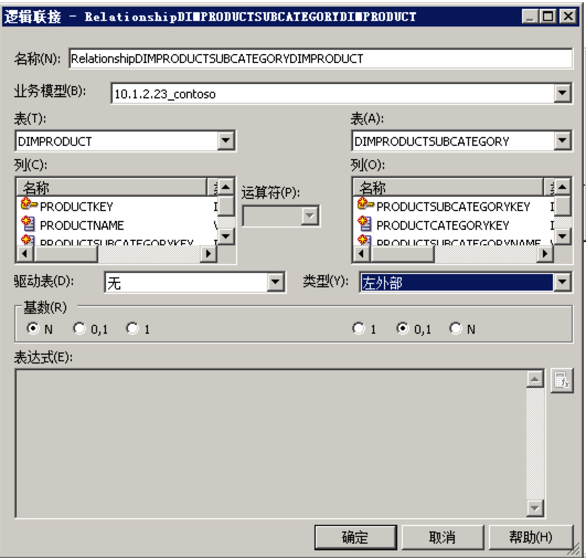

7. 点击 BI Administrator tool 中左上角的**文件**->**保存**，保存整个模型。

   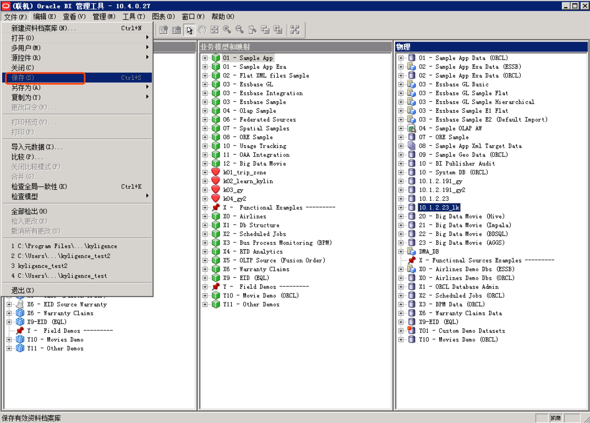

8. 重启BIEE server。


### 创建分析

有两种方式可以使用刚才创建的模型中的数据进行分析。

- **方法一**

  1. 在BIEE主页点击**新建-分析**，使用在 client 端创建的主题区域即可使用 Kyligence Enterprise 进行分析。这种方式使用拖拽查询方式方式。

     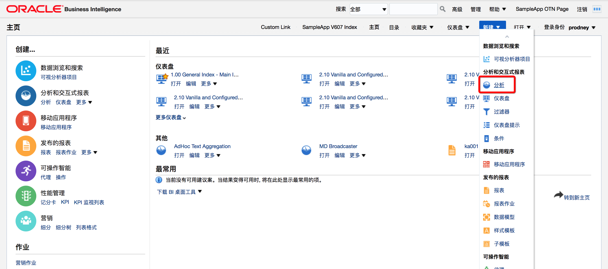

  2. 拖动所需字段到所选列即可，度量需要点击字段右下角的**编辑公式**编辑聚合方式。

     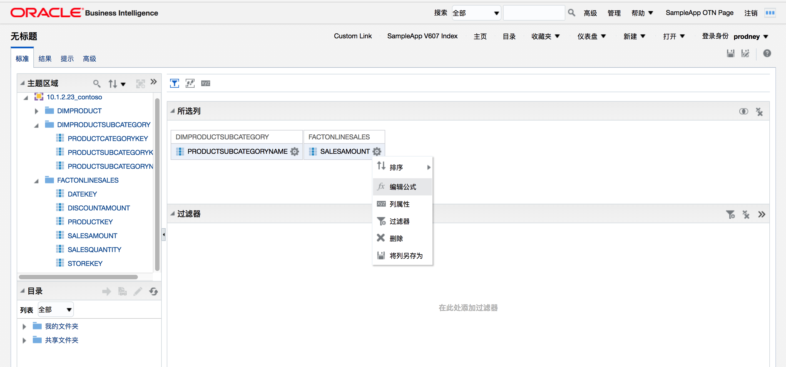

     其他需要再加工的字段都可以在**编辑公式**里进行再定义。

      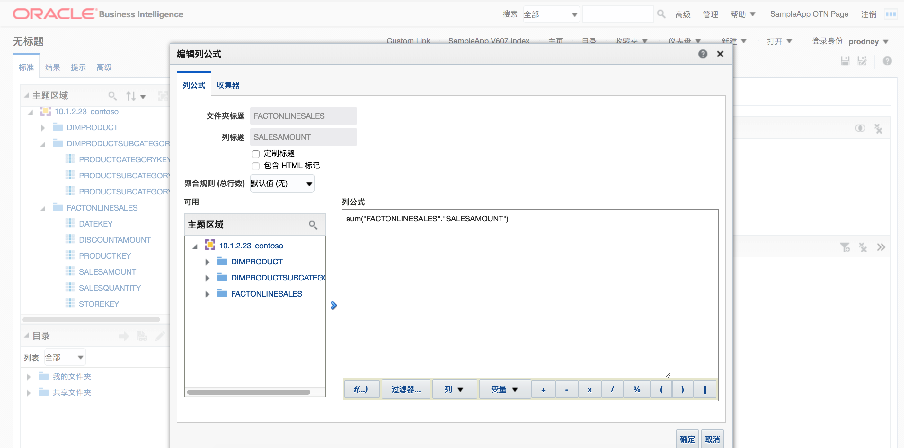

  3. 点击**结果**即可看到查询结果，然后编辑所需图表类型及相关样式即可。

      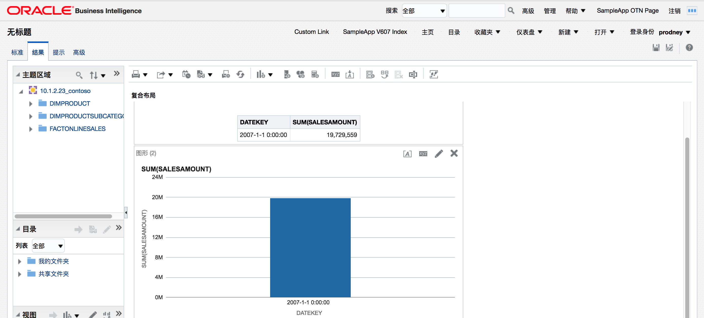


- **方法二**

  1. 在BIEE主页点击**新建-分析-创建直接数据库查询**，使用自定义 SQL 进行查询。

  2. 选择在 client 端创建的数据源的连接池名进行连接，输入查询 SQL 进行分析。

     连接池名称格式：`"dsn_name"."connect_pool_name"`

     

  3. 点击**结果**即可得到查询结果，点击结果左下角的**新建视图**可以更改图表类型。

     

     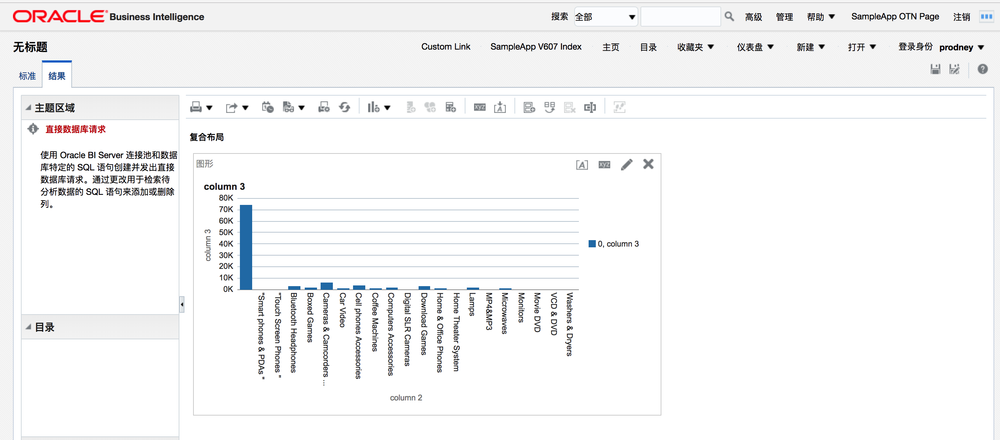

### 注意事项

1. 根据BIEE的开发规范，在 client 端创建的模型最少需要有两张表，否则上载模型会导致 BIEE 无法启动服务。
2. 由于 BIEE 产生的查询 SQL 不带 schema ，拖拽查询则需要一个项目里只含有一个 database 的表。在连接池查询时使用**自定义 SQL 查询**可以避免此问题 。
